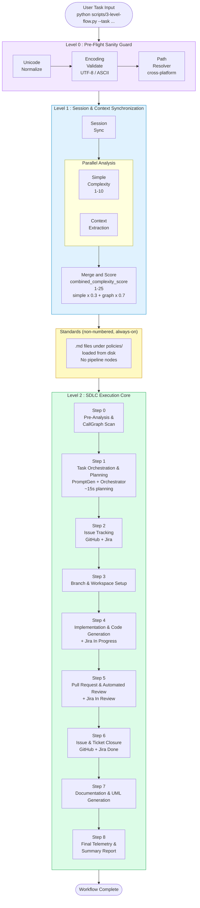
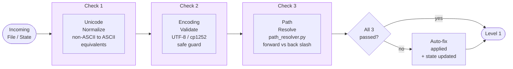
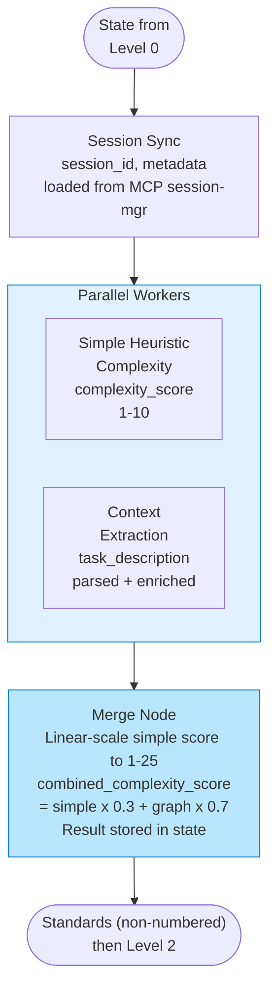
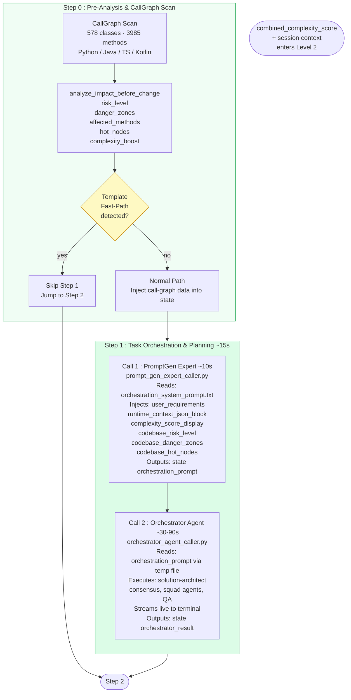
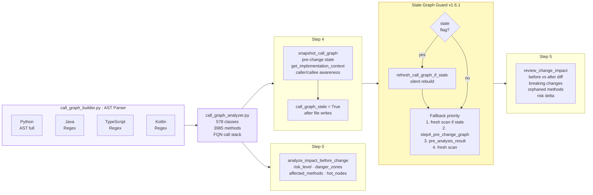
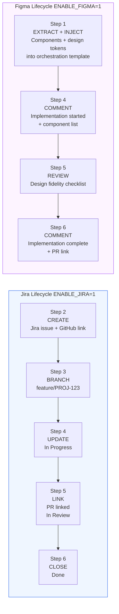
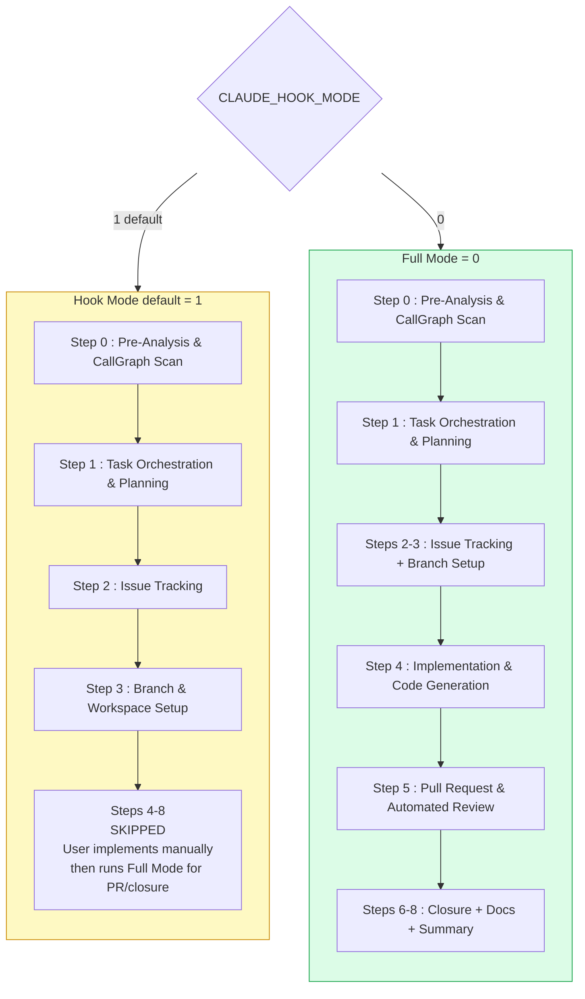
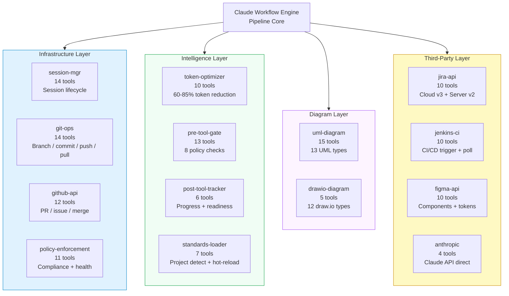
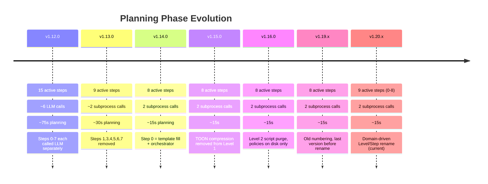

# Claude Workflow Engine — Pipeline Architecture

> Version 1.20.x · LangGraph 0.2.0+ · Python 3.10+
>
> Domain-driven Level/Step naming (see `CLAUDE.md` "Latest Execution Insight" for the rename
> rationale): `Level -1/1/2/3` + `Pre-0, Step 0, Steps 8-14` became `Level 0/1/2` (Pre-Flight
> Sanity Guard / Session & Context Synchronization / SDLC Execution Core) + `Steps 0-8`, each
> carrying a purpose name. The dead "Level 2: Standards" (never had pipeline nodes) is retired
> from the level count and documented below as a non-numbered, always-on mechanism.

---

## 1. Top-Level Pipeline Flow

---

## 2. Level 0 : Pre-Flight Sanity Guard Detail

---

## 3. Level 1 : Session & Context Synchronization Detail

---

## 4. Level 2 : Step 0 + Step 1 Detail

---

## 5. Level 2 : Steps 2-8 Execution Flow

```mermaid
flowchart TD
    IN(["orchestrator_result\nfrom Step 1"])

    S8["Step 2 : Issue Tracking\nGitHub Issue created\nJira Issue created if ENABLE_JIRA\nCross-linked dual-tracked\nLabel + assignee applied"]

    S9["Step 3 : Branch & Workspace Setup\nBranch from Jira key\nfeature/PROJ-123\nor from GitHub issue slug\nPushed to remote"]

    S10["Step 4 : Implementation & Code Generation\nCallGraph snapshot pre-change\ncall_graph_stale = True after writes\nJira -> In Progress\nFigma -> Implementation started\nSonarQube scan if ENABLE_SONARQUBE\nJenkins trigger if ENABLE_JENKINS"]

    S11["Step 5 : Pull Request & Automated Review\nPR opened on GitHub\nCallGraph diff: before vs after\nbreaking changes detected\norphaned methods flagged\nJira -> In Review, PR linked\nFigma design fidelity checklist\nJenkins build validate\nQuality Gate: 4-gate merge check"]

    S12["Step 6 : Issue & Ticket Closure\nGitHub Issue closed\nPR merged post-merge cleanup\nJira -> Done\nFigma -> Implementation complete"]

    S13["Step 7 : Documentation & UML Generation\nCHANGELOG.md finalized\nVERSION bumped\nREADME.md updated\n13 UML diagrams regenerated\n13 draw.io diagrams regenerated"]

    S14["Step 8 : Final Telemetry & Summary Report\nSession metrics aggregated\nCLAUDE.md Latest Execution Insight updated\nAudit log entry written\nPrometheus metrics flushed"]

    END(["Workflow Complete"])

    IN --> S8 --> S9 --> S10 --> S11 --> S12 --> S13 --> S14 --> END

    style S8  fill:#eff6ff,stroke:#2563eb
    style S9  fill:#eff6ff,stroke:#2563eb
    style S10 fill:#fef3c7,stroke:#d97706
    style S11 fill:#fef3c7,stroke:#d97706
    style S12 fill:#f0fdf4,stroke:#16a34a
    style S13 fill:#f0fdf4,stroke:#16a34a
    style S14 fill:#f0fdf4,stroke:#16a34a
```

---

## 6. CallGraph Intelligence Flow

---

## 7. Integration Lifecycles

---

## 8. Execution Modes

---

## 9. MCP Server Architecture  13 servers · 295 tools

---

## 10. Version History — Planning Evolution

Historical record -- entries below use the step numbering that was live at each version and
are intentionally NOT retconned to the current scheme (rewriting them would falsify the
historical record). The v1.12.0-v1.16.0 entries predate the domain-driven Level/Step rename
covered by this document; see `CLAUDE.md` "Latest Execution Insight" for that rename's details.

---

*Rendered by GitHub / VS Code Markdown preview with Mermaid support*
