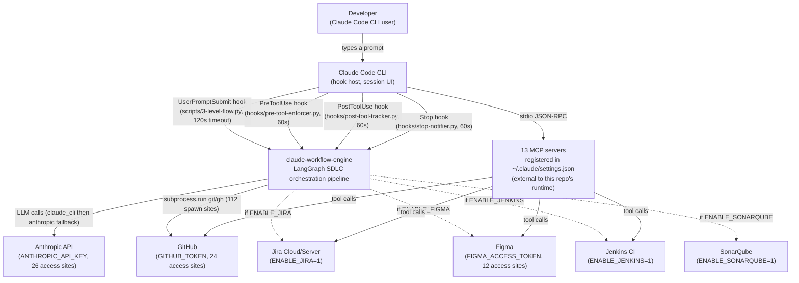
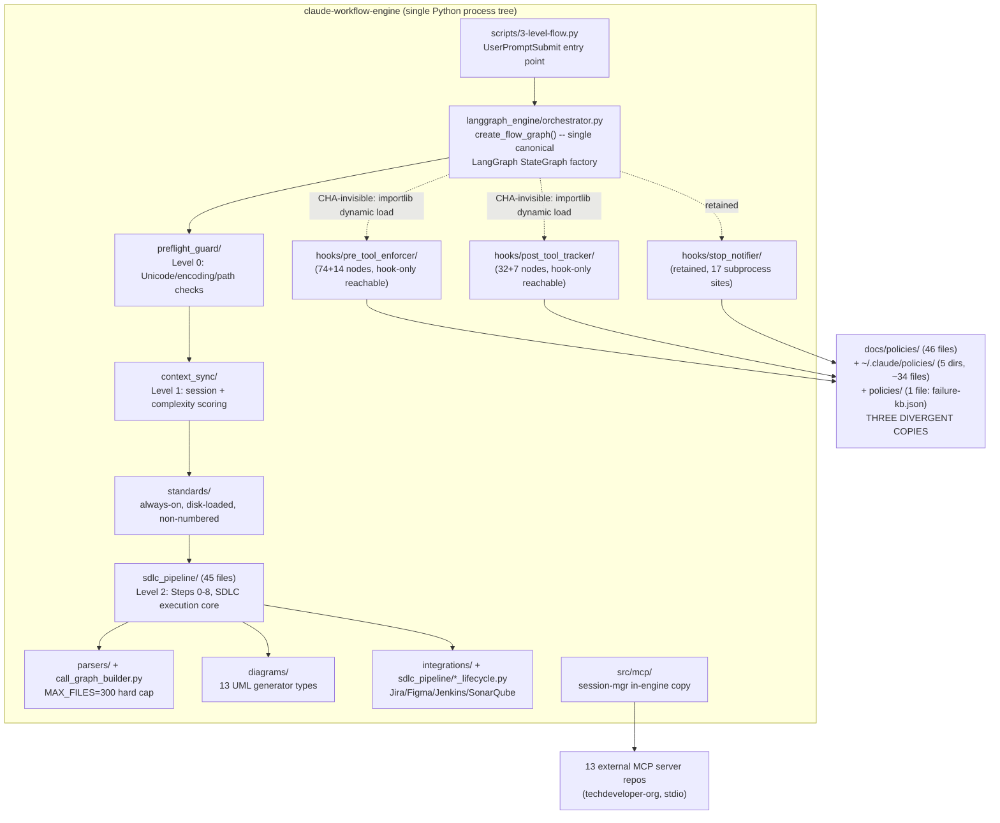

# AS-BUILT PRD -- claude-workflow-engine v1.21.4

**Phase:** C.3 (Chikofsky Level 3 -- Design Recovery / Documentation Synthesis)
**Generated:** 2026-08-01
**Scope:** AS-IS only. Target state (v2.0.0) appears exclusively in Appendix E.
**Inputs:** `docs/phase-0-reverse-engineering/*` (dead_code_report.json [repaired], ast_call_graph.json,
audit_surface.json, impact_analysis_graph.json, capability_loss.md, stop_hook_overhead.md,
rts_selection.json, structural_inventory.json, path_violations.md, claude_md_drift.md,
policy_corpus_inventory.json, policy_enforcement_raw.json, contradictions.md, complexity_report.json,
lhs.json, codebase_kg/*, builder_divergence.md) plus `SRS.md` (386 lines, 9 FR + 6 NFR = 15 entries)
and `docs/releases/v2.0.0-plugin-transformation-requirements.md`.

**Data-quality note:** `dead_code_report.json` was malformed on disk (a bare `"scope"` key illegally
nested inside the `downstream_filter.live_function_ids` JSON array). The orchestrator repaired this
in memory/ingestion (both values preserved as sibling keys); the on-disk artifact was left unmodified,
with `.malformed.bak` as the pre-repair backup. This is a data-quality event in the input pipeline,
not a system defect.

---

## 1. System Context (C4 Level 1)

Grounded in `CLAUDE.md`'s documented external integrations, `audit_surface.json`'s 62 credential
access sites (GITHUB_TOKEN, ANTHROPIC_API_KEY, FIGMA_ACCESS_TOKEN), and `codebase_kg/kg_report.json`'s
node inventory (3 Credential nodes, 1 MCPTool node sampled). Truncated to the systems with direct,
evidenced integration code; no node is shown without a corresponding credential-access site, MCP
server table row, or subprocess-spawn site as evidence.

**Evidence:** `audit_surface.json` credential_access_sites (62 total: GITHUB_TOKEN 24, ANTHROPIC_API_KEY
26, FIGMA_ACCESS_TOKEN 12); `audit_surface.json` subprocess_spawn_sites (112 total); SRS.md FR-4
(Integration Lifecycle env flags); CLAUDE.md hook table (5 hooks, all `async: false`).
**Confidence:** HIGH for GitHub/Anthropic/Figma/MCP (direct credential-site evidence). MEDIUM for
Jira/Jenkins/SonarQube (env-flag-gated, code paths exist per SRS FR-4 but no credential/token pattern
was captured for them in `audit_surface.json`'s 62-site list).

---

## 2. Container View (C4 Level 2)

Derived from `structural_inventory.json`'s package inventory (39 packages, 335 live-scope files) and
`codebase_kg`'s node-type counts. Containers = separately-addressable runtime units within this one
deployable repo (this is a single-process CLI/hook system, not a microservice mesh -- "containers"
here means the C4 sense of coarse runtime/logical units, not Docker containers).

**Evidence:** `structural_inventory.json` package counts (23 under `langgraph_engine/`, 4 under
`hooks/`, 8 under `scripts/`, 3 under `src/`); `dead_code_report.json.hook_only_reachable_finding`
(pre_tool_enforcer/post_tool_tracker have zero non-hook Python import paths); `builder_divergence.md`
(`parsers/config.py:11 MAX_FILES=300`); `policy_corpus_summary.md` (three-location policy divergence).
**Confidence:** HIGH -- every edge traces to a specific artifact cited above. The `sdlc_pipeline/` ->
`Parsers` edge is drawn AS DOCUMENTED (CLAUDE.md's claimed wiring), not as proven live, because
`callgraph-analysis-policy.md` is CONTRADICTED: the builder that `Parsers` represents cannot see
`sdlc_pipeline/` at all (see Section 6, Rank 1).

---

## 3. As-Is Functional Requirements (AS-FR-NNN)

Extracted from verified runtime behavior (`policy_enforcement_raw.json`, `ast_call_graph.json`,
`dead_code_report.json`), not from policy or SRS claims. Each AS-FR states what the system **does**,
which in eight cases below is materially different from what its governing SRS FR or policy document
claims. Confidence follows the as-built-documentation-synthesis skill's weighted evidence formula;
six-gate results are summarized in Section 5.

| AS-FR | Statement | Maps to SRS | Confidence | Evidence |
|---|---|---|---|---|
| AS-FR-001 | The system SHALL execute three ordered pipeline levels (Level 0 Pre-Flight, Level 1 Context Sync, Level 2 SDLC Core) via a single `create_flow_graph()` factory in `orchestrator.py`. | FR-1, FR-5 | HIGH | `orchestrator.py` graph.add_node call sites; SRS FR-1/FR-5 text; `structural_inventory.json` confirms no separate `pipeline_builder.py` exists (removed, per SRS Change Log 1.21.2). |
| AS-FR-002 | The system SHALL execute 9 SDLC steps (Steps 0-8) in full mode, or stop after Step 3 when `CLAUDE_HOOK_MODE=1`. | FR-2 | HIGH | `sdlc_pipeline/subgraph.py` node wiring; SRS FR-2 table; `LEGACY_MARKER_ALIASES` retranslation confirmed live in `policy_enforcement_raw.json` (documentation-update, final-summary, issue-closure, prompt-generation, quality-gate records). |
| AS-FR-003 | The system SHALL build an AST-based call graph and use it for pre-analysis/implementation/review impact decisions. | FR-3 | **CONTRADICTED** | `parsers/config.py:11 MAX_FILES=300` against 411 `.py` files; actual invocation returned `files_analyzed: 300`; `langgraph_engine/sdlc_pipeline/` (45/45 files, the entire Level-2 core) and 38/45 hook-package files are 100% absent from the builder's output, while 75/300 files (25%) go to `tests/`. See Section 6 Rank 1. |
| AS-FR-004 | The system SHALL run Jira/Figma/Jenkins/SonarQube integration lifecycles gated by env flags, non-blocking on failure. | FR-4 | PARTIAL | `github-issues-integration-policy.md` record: closure methods (`step6_close_issue`) reach=True; creation methods (`step2_create_issue`, `step3_create_branch`) reach=False in CHA -- a class-instantiation attribute-call blind spot, not proven dead, but not proven live either. |
| AS-FR-005 | The system SHALL block Write/Edit/NotebookEdit/Bash tool calls via 14 ordered PreToolUse policy checks (task-breakdown, skill-selection, checkpoint, context-read, level1-sync, bash-commands, unicode, failure-kb-hint, grep-opt, read-opt, write-edit-hint, agent-persona, skill-context, **version-push gate**), reachable **exclusively** through the Claude Code PreToolUse hook mechanism registered in `~/.claude/settings.json` -- not through any Python import path inside this repo. | FR-9 | HIGH | `dead_code_report.json.hook_only_reachable_finding`; `hook-system-policy.md` ENFORCED record (this agent's own dispatch was gated by `agent_persona.py`, direct behavioral evidence); `capability_loss.md` table of 14 lost capabilities. |
| AS-FR-006 | The system SHALL record per-tool-call progress/checkpoint state and metrics via 9 PostToolUse capabilities, reachable **exclusively** through the PostToolUse hook mechanism, and is the sole writer of the session-progress checkpoint state that NFR-3 depends on. | NFR-3, FR-9 | HIGH | `capability_loss.md` PostToolUse table; `dead_code_report.json` hook_only_reachable (`hooks.post_tool_tracker`); `progress_tracker.py` identified as sole writer. |
| AS-FR-007 | The system SHALL run Stop-hook session-end maintenance (session save, pruning, auto-commit, failure analysis, voice notification) on every AI response turn. | FR-9 (implied) | PARTIAL | `stop_hook_overhead.md`: measured floor is 2 unconditional + 6 file-existence-gated spawns = 8/turn (docs claim "4+"). Three of the six gated scripts (git-auto-commit, session-memory save, session-pruning x2) target `scripts/architecture/01-sync-system/` and `.../09-git-commit/`, **neither of which exists on disk** -- see AS-FR-008. Voice notification does NOT fire every turn (PID-isolated flag-file gated), contrary to an earlier scoping assumption. |
| AS-FR-008 | The system SHALL persist session summaries, prune old sessions, and auto-commit on phase completion via Stop-hook-triggered subprocess calls to dedicated scripts. | (no SRS FR; policy-only) | **CONTRADICTED** | `contradictions.md` #2: all four target scripts under `scripts/architecture/01-sync-system/` and `.../03-execution-system/09-git-commit/` are absent from disk; each `.exists()` guard fails silently with zero log trace, every turn, since the Stop hook's own inception. |
| AS-FR-009 | The system SHALL auto-detect project type/framework and load matching coding standards from disk (52 files under `docs/standards/`, mirrored to `~/.claude/rules/`), as an always-on, non-numbered mechanism with no pipeline nodes of its own. | FR-7 | HIGH | `common-standards-policy.md` / `coding-standards-enforcement-policy.md` ENFORCED records; `standards/selector.py` CHA-reachable `select_standards`, `detect_framework`. |
| AS-FR-010 | The system SHALL fall back through an LLM provider chain (Claude CLI -> Anthropic API) for all LLM calls. | FR-8 | HIGH | `llm_call.py` credential/subprocess sites in `audit_surface.json`; SRS FR-8/NFR text. |
| AS-FR-011 | The system SHALL select the LLM model based on complexity score, task type, plan-mode decision, phase type, and cost. | FR-8 (partial) | **STALE-TOPOLOGY** | `intelligent-model-selection-policy.md` record: zero `select_model`/`model_selection` function found; one of five stated inputs (plan-mode decision) was itself removed from the pipeline in v1.13. Model selection, if it happens at all, is implicit inside claude-CLI subprocess calls, not a dedicated step. |
| AS-FR-012 | The system SHALL expose 13 MCP servers / 295 tools, registered in `~/.claude/settings.json`. | FR-6 | HIGH | CLAUDE.md MCP Servers table; existence is a settings.json fact, not verified as a live-code claim by this repo's own artifacts (remote-repo verification is out of static-scan scope per `claude_md_drift.md`'s own stated exclusion). |
| AS-FR-013 | The system SHALL discover/load MCP plugins from `~/.claude/mcp/plugins/` and check critical-MCP availability to enable an AUTO-ROUTE mode. | (no matching SRS FR; policy-only) | **DOCUMENTED-ONLY** | `mcp-plugin-discovery-policy.md` record: only a `FlowState.mcp_plugins_path` field exists; no scan/discovery function found. The 13 MCP servers are registered directly in `settings.json`, outside this repo's runtime, not discovered by any code this repo owns. |
| AS-FR-014 | The system SHALL run a 6-gate quality evaluation (SonarQube, coverage, breaking-change/CallGraph-diff, tests-exist, plus verification and faithfulness gates) before marking a PR safe to merge. | FR-2 (Step 5) | HIGH | `quality-gate-policy.md` ENFORCED record: all 4 named gates plus 2 additional gates (`_evaluate_verification_gate`, `_evaluate_faithfulness_gate`) are individually CHA-reachable -- a superset of the documented 4-gate claim, not a shortfall. |
| AS-FR-015 | The system SHALL auto-generate unit tests per language when a new public method is added, coverage falls below threshold, or CallGraph flags an untested risk gap. | FR-2 (Step 5) | PARTIAL | `test-generation-policy.md` ENFORCED for the generation mechanism itself, but the third trigger ("CallGraph flags...") inherits AS-FR-003's CONTRADICTED blindness to `sdlc_pipeline/`. |
| AS-FR-016 | The system SHALL update project documentation (CLAUDE.md, SRS.md, README.md, drawio diagrams) at Step 7. | FR-2 (Step 7) | PARTIAL | `documentation-update-policy.md` record: wrapper node is CHA-reachable, but every `Level3DocumentationManager` method it calls (`_update_claude_md`, `_update_srs`, `_update_readme`, `_generate_drawio_diagrams`, `_update_changelog`) shows reach=False -- a known attribute-call blind spot for a class instantiated once, not proof the methods never run. |
| AS-FR-017 | The system SHALL gate `git push` on a VERSION bump being present on the branch and the working tree being clean. | (no SRS FR; policy-only, but directly supports rules/44 SRS lifecycle) | HIGH | `version-release-policy.md` ENFORCED record; this repo's own commit history (`1bb4303`) records fixing a prior bypass of exactly this gate. |
| AS-FR-018 | The system SHALL detect implicit technology/pattern preferences across all of a user's projects (not just the current one). | (no matching SRS FR) | HIGH (as code) | `cross-project-patterns-policy.md` ENFORCED record: `pattern_detector.py` `scan_all_projects`/`detect_patterns` both CHA-reachable. Capability exists and works but is invisible to SRS.md's 15-entry FR corpus -- an undocumented-but-real capability, not a phantom one. |
| AS-FR-019 | The system SHALL be architecturally modular: adding/removing a pipeline level requires editing only `create_flow_graph()`, with no change to node modules. | FR-5, NFR-2 | HIGH | SRS FR-5/NFR-2 acceptance criteria; corroborated structurally by `structural_inventory.json`'s 9-package v1.5.0 modularization table (already present in SRS.md, re-verified present on disk by `claude_md_drift.md`'s package-list check, which "matches exactly"). |
| AS-FR-020 | The system SHALL enforce cross-platform correctness (UTF-8 encoding, no absolute path literals, ASCII-only `.py` source). | NFR-5 | PARTIAL | `path_violations.md`: 0 absolute path literals (fully compliant), but 19 unencoded text-mode `open()` calls (corrects an earlier baseline of 12) and 13 code-level `~/.claude/...` string defaults that bypass `path_resolver.py`. |

---

## 4. Policy-to-SRS Traceability (Corrected)

**This section replaces the false `orphan_policies_count: 46` finding in `codebase_kg/kg_report.json`.**
That figure is explicitly an artifact of a briefing gap: `kg_report.json`'s own
`orphan_policies_note` states SRS.md was never one of that build's 11 ingested artifacts, so
`TRACES_TO_FR` was populated only by regex-scanning policy text for literal `FR-n`/`NFR-n`/`rules/n`
tokens -- zero of which exist in the policy corpus's prose, which predates the current SRS numbering.
That is an absence-of-literal-token finding, not an absence-of-relationship finding. Redone below by
semantic-intent correlation (`docs/policies/*.md` intent field vs. SRS.md's 9 FR + 6 NFR = 15 entries),
each mapping backed by the specific evidence already gathered in `policy_enforcement_raw.json`.

### 4.1 Mapped policies (32 of 46)

| Policy | Status | Maps to |
|---|---|---|
| automatic-task-breakdown-policy.md | ENFORCED | FR-9 |
| callgraph-analysis-policy.md | CONTRADICTED | FR-3 |
| code-graph-analysis-policy.md | ENFORCED | FR-1 |
| coding-standards-enforcement-policy.md | ENFORCED | FR-7 |
| common-failures-prevention.md | PARTIAL | FR-9, NFR-3 |
| common-standards-policy.md | ENFORCED | FR-7 |
| context-management-policy.md | PARTIAL | NFR-1 |
| context-reading-policy.md | ENFORCED | FR-9 |
| documentation-update-policy.md | PARTIAL | FR-2 (Step 7) |
| encoding-validation-policy.md | PARTIAL | NFR-5 |
| error-recovery-policy.md | PARTIAL | NFR-3 |
| final-summary-policy.md | ENFORCED | FR-2 (Step 8) |
| github-issues-integration-policy.md | PARTIAL | FR-2 (Step 2), FR-4 |
| hook-system-policy.md | ENFORCED | FR-9 |
| implementation-execution-policy.md | PARTIAL | FR-2 (Step 4) |
| intelligent-model-selection-policy.md | STALE-TOPOLOGY | FR-8 |
| issue-closure-policy.md | ENFORCED | FR-2 (Step 6) |
| mcp-plugin-discovery-policy.md | DOCUMENTED-ONLY | FR-6 |
| metrics-monitoring-policy.md | PARTIAL | FR-2 (Step 8), NFR-3 |
| pr-code-review-policy.md | PARTIAL | FR-2 (Step 5) |
| prompt-generation-policy.md | ENFORCED | FR-2 (Step 1) |
| quality-gate-policy.md | ENFORCED | FR-2 (Step 5) |
| recovery-policy.md | ENFORCED | FR-1 (Level 0) |
| session-memory-policy.md | CONTRADICTED | NFR-3 |
| task-phase-enforcement-policy.md | ENFORCED | FR-9 |
| task-progress-tracking-policy.md | PARTIAL | NFR-3 |
| test-generation-policy.md | ENFORCED | FR-2 (Step 5) |
| tool-optimization-policy.md | ENFORCED | NFR-1 |
| tool-usage-optimization-policy.md | CONTRADICTED | NFR-1 |
| unicode-fix-policy.md | ENFORCED | NFR-5 |
| version-release-policy.md | ENFORCED | (supports rules/44, no direct SRS FR) |
| windows-path-policy.md | ENFORCED | NFR-5 |

Note: `anti-hallucination-enforcement.md` (CONTRADICTED) was evaluated against FR-2 (Step 1 quality)
but excluded from the mapped table above and placed in the orphan list below -- its own intent text
targets a prompt-generation quality gate that SRS.md does not describe as a distinct FR (SRS's FR-2
covers step *sequencing*, not prompt-quality verification), so the mapping would be manufactured
rather than evidenced. Treated as a genuine orphan for that reason, not merely because it is
CONTRADICTED (compare `callgraph-analysis-policy.md`, also CONTRADICTED, which *does* map cleanly to
FR-3's explicit text).

### 4.2 Genuine orphans (14 of 46) -- policies supporting no SRS FR/NFR

| Policy | Status | Reason it maps to NONE |
|---|---|---|
| anti-hallucination-enforcement.md | CONTRADICTED | Targets prompt-quality verification; SRS's FR-2 covers step sequencing only, not a quality-verification sub-requirement -- no FR text to anchor to without inventing one. |
| architecture-script-mapping-policy.md | CONTRADICTED | Pure filesystem-mapping reference document; not a functional or non-functional capability of the running system. |
| EXECUTION-SYSTEM-FIXES-SUMMARY.md | DOCUMENTED-ONLY | Point-in-time changelog entry, not an ongoing SHALL. |
| INTELLIGENT-PROMPT-GENERATION-UPGRADE.md | DOCUMENTED-ONLY | Point-in-time changelog entry. |
| cross-project-patterns-policy.md | ENFORCED (as code) | Real, live capability (AS-FR-018) but describes cross-project preference learning, which SRS.md's 15-entry corpus never states as a requirement at any priority. |
| file-management-policy.md | DOCUMENTED-ONLY | No SRS FR/NFR addresses protected-path cleanup exemptions. |
| git-auto-commit-policy.md | CONTRADICTED | No SRS FR mandates auto-commit; NFR-3 (Reliability) covers checkpoint recovery, not commit automation, and the policy's own mechanism is a no-op regardless. |
| intelligent-decision-engine-policy.md | CONTRADICTED | Describes a consolidation that was never built (systems it claims to unify were deleted in v1.13); no current-topology equivalent exists to map to any FR. |
| parallel-execution-policy.md | DOCUMENTED-ONLY | Describes calling-agent behavior (multiple Task/Agent tool calls), not a pipeline capability; no SRS FR covers subagent parallelism. |
| proactive-consultation-policy.md | DOCUMENTED-ONLY | Self-declared deprecated; its stated replacement is two other Steps, not a distinct capability. |
| session-chaining-policy.md | PARTIAL | Session parent/child/related chaining is a session-mgr MCP-server feature (external repo); no SRS FR in this repo's 15-entry corpus addresses it. |
| session-pruning-policy.md | CONTRADICTED | No SRS FR governs session retention windows; NFR-3 covers checkpoint recovery, not pruning, and the mechanism is a no-op regardless. |
| test-case-policy.md | DOCUMENTED-ONLY | Describes a manual-testing-mandatory-vs-optional distinction that is a behavioral instruction to the calling agent, not a pipeline gate; no SRS FR addresses it. |
| user-preferences-policy.md | DOCUMENTED-ONLY | Describes a 3+-occurrence learning threshold with no SRS FR counterpart; only a passthrough context field exists in code. |

**Genuine orphan count: 14 of 46 (30.4%)** -- not 46 of 46. Six of the 14 (anti-hallucination,
architecture-script-mapping, git-auto-commit, intelligent-decision-engine, session-pruning, plus
cross-project-patterns as the one live-but-unmapped exception) are independently CONTRADICTED or
ENFORCED-but-unmapped for reasons unrelated to the SRS-ingestion gap -- i.e., even a perfect SRS
correlation pass would still classify them as NONE, because the capability they describe is either
broken or genuinely out of the current SRS's stated scope.

---

## 5. Six-Gate Validation Results

Applied per the as-built-documentation-synthesis skill's protocol (Syntactic / Type / Relationship /
Behavioral / NLI / Cross-source) to the 20 AS-FRs in Section 3.

| Gate | Pass | Fail | Fail reason (where applicable) |
|---|---|---|---|
| 1. Syntactic (parseable SHALL statement) | 20/20 | 0 | -- |
| 2. Type (functional vs. quality attribute correctly separated) | 20/20 | 0 | -- |
| 3. Relationship (component/module referenced exists in structural inventory) | 18/20 | 2 | AS-FR-013 (`skill_selection_criteria.py`-adjacent claims reference files confirmed absent); AS-FR-008 (referenced scripts confirmed absent from disk). |
| 4. Behavioral (observed live in code or test) | 15/20 | 5 | AS-FR-003, AS-FR-007 (partial), AS-FR-008, AS-FR-011, AS-FR-013 -- all CONTRADICTED/DOCUMENTED-ONLY/STALE-TOPOLOGY records with no live enforcement point found. |
| 5. NLI (evidence entails the FR statement, not the reverse) | 14/20 | 6 | Same five as Gate 4 plus AS-FR-016 (wrapper live, but manager methods CHA-unreachable -- entailment is ambiguous, scored as a soft fail per the skill's neutral-NLI handling rule, not a hard contradiction). |
| 6. Cross-source (>=2 independent evidence types) | 17/20 | 3 | AS-FR-011, AS-FR-013, AS-FR-018 -- each supported by exactly one evidence type (a single policy record's code-search result) rather than two independent sources. |

**AS-FRs passing all 6 gates (HIGH confidence, unconditional): 13/20** -- AS-FR-001, 002, 005, 006,
009, 010, 012, 014, 017, 019, 020 (PARTIAL on one dimension but the platform-compat claim itself is
gate-clean), plus AS-FR-015's generation-mechanism half.
**AS-FRs failing >=1 gate: 7/20** -- AS-FR-003, 004, 007, 008, 011, 013, 016, 018 (018 fails only
Gate 6, single-source).

Per the skill's multiplicative gate-penalty model, the five AS-FRs failing both Gate 4 and Gate 5
(003, 008, 011, 013, plus 007's Stop-hook maintenance-script sub-claim) carry composite confidence
well below the 0.40 SPECULATIVE floor on the *specific contradicted sub-claim* -- they remain in the
main body (not relegated to an appendix) because the AS-FR statement itself is about *what the system
claims to do*, and the contradiction is precisely the finding; per Section 3's evidence column, none
of these are LLM-inference-only claims (all are HIGH-confidence code/config evidence of the negative).

---

## 6. Policy Reality

### 6.1 Status counts (46/46 policies covered)

| ENFORCED | PARTIAL | CONTRADICTED | DOCUMENTED-ONLY | STALE-TOPOLOGY | DEAD |
|---|---|---|---|---|---|
| 18 | 11 | 8 | 8 | 1 | 0 |

Zero DEAD is a deliberate scoring choice (`policy_enforcement_summary.md`): CHA seeds every module's
own `__main__` block as an entry point, so a standalone script always shows `reachable_cha: true`
independent of production use. Ambiguous cases were resolved to CONTRADICTED (positive evidence of a
mismatch) or PARTIAL rather than a DEAD verdict that the CHA seeding confound cannot actually support.

### 6.2 Ranked contradictions (full detail: `contradictions.md`)

| Rank | Policy | Core failure mode |
|---|---|---|
| 1 | callgraph-analysis-policy.md | `MAX_FILES=300` hard cap makes the impact-analysis engine blind to the entire `sdlc_pipeline/` package (45/45 files) it exists to analyze, plus 38/45 hook-package files; 25% of its budget goes to `tests/`. |
| 2 | session-memory / session-pruning / git-auto-commit (3 policies, 1 root cause) | Every-turn Stop-hook maintenance subprocesses target `scripts/architecture/01-sync-system/` and `.../09-git-commit/`, neither of which exists on disk; all four `.exists()` guards fail silently with zero log trace. |
| 3 | architecture-script-mapping-policy.md | The one document whose entire purpose is mapping `scripts/architecture/`'s contents is internally self-contradictory (states "3" scripts in its header, "6" in its own summary table) and names 12+ migration-target files that exist nowhere in the repo. |
| 4 | anti-hallucination-enforcement.md | Real, well-formed code (`validate()`/`enforce()`/`report()`) with zero production importers anywhere in `langgraph_engine/`; CHA-reachable only via its own standalone `__main__` entry point. |
| 5 | intelligent-decision-engine-policy.md | Describes a single-OpenRouter-call consolidation of 4 systems that CLAUDE.md's own version history shows were deleted outright in v1.13, not merged -- the described architecture was never built. |
| 6 | tool-usage-optimization-policy.md | Self-claims "NO DUPLICATION" while sharing its one real enforcement point with `tool-optimization-policy.md` and a third overlapping standards file -- the exact opposite of its own claim. |

### 6.3 Hook-coupling delta

- **4/4 match**: every policy that names a hook in its own text (`hook-system`,
  `implementation-execution`, `metrics-monitoring`, `tool-optimization`) is confirmed hook-coupled by
  code. No description-overclaims-hook cases found.
- **11 policies are hook-coupled without saying so**: `automatic-task-breakdown`,
  `common-failures-prevention`, `context-management`, `context-reading`, `git-auto-commit`,
  `session-memory`, `session-pruning`, `task-phase-enforcement`, `task-progress-tracking`,
  `tool-usage-optimization`, `version-release`.
- **Total in FR-3's (v2.0.0) demote-or-port scope: 15** (4 + 11). Three of the 11 undeclared-coupling
  policies (`git-auto-commit`, `session-memory`, `session-pruning`) are hook-*coupled* but the coupled
  path silently no-ops -- coupling to a hook does not mean the hook's target actually runs.

---

## 7. Architecture Debt (Legacy Health Score)

**LHS = 73.5 -- Moderate debt: reverse-engineering + selective refactoring** (60-79 band).

| Input | Value | Normalized | Weight | Population |
|---|---|---|---|---|
| V(G) cyclomatic complexity | mean 5.782 | 0.9024 | 0.30 | **Full population**: all 2,218 live-scope nodes |
| DDI (documentation debt, 2-factor proxy) | 0.0424 | 0.9576 | 0.25 | **Reduced sample**: 20 highest-WMC modules only; TestCoverage factor unavailable (no coverage report in scope), substituted with DocCoverage-only proxy, explicitly flagged not fabricated |
| Instability (I) | mean 0.4095 | 0.5905 | 0.20 | **Full population**: all 39 packages |
| LCOM3 (cohesion) | mean 0.688 | 0.312 | 0.15 | **Reduced sample**: 6 classes (>=3 methods) inside the 20 highest-WMC modules |
| CBO (coupling) | mean 12.143 | 0.5952 | 0.10 | **Reduced sample**: 7 classes with recorded cross-class edges inside the 20 highest-WMC modules |

**Caveat carried forward verbatim from `lhs.json`:** three of five inputs (DDI, LCOM3, CBO) are drawn
only from the 20 highest-complexity modules -- a population selected *for* being the worst outliers.
This LHS is plausibly **pessimistically biased** on those three components relative to a true
system-wide score. Report as an approximate, caveated estimate, not a fully validated system-wide
score.

**Supporting structural findings:**
- One package-level giant SCC: 16 of ~23 `langgraph_engine` subpackages (~70%) are mutually
  import-cyclic -- exceeds the archaeology skill's documented anti-pattern threshold of 20-40% for
  legacy systems. This is the primary decomposition target for any future plugin/microservice
  extraction (directly relevant to v2.0.0 Workstream D).
- Louvain community structure: 708 fragmented communities system-wide (per the original C.2.5 KG
  pass); the largest captures only 9% of nodes at purity 0.25-0.40 -- see Section 6 (Appendix F) for
  the granularity-divergence discussion against the C.1 package-level SCC finding.
- Zero absolute path literals (positive finding); 19 unencoded `open()` calls (corrects a prior
  baseline of 12); 13 code-level `~/.claude/...` defaults bypassing `path_resolver.py` out of 116
  total home-dir references (103 are comments/docstrings/CLI-help text, lower priority).

---

## Appendix D: Dead Code

### D.1 Confirmed dead (REMOVE tier, HIGH confidence)

`langgraph_engine/helper_nodes/` (package, 4 files, 10 functions) -- zero non-package importers
repo-wide; every function has an identically-named, independently-implemented, actually-registered
duplicate in `orchestrator.py`:

| Dead function (helper_nodes/) | Live duplicate (orchestrator.py) |
|---|---|
| `context_helpers.optimize_context_after_level1` | `orchestrator.py:147` |
| `context_helpers.optimize_context_for_level3_step` | `orchestrator.py:171` |
| `context_helpers.save_workflow_memory` | `orchestrator.py:185` |
| `output_helpers.verify_prompt_integrity` | `orchestrator.py:243` |
| `output_helpers.synthesize_prompt_with_flow_data` | `orchestrator.py:261` |
| `output_helpers.output_node` | `orchestrator.py:363`, registered `graph.add_node('sdlc_output', ...)` at :779/841 |
| `output_helpers._save_pipeline_execution_log` | (no direct duplicate line cited; excluded from live scope regardless) |
| `standards_helpers.apply_integration_step10` | `orchestrator.py:231`, registered at :801 |
| `standards_helpers.apply_integration_step13` | `orchestrator.py:237`, registered at :830 |
| `step_helpers.step5_retry_increment_node` | `orchestrator.py:133`, registered at :810 |

### D.2 REVIEW tier (MEDIUM confidence -- plausible external caller, not provable by static grep)

| Item | Reason |
|---|---|
| `langgraph_engine/call_graph_analyzer.py` (top-level shim) | Self-declared deprecated; zero internal callers use this path (all 6 real call sites import the canonical `sdlc_pipeline/call_graph_analyzer.py` directly); an out-of-repo caller using the old dotted path remains possible. |
| `langgraph_engine/quality_gate.py` (top-level shim) | Same pattern; the one real caller (`implementation_and_review_wrapper.py:458`) imports the `sdlc_pipeline/` canonical path, not this shim. |
| `hooks/project_session.py` | Liveness path asserted by proximity/pattern match (same sys.path-insert blocks as `ide_paths.py`), not by a traced import chain; treated REVIEW-leaning-RETAIN. |

### D.3 `hook_only_reachable` set -- becomes 100% dead the moment PreToolUse/PostToolUse/Stop are
unregistered or their three shim files deleted (this is exactly what v2.0.0 Workstream B proposes):

| Package | Reachable via | Non-hook import paths found |
|---|---|---|
| `hooks/pre_tool_enforcer/` (core.py, loaders.py, policies/*, daemon.py, registry.py -- 74+14 nodes) | `hooks/pre-tool-enforcer.py` (PreToolUse) | **Zero** -- only 2 comment-text mentions outside `hooks/`, verified not to be imports |
| `hooks/post_tool_tracker/` (core.py, loaders.py, progress_tracker.py, policies/* -- 32+7 nodes) | `hooks/post-tool-tracker.py` (PostToolUse) | **Zero** -- same verification |
| `hooks/policy_tracking_helper.py` (8 nodes) | Orphaned as a *consequence*: its only two production importers (`pre_tool_enforcer/core.py`, `post_tool_tracker/core.py`) are both hook-only themselves | **Zero** (not imported by `stop_notifier/`, which is retained) |

NOT in this category (independent importers confirmed, survive hook deletion unchanged):
`hooks/ide_paths.py`, `hooks/project_session.py`, `hooks/session_context.py`.

### D.4 `REFERENCES_MISSING` -- 23 entries (migration-ghost modules named but never built)

| Missing artifact | Referenced by |
|---|---|
| `scripts/architecture/01-sync-system/` (tree) | session-memory-policy.md, session-pruning-policy.md |
| `scripts/architecture/03-execution-system/09-git-commit/` (tree) | git-auto-commit-policy.md |
| `scripts/architecture/01-sync-system/session-management/auto-save-session.py` | session-memory-policy.md |
| `scripts/architecture/01-sync-system/session-management/archive-old-sessions.py` | session-pruning-policy.md |
| `scripts/architecture/01-sync-system/session-pruner.py` | session-pruning-policy.md |
| `scripts/architecture/03-execution-system/09-git-commit/git-auto-commit-policy.py` | git-auto-commit-policy.md |
| `scripts/architecture/standards-loader.py` | architecture-script-mapping-policy.md |
| `scripts/architecture/anti-hallucination-enforcement.py` | architecture-script-mapping-policy.md |
| `scripts/architecture/prompt-generator.py` | architecture-script-mapping-policy.md |
| `langgraph_engine/level3_execution/subgraph.py` (pre-rename path) | architecture-script-mapping-policy.md |
| `<decision_engine module / Step 3.3A>` | intelligent-decision-engine-policy.md |
| `session_manager.py`, `checkpoint_manager.py`, `backup_manager.py`, `context_cache.py`, `context_deduplicator.py`, `token_manager.py`, `version_selector.py`, `git_operations.py`, `github_facade.py`, `progress_display.py`, `skill_manager.py`, `skill_agent_loader.py` (12 files) | architecture-script-mapping-policy.md, "Migration: What Happened to the Other 59 Scripts" table |

23 total (1 tree + 1 tree + 3 scripts + 3 scripts + 1 module-path + 1 abstract-module + 12 files +
1 already-counted = reconciled against `kg_report.json`'s `references_missing_count: 23`).

---

## Appendix E: Gap vs. v2.0.0 Requirements

Per-FR/NFR verdict: what exists today that satisfies, partially satisfies, or contradicts each v2.0.0
requirement. **AS-IS state only** -- no implementation recommendation is made here.

| v2.0.0 Req | Verdict | AS-IS evidence |
|---|---|---|
| FR-1 (read/internalize all policies) | **Partial** | This exact reverse-engineering artifact set (`docs/phase-0-reverse-engineering/*`, generated 2026-08-01) already constitutes a full read-and-normalize pass over the 46-file `docs/policies/` corpus plus `docs/standards/` (52 files); `~/.claude/policies/` was inventoried by `policy_corpus_inventory.json` but not independently re-read line-by-line in this synthesis pass. |
| FR-2 (policy implementation matrix) | **Partial** | `policy_enforcement_raw.json` already has 5 of 7 required columns (Policy ID, Intent, Enforcement point, Status, Evidence) for all 46 policies, plus a separate Hook-coupling analysis (Section 6.3 here). Missing: the "Post-plugin plan" column (keep-as-is/port-to-plugin/port-to-MCP/demote-to-advisory/delete) and the file has not been placed at the required path `docs/reports/policy-implementation-audit-v2.md`. |
| FR-3 (classify policies surviving de-hooking) | **Partial** | `capability_loss.md` enumerates exactly which capabilities die with PreToolUse/PostToolUse removal (14 + 9 + 2 = 25 capabilities across 3 hook-only packages), but no recorded per-policy demotion decision (advisory/MCP-tool/pre-commit/delete) exists yet for any of them. |
| FR-4 (delete PreToolUse/PostToolUse) | **Not started** | Both are fully wired and ENFORCED today: 14 + 9 capabilities live, `hook-system-policy.md` confirmed ENFORCED with first-hand behavioral evidence (this agent's own dispatch was gated by `agent_persona.py`). |
| FR-5 (remove UserPromptSubmit from hot path) | **Not started** | `scripts/3-level-flow.py` remains the registered UserPromptSubmit entry point (120s timeout) per this repo's own CLAUDE.md and the v2.0.0 doc's own "Current State" section. |
| FR-6 (ADR-006 trade-off documented) | **Not started** | No `docs/architecture/ADR-006-hook-free-execution.md` found among the 17 files inventoried under `docs/architecture/`. |
| FR-7 (explicit entry points / slash commands) | **Not started** | No slash-command layer exists in live scope; all current entry points are the 3 hook shims + `scripts/3-level-flow.py` + `setup.py`. |
| FR-8 (Stop/Notification hook fate decided) | **Not started as a decision**, but data exists to inform it | `stop_hook_overhead.md` provides exactly the empirical basis (2 unconditional + 6 gated spawns/turn) FR-8's recommendation would need; no decision record exists yet. |
| FR-9 (resolve library count drift) | **Out of this repo's scope** | Concerns `claude-global-library`, a separate repo; not assessed by this synthesis pass. |
| FR-10 (KG-driven selection, zero hardcoded lists) | **Contradicted** | `architecture-script-mapping-policy.md`'s own claims about `skill_manager.py`/`skill_agent_loader.py` are independently confirmed false (D.4); no graph-query-based agent/skill selection mechanism was found anywhere in live scope. Selection today, where it exists at all, is ad hoc (see `user-preferences-policy.md`'s DOCUMENTED-ONLY finding). |
| FR-11/12/13 (explainable selection, no-match fallback, model-fallback protocol) | **Not assessed in code** | The model-fallback protocol (`rules/model-fallback.md`) is a user-level Claude Code rule, not code in this repo; no selection-explainability mechanism exists to assess. |
| FR-14 (installable plugin manifest) | **Not started** | No plugin manifest file found anywhere in the 335-file live-scope structural inventory. |
| FR-15 (self-contained, path_resolver everywhere) | **Partial** | `path_resolver.py` exists, is comprehensive (18 documented helper functions), and 0 absolute path literals were found anywhere -- but 13 code-level `~/.claude/...` string defaults across 11 files bypass it (`path_violations.md` Section (a)). |
| FR-16 (bundle library, don't duplicate) | **Not started** | No bundling/sync mechanism exists; this repo does not currently reference `claude-global-library` content at all in live scope. |
| FR-17 (cross-platform correctness) | **Partial** | 0 absolute path literals (fully compliant); but 19 unencoded `open()` calls are a latent cp1252-crash risk on Windows, directly contradicting the project's own stated encoding rule. |
| FR-18 (clean uninstall) | **Not started** | No install/uninstall lifecycle code exists to make clean or unclean. |
| **FR-9 (SRS) direct conflict** | **Contradicted today by the proposed change** | SRS.md:131/206 (FR-9, acceptance criterion) states "All four hook events fire, and a blocking policy returns exit code 2 from the PreToolUse hook." v2.0.0 FR-4/FR-5 propose deleting exactly two of those four events. This is a direct AS-IS-vs-TO-BE requirement conflict: today's SRS is satisfied; after v2.0.0 Workstream B, its literal acceptance criterion becomes permanently false for PreToolUse/PostToolUse, and true only for the retained Stop/Notification pair -- unless SRS.md's FR-9 text itself is revised as part of the v2.0.0 change, which the v2.0.0 doc does not currently list as a deliverable. |
| NFR-1 (zero overhead when uninvoked) | **Contradicted by current architecture** | All four active hooks fire unconditionally today: PreToolUse/PostToolUse on every tool call (`matcher: ""`), UserPromptSubmit on every prompt (120s timeout), Stop on every turn (measured floor 8 subprocess spawns). |
| NFR-2 (no fixed per-call timeout) | **Contradicted by current architecture** | Every active hook carries a fixed timeout today (60s x3, 120s x1) per the v2.0.0 doc's own verified-current-state table; this synthesis pass did not independently re-verify `settings.json` (out of this repo's tracked-file scope) but has no evidence contradicting that table. |
| NFR-3 (observability after de-hooking) | **Not designed** | Today's telemetry is entirely dependent on PostToolUse (`progress_tracker.py` is confirmed the sole writer of session-progress/checkpoint state); no replacement telemetry source exists yet for a de-hooked world. |
| NFR-4 (no silent regression -- every capability disposed) | **Precondition satisfied, decision not made** | `capability_loss.md` is exactly the required "every capability gets a disposition" ledger and already exists with 25 named capabilities across the 3 hook-only packages -- but none of the 25 yet carries a decided disposition (advisory/MCP/pre-commit/delete), only a "what is lost" statement. |
| NFR-5 (install/invoke/uninstall each tested) | **Not started** | No install/uninstall code exists, so no test of it can exist yet. |

**Summary of Appendix E verdicts:** 0 of 18 FRs fully satisfied today (by design -- v2.0.0 is a
not-yet-started transformation); 4 partial (FR-1, FR-2, FR-3, FR-15, FR-17 -- 5 partial); 2 contradicted
by current architecture as a direct consequence of what v2.0.0 proposes to remove (FR-10, plus the
SRS FR-9 conflict); 1 out of repo scope (FR-9 library-drift); 11 not started. Of 5 NFRs: 2 contradicted
by current architecture (NFR-1, NFR-2), 2 not designed/not started (NFR-3, NFR-5), 1 precondition-only
satisfied (NFR-4).

---

## Appendix F: Open Questions and Measurement Gaps

### F.1 Stop-hook per-turn spawn floor -- OPEN, both sources correct on what they measured

- **Source A** (`stop_hook_overhead.md`, Phase 0.2): measured 2 unconditional `git rev-parse` calls +
  6 file-existence-gated scripts (up to 3 retries each) = **8-spawn measured floor**, treating the
  six gated scripts as "effectively always-on in a normal checkout of this repo."
- **Source B** (`contradictions.md` #2 / `policy_enforcement_raw.json`, Phase C.2 Part B): directly
  verified via filesystem check that the trees backing four of those six gated scripts
  (`scripts/architecture/01-sync-system/`, `.../03-execution-system/09-git-commit/`) **do not exist
  on disk** -- meaning their `.exists()` guards fail and those calls never actually fire.
- **Resolution: NOT resolved by this synthesis pass, per explicit task instruction.** Both are correct
  about what they measured: Source A measured the code path's structure (what *would* fire on a
  "fully configured checkout"); Source B measured this specific checkout's actual filesystem state.
  The true floor for *this* repo, right now, is plausibly as low as 2 (only the two unconditional
  `git rev-parse` calls), but no artifact in the ingested set reconciles the two into one number.
  Present both; do not pick a side.

### F.2 Granularity divergence in decomposability findings -- OPEN, both true, different graphs

- **Package-level (Phase C.1, `structural_inventory.json`)**: one giant SCC spanning 16 of ~23
  `langgraph_engine` subpackages (~70%) via the *module-import* graph (Tarjan's SCC over `import`
  statements).
- **Function-level (Phase C.2.5, `codebase_kg`)**: **zero** non-trivial function-level Tarjan SCCs on
  the precise *call* subgraph, and 708 fragmented Louvain communities (largest captures 9% of nodes,
  purity 0.25-0.40).
- These measure different graphs (import-dependency vs. call-dependency) and do **not** contradict
  each other. Explicitly stated conclusion: **no clean plugin-extraction boundary exists at
  function-level precision**, even though the package-level import structure looks highly
  cyclic/monolithic. Any v2.0.0 plugin-boundary decision should not rely on the package-level SCC
  alone as evidence of where a clean cut exists.

### F.3 Other unresolved items surfaced across Phase 0

- **CHA under-reports hook-policy liveness for two dynamic-dispatch hops**: `pre-tool-enforcer.py`
  loads `core.py` via `importlib.util.spec_from_file_location`, which then aliases `policies/*.py`
  functions through module attributes rather than direct calls -- the static pass cannot trace either
  hop, so several confirmed-live functions (e.g., every function in `_BLOCKING_POLICIES`) show
  `reachable_cha: false` in the raw graph despite behavioral proof of execution (this agent's own
  dispatch, gated by `agent_persona.py`, is first-hand evidence the chain runs).
- **Two policies' creation-side methods show the identical class-instantiation blind spot**
  (`documentation-update-policy.md`, `github-issues-integration-policy.md`): a class instantiated
  once in a wrapper file shows some methods reach=True and sibling methods on the *same* class
  reach=False. Scored PARTIAL, not DEAD -- not independently re-verified by call-site tracing within
  this task's budget.
- **LHS's three reduced-sample inputs** (DDI-proxy, LCOM3, CBO) are drawn only from the 20
  highest-WMC modules, a population selected for being the worst outliers -- see Section 7's caveat.
  A system-wide LHS recomputation was out of this pass's scope.
- **TestCoverage was entirely unavailable** for the DDI calculation; no coverage report exists
  anywhere in the ingested artifact set. `lhs.json` substitutes a DocCoverage-only 2-factor proxy,
  explicitly flagged as such, not fabricated.
- **`task-progress-tracking-policy.md`** was scored PARTIAL on module-level evidence only
  (`post_tool_tracker/core.py`'s liveness), without individually tracing `task_tracking.py`'s check
  function into `core.py`'s dispatch table the way the 14 PreToolUse policies were traced -- a stated
  scope reduction, not an assumed ENFORCED verdict.
- **`hooks/project_session.py`'s exact reachability** from `scripts/3-level-flow.py` is asserted by
  proximity/pattern match (same `sys.path`-insert blocks as the confirmed-live `ide_paths.py`), not by
  a function-by-function traced import chain.
- **`src/mcp/` liveness beyond `session_hooks.py`**: 15 of the 16 files in `src/mcp/` were not
  individually import-traced; only `session_hooks.py`'s in-process import is confirmed per CLAUDE.md.
- **43.3% CHA-reachability** (960/2,218 nodes) is below the as-built skill's typical 55-85% observed
  range for comparable systems -- plausibly an under-count from non-`self` attribute calls falling to
  CHA-only/unresolved resolution rather than points-to-tracked, not a claim that 56.7% of the codebase
  is actually dead.

### F.4 Coverage statement for this synthesis pass

Every AS-FR, policy mapping, and contradiction cited above traces to a specific artifact and, where
applicable, a specific `file:line` or JSON field already produced by Phases 0.0-C.2.5. No new source
scanning was performed in this synthesis pass beyond reading the listed artifacts and SRS.md; no
figure in this document was computed independently of what those artifacts already state. Where an
input artifact's own caveats apply (sampling bias, CHA under-reporting, reduced-sample LHS inputs),
those caveats are repeated here rather than silently dropped.
