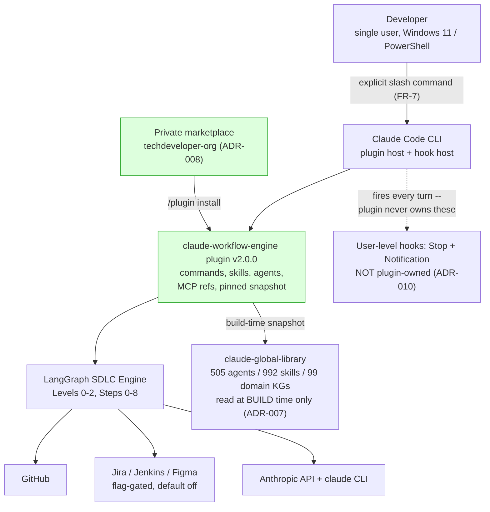
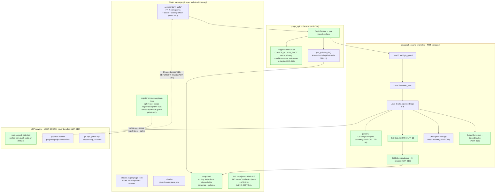

# High-Level Design (Delta HLD) -- claude-workflow-engine v2.0.0, Hook-Free Plugin Architecture

**Mode:** Phase 1 Brownfield (Mode B -- Delta HLD)
**Author:** solution-architect (Domain 5, architecture-quality)
**Date:** 2026-08-01
**Baseline:** v1.21.4 (per `CLAUDE.md`)
**Target:** v2.0.0
**Status:** DRAFT -- pending consensus gate (hallucination-detector NLI 1.0 / context-faithfulness FactScore 1.0)

> **Supersession note.** The prior HLD at this path (dated 2026-07-21, engine v1.20.0, scope
> FR-1..FR-9 engine/library integration) has been preserved unmodified at
> `docs/phase-1-architecture/hld-v1.20.0-superseded.md`. It was not deleted and not edited. This
> document does not restate it; it is a delta against the v1.21.4 as-built.

> **Nature of this system (carried forward from the superseded HLD and still true).** This is a
> single-developer local developer tool: no end users, no public API, no PII, no multi-tenant
> runtime. Product-scale NFRs (QPS, DAU, SLA, capacity) are **not applicable and are not
> fabricated**. Section 9 is scoped to the five NFRs the v2.0.0 requirement set actually defines.

**Citation rule applied throughout.** Every factual claim about existing code cites a Phase 0
artifact or a `file:line` this pass verified directly. Claims verified by this pass and NOT present
in any Phase 0 artifact are marked **[NEW-P1]** so a reviewer can separate them from inherited
findings.

**Skills applied.** `system-design`, `clean-architecture`, `dsa-core`, `error-handling-patterns`
(the four mandatory), plus `event-driven-architecture`, `message-queues-core`, `api-design-core`,
`cloud-security-core`, `logging-patterns`, `performance-optimization`. Where a skill does **not**
cover something this HLD needs, that is stated in SS 13 rather than papered over -- notably, the
library's `system-design` skill contains no C4 or ADR conventions and `cloud-security-core` contains
no STRIDE model or prompt-injection guidance. Those conventions come from the task contract, and the
gap is disclosed.

---

## 1. Context

### 1.1 What this design changes

v1.21.4 is a LangGraph orchestration engine invoked involuntarily through four Claude Code hook
events. v2.0.0 converts it into a Claude Code **plugin** invoked explicitly, shipping zero bundled
hooks (ADR-010) and carrying its own pinned library snapshot (ADR-007).

Current hook registration, verified 2026-08-01 in `~/.claude/settings.json`
(`orchestration_prompt.md` SS 1.2):

| Event | Script | Timeout | Matcher | v2.0.0 disposition |
|---|---|---|---|---|
| UserPromptSubmit | `scripts/3-level-flow.py` | 120s | all prompts | Off hot path (FR-5) |
| PreToolUse | `hooks/pre-tool-enforcer.py` | 60s | `""` (every tool call) | Delete (FR-4) |
| PostToolUse | `hooks/post-tool-tracker.py` | 60s | `""` (every tool call) | Delete (FR-4) |
| Stop | `hooks/stop-notifier.py` | 60s | all stops | Keep, audit + repair (FR-8a/FR-21) |
| Notification | inline PowerShell beep | 15s | all notifications | Keep (user decision) |

All five are `async: false`.

### 1.2 Structural blast radius (inherited, not re-derived)

`orchestration_prompt.md` FR-4a: 135 of 2,218 nodes disappear (6.09%), entirely inside the three
deleted packages. Of 26 candidate cross-boundary edges, **zero survived confidence verification**;
4 were spot-checked and confirmed bare-name collisions. Nothing outside the deletion set breaks
structurally. Node count corroborated by `codebase_kg/metrics.json` (`function_node_count = 2218`,
`precise_edge_count = 2319`).

### 1.3 Scope

In scope: architecture for FR-4/FR-5/FR-7/FR-8a, FR-9a, FR-10..FR-13, **FR-14, FR-14a, FR-15,
FR-16, FR-17, FR-18**, FR-19, FR-21, FR-23, **FR-24**, NFR-1..NFR-5, and the six open architectural
questions. (The FR-14..FR-18 range is now enumerated rather than abbreviated: BA's Phase 2 review
correctly found **FR-16** -- bundle-do-not-duplicate -- architecturally covered by ADR-007's pinned
snapshot but absent from this listing, which is how a covered requirement can read as an omitted
one. **FR-24** -- user-run cleanup runbook -- is new from BA's Phase 2 review and is covered by
SS 10 plus ADR-019's `unregister-mcp` inverse command.)

Out of scope, stated rather than silently omitted: sprint sizing; per-file implementation; the
`claude-global-library` KG rebuild (FR-9, different repo); the SRS supersession text (FR-22, owned
by business-analyst-agent + product-manager-agent at Phase 5 per Resolution 3).

### 1.4 The governing trade-off

This design does not make enforcement better. It makes enforcement **opt-in**. That is the accepted
cost of ADR-006 and it is stated without softening in SS 4.1.

---

## 2. C4 Level 1 -- System Context



**Library counts are 505 agents / 992 skills / 99 domain KGs, and these are deliberate.** A naive
directory listing returns 506/993/101 and is wrong three times over: `agents/INDEX.md` and
`skills/INDEX.md` are *files* sitting alongside the directories, and `knowledge-graph/_master/` and
`knowledge-graph/_orchestration-decision-tree/` are not domains. The figures here match
`knowledge-graph/_master/README.md` (`orchestration_prompt.md` SS 1.3) and are the post-dedup
directory counts. Recorded because this figure has already been challenged once on the naive count
and held; a future reviewer should not "correct" it back.

**What is absent versus v1.21.4:** the PreToolUse, PostToolUse and UserPromptSubmit edges from the
Claude Code CLI into the engine. In v1.21.4 those three edges are the *only* way the engine is
reached; in v2.0.0 the sole inbound edge is an explicit developer action. That single diagram
difference is ADR-006.

Nodes: 10 of a 50 limit. No truncation.

---

## 3. C4 Level 2 -- Container / Component View



Nodes: 21 of a 50 limit. No truncation. (Counting basis: 6 in `PKG` + 3 in `FACADE` + 8 in `ENG` +
3 in `MCPS` = 20 declared nodes, plus `MCPS` itself, which is a subgraph *and* a direct edge target
via `L2 --> MCPS` and `REGCMD --> MCPS`, making it a 21st rendered node. A reviewer counting only
declared nodes will get 20; both counts are defensible, and this states which one the figure uses.
**Re-verified programmatically after the ADR-019/ADR-020 diagram revision**, which replaced
`MCPJSON` with `REGCMD` and `NOHOOKS` with `NOBUNDLE`: the totals are unchanged at 20/21 because the
revision was one-for-one in both cases. The composition changed even though the arithmetic did not,
which is exactly the case where an unrevised basis would have survived unnoticed.)

`langgraph_engine` is drawn as **one container deliberately**. See SS 12 OAQ 5: no evidenced clean
cut exists inside it, so this design does not draw one.

---

## 4. ADR Set

**Count: 7 settled ADRs recorded (006, 007, 008, 009, 009a, 009b, 010) + 10 newly authored
(011-020) = 17 total.** ADR-019 was added at Phase 2 to decide the bundled-MCP question that
ADR-018 could only flag; ADR-020 was added at Phase 2.4 to decide whether ADR-019's downstream
safety precondition is mechanically enforced or documented-only. Counting basis: ADRs, not headings. SS 4.1 carries 5 `####` headings and
SS 4.2 carries 10, because ADR-009, ADR-009a and ADR-009b share a single combined heading. A reviewer
counting headings will get 15; the 17 above counts the decisions themselves.

### 4.1 Settled -- recorded, not re-derived

#### ADR-006: Hook-Free Execution Model (SETTLED)

- **Chosen:** Remove PreToolUse + PostToolUse entirely; take UserPromptSubmit off the hot path.
- **Why:** Two synchronous Python process spawns per tool call on `matcher: ""` with 60s timeouts
  each; up to 120s blocking before Claude sees any prompt. Dominant latency on long tasks and a
  single-point failure surface -- a hook crash blocks the tool call.
- **Rejected:** (a) Keep hooks with `async: true` -- the user's global instruction mandates
  `async: false` for all hooks, and it hides latency rather than removing the spawn cost.
  (b) Narrow the matcher -- reduces but does not eliminate per-call overhead and leaves the 60s
  timeout failure mode intact.
- **Consequence, stated plainly and not softened:** **Enforcement becomes opt-in. Policies do not
  apply on any session where the plugin is never invoked.** A developer who never types the slash
  command gets no policy enforcement at all -- no PreToolUse block, no push gate, no standards
  injection, no progress tracking. Coverage becomes a function of user habit rather than a property
  of the system. This is not a risk to be mitigated away; it is the accepted price of removing
  involuntary per-tool-call execution. Accepted by the user.
- **Required cross-reference in the ADR-006 document (FR-6):** the three FR-4a consequences --
  SRS FR-9 violation (FR-22), version-push bypass reopening (FR-23), and the NFR-3 loss as re-scoped
  in SS 12 OAQ 1 -- must appear in the ADR body, not only in the orchestration prompt.

#### ADR-007: Library Coupling -- Pinned Build-Time Snapshot (SETTLED)

- **Chosen:** Build-time pinned snapshot of library routing registries + dispatchable-agent personas
  only (not all 505 agent directories), with a staleness check against
  `claude-global-library/VERSION`.
- **Why:** Reproducible installs; the plugin works with no workspace checkout; protects against
  shipping against a half-built graph -- the live `master_graph.md` (541/1030) versus `README.md`
  (505/992) divergence is a working demonstration of that risk.
- **Rejected:** Live workspace checkout (breaks on any machine without that exact path; inherits
  mid-build graph inconsistency into routing). Hybrid pinned-KG/live-personas (can route to an agent
  whose persona has since changed, so the recorded justification no longer matches what ran).
- **Dev-mode guardrails (binding):** `CLAUDE_PLUGIN_DEV_MODE=1` is (a) environment-variable only,
  never readable from a bundled config file; (b) tags every selector result and log line
  `mode: dev`; (c) the release script FAILS if the flag is set in the publishing environment.

#### ADR-008: Distribution -- Private Marketplace under techdeveloper-org (SETTLED)

- **Chosen:** `.claude-plugin/marketplace.json` in a repo under `techdeveloper-org`; install by name.
- **Why:** Matches the existing 14-repo MCP organisation; gives the plugin its own version history;
  reinstallable on a new machine with no manual path surgery.
- **Rejected:** Local-directory install only (not reproducible off-machine, no version history).
  Defer the decision (forces the packaging agent to design for a path it never exercises or tests).
- **Binding detail:** an explicit semver `version` is mandatory -- omitting it under git distribution
  makes the commit SHA the version (`orchestration_prompt.md` SS 1.4, CONFIRMED).

#### ADR-009 / 009a / 009b: Canonical Policy Location (SETTLED)

- **ADR-009 Chosen:** `docs/policies/` in-repo is the single source of truth.
- **Why:** Holds all 46 real policy documents; version-controlled alongside the code it governs;
  policy changes become reviewable in a PR.
- **Rejected:** `~/.claude/policies/` stays canonical (outside version control; edits invisible to
  git). Bundle-into-plugin-only (adds a re-bundle step to every policy edit).
- **ADR-009a Chosen** -- one resolution order, implemented once in `path_resolver.py`:
  1. `CLAUDE_PLUGIN_DEV_MODE=1` -> live workspace `docs/policies/` (dev only, tagged)
  2. plugin-bundled snapshot `policies/` under plugin root (standalone install)
  3. repo `docs/policies/` when running inside the engine checkout (contributor path)
  4. hard error naming all three attempted paths -- **never** a silent fallback, and specifically
     never `~/.claude/policies/`
- **ADR-009a Rejected:** repo-only (breaks every standalone install, the primary distribution mode);
  snapshot-only (breaks the contributor workflow, where editing `docs/policies/` must take effect
  without a re-bundle); silent `~/.claude/policies/` fallback (reintroduces the exact divergence
  ADR-009 exists to eliminate, hidden behind a path that appears to work).
- **ADR-009b Chosen** -- merge before canonicalise, executed as one atomic unit at canonicalisation
  time (a Workstream B/C task, not Phase 0), exactly this slate and nothing more:

| Policy (in `~/.claude/policies/`) | Lines | Action |
|---|---|---|
| `recommendations-policy.md` | 427 | **PORT** to `docs/policies/` |
| `core-skills-mandate.md` | 602 | **PARTIAL PORT as advisory** |
| `auto-skill-agent-selection-policy.md` | 710 | **DELETE (permanent)** |
| `adaptive-skill-registry.md` | 109 | **DELETE (permanent)** |
| `auto-plan-mode-suggestion-policy.md` | 1,045 | **DELETE (permanent)** |

  The three deletions total **1,864 irrecoverable lines** (`~/.claude/` is not under git). The user
  was shown the line counts and the irrecoverability and chose permanent deletion. Not reopened
  here; no backup is to be taken. `github-branch-pr-policy.md` is a verified content-identical
  rename of `docs/policies/pr-code-review-policy.md` and is simply not copied.

#### ADR-010: The Plugin Ships ZERO Bundled Hooks (SETTLED, NON-NEGOTIABLE)

- **Chosen:** No `hooks/` directory, no `hooks.json`, ever.
- **Why:** Plugin hooks merge into the user's configuration on enable, and per `hooks.md` "there is
  no way to disable an individual hook while keeping it in the configuration." A plugin that bundled
  hooks would reintroduce the exact failure mode this project exists to remove, with *less* user
  control than today. An empty set cannot activate silently, so the documentation's unresolved
  ambiguity about opt-in-versus-silent activation becomes irrelevant -- the safe design costs
  nothing, so the open doc question does not need answering.
- **Rejected:** Bundle-and-document (users cannot decline individual hooks, so documentation is not
  consent). Bundle-but-default-off (no documented per-hook mechanism exists).
- **Consequence:** the retained Stop and Notification hooks stay exactly where they are, as
  user-level `~/.claude/settings.json` entries the plugin neither owns, installs, nor modifies.
- **Conformance:** presence of `hooks/` or any `hooks.json` in the plugin tree is a CI build failure
  at CRITICAL.

### 4.2 New -- authored by this HLD

#### ADR-011: CheckpointManager Is the Contractual Crash-Recovery Writer

- **Context [NEW-P1]:** Phase 0 records `post-tool-tracker.py` / `progress_tracker.py` as "the sole
  writer of session-progress/checkpoint state" backing SRS's resume guarantee (`as-built-prd.md`
  Appendix E NFR-3; `orchestration_prompt.md` FR-4a Consequence 3). Direct verification this pass
  shows that sentence conflates **two separate state systems**. Full evidence in SS 12 OAQ 1.
- **Chosen:** `langgraph_engine/checkpoint_manager.py::CheckpointManager` is named the sole
  contractual owner of crash-recovery state. Its trigger is the existing step-boundary decorator
  `langgraph_engine/core/step_decorator.py` (`save_success_checkpoint` :158, invoked at :336;
  `save_failure_checkpoint` :171), which already fires on every step on both the success and the
  failure path. Per-tool-call progress state -- the part PostToolUse genuinely owns -- moves to an
  explicit MCP tool call (`mcp-post-tool-tracker`) invoked by the pipeline rather than by a hook.
- **Why:** the replacement writer already exists, is already wired at exactly the granularity SRS's
  "resume from any step" guarantee is written at, and lives entirely outside the three deleted hook
  packages, so FR-4 does not touch it. Designing a new writer would duplicate working code and
  create a second source of truth for one guarantee -- which is how resume state diverges.
- **Rejected:**
  - *Build a new checkpoint writer* -- duplicates `CheckpointManager`'s existing API
    -- 5 of the 7 symbols this HLD cites for the class, listed in full in SS 12 OAQ 1:
    (`save_checkpoint` :145, `load_checkpoint` :209, `get_last_successful_checkpoint` :317,
    `list_checkpoints` :341, `_atomic_write` :113) -- and creates two writers for one guarantee.
  - *Keep a reduced PostToolUse hook purely for checkpointing* -- violates ADR-006 and reinstates a
    per-tool-call process spawn, the exact cost this project exists to remove.
  - *Rely on LangGraph's `SqliteSaver` alone* (`orchestrator.py:784,848`) -- it persists graph state,
    but the repo's own resume entry point (`orchestrator.py::resume_flow` :941 ->
    `quality/recovery_handler.py::resume_from_checkpoint` :462) reads `CheckpointManager`
    checkpoints; making SqliteSaver the contract would mean rewriting a working resume path.
- **Binding durability defects to fix [NEW-P1]:**
  1. `step_decorator.py:169` swallows a checkpoint-save failure with `logger.warning(...)` and
     continues. A best-effort write cannot back a contractual guarantee, and silent-swallow violates
     `rules/01` SS 2. Failure must raise, or set an explicit `checkpoint_degraded` flag the resume
     path refuses to trust.
  2. **Checkpoint and progress must not become a dual write.** Per `event-driven-architecture`
     SS 12 / M5, writing state and separately publishing a progress record is the classic dual-write
     failure -- `P(state committed AND progress lost)` is non-zero, and on crash the two disagree.
     The offset/progress record must be committed **in the same transaction as the state it
     describes** (the offset-in-same-store rule), or published via an **outbox** the pipeline drains.
     This design takes the first option: progress is a field of the checkpoint record, and the MCP
     progress tool is a *projection* of it, not an independent writer.
  3. **Replay must be idempotent.** Resume re-executes from the last successful step boundary, so
     any step's effects must tolerate being applied twice (`event-driven-architecture` projection
     rule). Steps with external side effects (GitHub issue creation, Jira transition) require an
     idempotency key -- a natural one already exists in the session id + step number pair.
- **Skill gap disclosed:** none of the ten skills covers checkpoint-file durability primitives
  (fsync, atomic rename, torn-write protection). `CheckpointManager._atomic_write` (:113) already
  implements something in this space; verifying it is genuinely crash-atomic is an implementation
  review item this HLD flags but cannot settle from the skill corpus.

#### ADR-012: Plugin Root Resolution -- CLAUDE_PLUGIN_ROOT Primary, Manifest-Anchored Ascent as Defence-in-Depth

- **Context:** FR-14a item 2 (is `CLAUDE_PLUGIN_ROOT` in a spawned Python process's `os.environ`?)
  is UNVERIFIED and, as written, gates ADR-009a branch 2.
- **Heading superseded at Phase 2.5.** This ADR was originally titled *"Plugin Root by
  Manifest-Anchored Ascent; Env Var Advisory Only"*, written when FR-14a item 2 was unverified. The
  body, the SS 3 diagram and SS 11's table were all reframed at Phase 2 when the measurement landed;
  **the heading was not, and survived three review passes including an author attestation.** Recorded
  because the failure mode generalises: a heading is skimmed as a label rather than re-read as a
  claim, so it is the surface self-review under-weights most. Original title retained here for the
  audit trail.
- **STATUS UPDATE (Phase 2, FR-14a item 2 measured):** `CLAUDE_PLUGIN_ROOT` **is** present in a
  spawned Python process's `os.environ`, alongside `CLAUDE_PLUGIN_DATA` and `CLAUDE_PROJECT_DIR`
  (`plugin_schema_spike.md` item 2, 3 observed spawns). **ADR-009a branch 2 is UNBLOCKED and the
  env var is now the primary mechanism.** The `__file__`-ascent below is **retained as
  defence-in-depth, not as the primary path** -- it costs a few lines on a load-bearing resolution
  path and covers the case the spike itself flags: a process not spawned by Claude Code (a developer
  running the module directly) has no `CLAUDE_PLUGIN_ROOT` at all. The ordering below is therefore
  inverted in implementation: env var first, ascent as fallback. **The reasoning for keeping the
  ascent stands unchanged and is not re-litigated** -- it was correct to design a path that did not
  depend on an unverified runtime behaviour, and it is correct to keep it now that the behaviour is
  verified, because the cost is trivial and the failure it prevents is total.
- **Chosen (as originally written, when item 2 was unverified):** the primary mechanism is **not**
  the environment variable. `PluginRootResolver`
  ascends from `Path(__file__).resolve().parent` until it finds a directory containing
  `.claude-plugin/plugin.json`, bounded by the filesystem root. `CLAUDE_PLUGIN_ROOT`, if present, is
  read as a corroborating override and logged when it disagrees. A self-written first-run marker
  (written on first successful invocation, never at install time) is third. Hard error naming every
  attempted path is terminal.
- **Why:** the ascent depends only on Python semantics the project already relies on, not on
  undocumented Claude Code behaviour. It makes **ADR-009a branch 2 implementable regardless of how
  FR-14a item 2 returns**, removing the brief's stated single point of failure for FR-15 on
  standalone installs. It introduces no absolute path literal and no `~/.claude/` reference, so it
  satisfies the self-contained fitness function by construction. Complexity O(d), d <= ~10.
- **Rejected:**
  - *`CLAUDE_PLUGIN_ROOT` as primary* -- unverified behaviour; a NO answer breaks FR-15 for
    standalone installs, the primary distribution mode under ADR-008.
  - *Install-time config file written by an install step* (FR-14a item 2's stated fallback) --
    **[NEW-P1] this fallback has an unexamined dependency.** `/plugin install` is not documented to
    execute arbitrary code, and ADR-010 forbids shipping a hook, so the plugin has **no install-time
    execution point** in which to write such a file. As written the fallback may not be
    constructible; the marker-file idea survives only as a *first-run* artifact.
  - *Absolute path baked at build time* -- violates FR-15 and the fitness function outright.
- **Known limitation, stated:** `__file__` anchoring does not survive zipimport or a frozen bundle.
  Neither is in the distribution design (ADR-008 ships a git repo tree), so this is a recorded
  constraint on future packaging, not an open defect.

#### ADR-013: Coverage-Complete Discovery Replaces the Silent Cap

- **Context (current state, as of Phase 5 -- MEASURED at runtime).** The builder discovers only
  **300 of 411** Python files. **The binding cap is
  `langgraph_engine/parsers/call_graph_builder_legacy.py:64`** (`MAX_FILES = 300`), bound as the
  default at `:76` and enforced at **`:107`** and **`:118`**. Discovery is
  `project_root.glob("**/*.py")` with a running counter, so the budget is exhausted **five files
  before the `sdlc_pipeline` tree begins** -- `langgraph_engine/sdlc_pipeline/` 45 of 45 absent,
  `hooks/` 38 of 45 absent, `state/` 5 of 5 absent, while `tests/` consumes 75 of the 300. A
  **second cap binds independently**: `langgraph_engine/parsers/graph_model.py:43`
  (`DEFAULT_MAX_PATHS = 500`) truncates path enumeration and **survives any fix to the file cap**.
  *Correction record (frozen).* This Context previously cited `parsers/config.py:11` as the cap.
  **That constant is DEAD CODE, read by nothing** -- its only importer re-exports it. It is retained
  and relabelled in SS 12 OAQ 4, not deleted, because other artifacts still point at it. Editing it
  changes no behaviour.
- **Chosen:** four-phase discovery. ENUMERATE (uncapped full walk, partitioned by package) ->
  ALLOCATE (per-package budget with a non-zero floor, deterministic within package) -> RECONCILE
  (emit a `DiscoveryManifest` asserting `analysed_n + dropped_n == discovered_n` per package) ->
  PROPAGATE (the build result carries `coverage_complete: bool` and a `dropped` list; a package with
  `analysed_n == 0` raises `PackageFullyDropped` at CRITICAL). **The default budget is unbounded**;
  the cap becomes an opt-in ceiling. Per-file `MAX_FILE_SIZE_KB` is retained for memory safety
  because it is bounded and non-arbitrary.
- **Why silent dropping becomes structurally impossible rather than merely unlikely:** the
  allocator returns the pair `(selected, dropped)` and `build_call_graph` requires the manifest as a
  **non-optional constructor argument**. There is therefore no code path that removes a file from the
  candidate set without that removal appearing in the manifest, because the graph cannot be
  constructed from `selected` alone. A package can only go dark via `dropped_n == discovered_n`,
  which is exactly the condition the invariant raises on. The guarantee rests on the constructor
  surface, not on developer discipline.
- **Rejected:**
  - *Raise `MAX_FILES` to 500 or 1000* -- explicitly ruled out by Resolution 1; a larger silent cap
    is the same defect. It leaves risk #1 (`product-sequencing-v2.md` SS 7) fully intact: the next
    package added is dropped by the same mechanism, undetected.
  - *Exclude `tests/` to free budget* -- treats a symptom, keeps arbitrary truncation, and silently
    changes analysis semantics.
  - *Warn-on-truncation only* -- a log warning is not a signal the FR-10 selector can consume; the
    coverage flag must travel with the data, in the result object.
- **Implementation note (`dsa-core` M9):** a directory walk is graph DFS, O(V+E) over files+links,
  recursion space O(h). The skill names unbounded recursion depth on worst-case input as an
  anti-pattern; discovery must use an explicit stack rather than recursion.
- **[CORRECTED Phase 5] 17 truncation sites exist; exactly TWO bind. The prior "four independent
  sites" framing was wrong in substance, not only in attribution.**
  *Correction record (frozen).* This clause previously read *"the defect exists at FOUR independent
  sites... `parsers/config.py:11` is the only one Phase 0 names"* -- which reads as **start there**,
  and the site it named is dead code.
  *Current state (MEASURED, `docs/phase-5-uml/callgraph_coverage_probe.md`).* 17 distinct truncation
  sites: 4 file-count, 4 file-size, 2 graph-traversal, 2 different-class, 5 diagram-level.
  **Only two bind today:**

| Binding site | What it truncates | Measured effect |
|---|---|---|
| `parsers/call_graph_builder_legacy.py:64` (enforced `:107`, `:118`) | File discovery | 411 -> 300 files; 27% of the codebase invisible |
| `parsers/graph_model.py:43` (`DEFAULT_MAX_PATHS = 500`) | Path enumeration | Every sequence/interaction diagram truncated at 500 paths, **regardless of files ingested** |

  The other 15 are inert: 4 file-size caps at measured-zero impact (no file exceeds 100 KB),
  `config.py:11` dead, `code_graph_analyzer.py:73` dormant (no importers),
  `code-graph-analyzer.py:68` live but non-binding (500 > 411 files), 2 different-class truncators
  outside call-graph construction, and 5 post-discovery diagram truncators governed by rules/45.

  **A work list padded with inert sites invites a fix aimed at the wrong target** -- which is
  precisely how the original citation error would have played out: an implementer changes a dead
  constant, the diff matches the requirement, review passes, and discovery still stops at 300.
  Migrate the **two binding sites** to this ADR's contract; retire or clean the rest as separate,
  explicitly non-FR-9a work. **SS 12 OAQ 4 remains the authoritative table.**
- **Binding on the FR-9a fix (aligned to the strengthened acceptance criterion).** The fix must be
  proven by **runtime output**, not by inspection of a constant: set equality of discovered files
  against an independent oracle, zero `max_paths` truncation records emitted, and a negative test
  proving the check can fail. **Proving the fix by rebinding `MAX_FILES` is explicitly forbidden** --
  MEASURED: `legacy.MAX_FILES = N` is silently ignored, because `:76` captures the default at
  function-definition time, and discovery stays at exactly 300 while appearing to have been raised.
  Deleting `config.py:11` asserts nothing and does not satisfy any part of this criterion.

#### ADR-014: Facade Over the Monolith -- No Module Extraction in v2.0.0

- **Context:** C.1 measured one package-level import SCC spanning 16 of ~23 `langgraph_engine`
  subpackages (~70%), above the archaeology skill's 20-40% legacy anti-pattern threshold. C.2.5
  measured **zero** non-trivial function-level SCCs and 708 fragmented Louvain communities, largest
  9% of nodes at purity 0.25-0.40. Both correct, different graphs (`as-built-prd.md` F.2).
- **Chosen:** the plugin boundary is a **process and API boundary, not a module cut**. A thin
  `plugin_api/` package is the single import surface the plugin's entry points touch; it imports
  `langgraph_engine` wholesale. The SCC stays inside the boundary rather than being cut through.
  `plugin_api` is the **composition root** in `clean-architecture` SS 22 terms -- the one place that
  knows about all layers.
- **Why:** the number of edges crossing the plugin boundary equals the size of `plugin_api`'s public
  surface -- a quantity the design controls -- rather than a function of the SCC, which it does not.
  No v2.0.0 gate (D1-D7) depends on decomposition. 708 communities at purity 0.25-0.40 means no
  community aligns with any candidate module: that is positive evidence *against* a clean cut, not
  merely absent evidence for one.
- **Rejected:**
  - *Extract a `core` subset now* -- requires breaking a 16-subpackage import SCC first; unbounded
    scope, and the function-level data supplies no evidence about where to cut.
  - *Use the package-level SCC as the cut line* -- `as-built-prd.md` F.2 states explicitly that
    package-level cyclicity is not proof a clean cut exists at the granularity the plugin split
    needs.
  - *Ship the engine as a separate pip package the plugin depends on* -- moves the same unbroken SCC
    behind a version boundary and adds release coupling without reducing the coupling itself.
- **Fitness function for the deferred work (v2.1+), quantified from `clean-architecture` M4:** a
  bounded context is well-bounded when `cross_context_calls / total_calls < 0.1`; `> 0.3` indicates
  poor boundaries. Cycle-breaking therefore gets a measurable target rather than a vibe: reduce
  package-level SCC membership from ~70% into the 20-40% band **and** demonstrate a candidate
  boundary whose cross-boundary call ratio is under 0.3 before any extraction is attempted.
  Sequenced *after* v2.0.0 because no gate depends on it and it does not affect NFR-1.
- **The one cut the evidence does support** is the hook-package removal already in flight:
  135/2,218 nodes (6.09%), zero surviving cross-boundary edges (FR-4a). That cut proceeds; no other
  does.

#### ADR-015: KG Schema Adapter With PARSE_ERROR as a First-Class Outcome

- **Context -- CORRECTED CENSUS (2026-08-01).** An independent from-scratch classifier over all 99
  `knowledge-graph/{slug}/relationships.json` files, re-verified by this pass, returns six real
  shapes and **zero genuinely empty domains**:

| Container form | Edge-type key | Domains |
|---|---|---|
| bare list | `type` | 58 |
| `edges` key | `type` | 22 |
| bare list | `edge_type` | 7 |
| **`relationships` key** | `type` | **7** |
| `edges` key | `edge_type` | 3 |
| bare list | `relationship_type` | 2 |
| | **Total** | **99** |

  **The "7 empty domains" bucket in `orchestration_prompt.md` FR-10a does not exist.** Those 7
  domains store their edges under a `relationships` container key, and they are among the
  best-populated in the library: `agritech` 85, `insurance` 84, `supply-chain` 81,
  `embedded-firmware-kernel` 63, `mobile-engineering` 60, `assembly-boot` 59,
  `systems-programming` 54 -- **486 real edges in total**. The original census checked for `edges` or
  a bare list, found neither, and recorded "empty".

  **This mis-measurement is the strongest available evidence for this ADR.** FR-10a was written
  specifically to warn that a parse failure indistinguishable from a genuine no-match is the worst
  outcome available to this component -- and the measurement of that risk then committed exactly that
  error, on 7 of 99 domains, undetected until an independent classifier was written. If a
  hand-checked census made this mistake, a parser written under deadline will make it too.

- **Chosen:** an Adapter layer at the KG-read boundary, built as a shape-detecting Abstract Factory
  consistent with the repo's existing `parsers/ParserRegistry`. It resolves in three ordered steps:
  the file must be **valid JSON** at all; then the **container form** -- bare list OR
  `{edges: [...]}` OR `{relationships: [...]}`; then the **edge-type key** -- `type` OR
  `relationship_type` OR `edge_type`. It also normalises hyphen, colon
  (`agent:hallucination-detector`) and underscore (`agent_hallucination_detector`) ID conventions to
  one internal form. Its result is a **two-way discriminated union**:
  `Parsed(edges, container_form, edge_type_key)` | `ParseError(path, failure_kind, detail)`, where
  `failure_kind` is one of `malformed_json`, `unrecognised_container`,
  `unrecognised_edge_type_key`. **All three failure kinds route to the same `ParseError`**, because
  all three degrade into an indistinguishable empty result if they do not -- including raw JSON
  syntax failure, which is not hypothetical: a malformed JSON artifact was found and repaired in
  this project mid-run.
- **Why container-first dispatch, and why exactly three container forms:** the defect above was
  caused by treating container detection as an afterthought of edge-key detection. Resolving the
  container first makes an unrecognised container a `ParseError` by construction rather than an empty
  list. Three container forms are not defensive over-engineering -- all three are observed in the
  live corpus, and a design accepting only two silently discards 486 edges.
- **Why the union is two-way, not three:** an earlier draft of this ADR carried an `EmptyByData`
  variant to represent "7 domains that legitimately have no edges." **That variant is deleted, not
  adjusted** -- it was falsified, not merely imprecise. No domain in the library is empty. With zero
  genuinely-empty domains, a parsed-but-empty result is **definitionally a parse bug**, so it must
  not have a name that legitimises it. If a genuinely empty domain is ever added upstream, the
  conformance test below fails loudly and a human decides -- which is the correct outcome, not a
  regression.
- **The consequence, stated at full strength:** a naive parser does **not** find 7 harmless empty
  domains. It **silently discards 486 real edges across 7 domains** -- including three of the
  best-connected in the library -- and then reports a clean FR-12 DEGRADED fallback for every task
  routed through them. The selector would look correct, log correctly, and be wrong: those 7 domains
  would be permanently unreachable by agent selection, with no error anywhere. That is precisely the
  FR-12 conflation this ADR exists to make impossible, and it is not hypothetical -- it already
  happened once, to the census itself.
- **Why a discriminated union rather than a nullable list:** if parse failure collapses into the same
  empty list as a real no-match, the selector logs a legitimate-looking DEGRADED result and the
  failure is invisible. The union makes the conflation **inexpressible in the type**, so it cannot be
  reached by omission. This follows `error-handling-patterns` SS 2/SS 8: a malformed input is a
  distinct non-exceptional variant of a Result union. The skill has no explicit parse-vs-no-match
  rule, so the union is the applicable pattern rather than a quoted one (gap disclosed).
- **Rejected:**
  - *Return `[]` on parse failure and log* -- the exact conflation FR-10a forbids.
  - *Fix the 99 upstream files and parse one shape* -- correct long-term, and raised as a separate
    issue against `claude-global-library`, but it makes v2.0.0's selector depend on a change in
    another repo, and the adapter is defensive depth that survives the next new shape.
  - *Raise on parse failure* -- one malformed domain file would fail the entire selection; the
    selector must degrade per-domain, not globally (`error-handling-patterns` SS 2 fail-safe rule for
    infrastructure-shaped failures).
- **Conformance test (strengthened by the corrected census):**

```python
def test_adapter_reads_every_domain_with_edges():
    domains = discover_domain_slugs()              # independent of the adapter
    assert len(domains) == 99

    containers, type_keys = set(), set()
    for slug in domains:
        result = read_domain(slug)
        # Structural: a malformed file, unknown container or unknown edge-type key
        # all land here as ParseError -- never as a silent empty parse (S1, S2).
        assert isinstance(result, Parsed), f"{slug} did not parse: {result}"
        # Conformance fact C1, not a structural invariant -- see the note below.
        assert len(result.edges) > 0, f"{slug} parsed to zero edges"
        containers.add(result.container_form)       # fields carried by Parsed, per SS 7.4
        type_keys.add(result.edge_type_key)

    # All three container forms and all three edge-type keys are actually exercised.
    # Without these, a regression that stopped reading `relationships` containers would
    # still pass every per-domain assertion above on a corpus that had drifted.
    assert containers == {"bare", "edges", "relationships"}
    assert type_keys == {"type", "relationship_type", "edge_type"}
```

  **If this test goes red, read it as follows.** An `isinstance` failure is always a code bug: it
  means some input reached a path that did not route to `ParseError`, breaching structural invariant
  S1 or S2. A `len(result.edges) > 0` failure is **ambiguous by design** -- it means either the
  adapter stopped parsing that domain (code bug) or the library legitimately gained a genuinely
  empty domain (news, and the first such domain in the corpus). Distinguish them by checking whether
  the raw file has edges: if it does, the adapter is wrong; if it does not, the corpus changed and
  conformance fact C1 needs re-stating rather than the code needing a fix. The two container/key
  assertions failing means the corpus lost a shape -- also news, not necessarily a bug.

  **Why "every domain yields edges" is now a valid invariant and a materially better test than the
  per-shape parse-success count it replaces:** with zero genuinely-empty domains in the corpus, any
  zero-edge result is a parse bug by definition -- so the assertion has no false-positive mode
  today. The per-shape count originally specified would have **passed** against the very defect that
  motivated this ADR: the 7 `relationships`-key domains would have been classified as a successfully
  parsed "empty" shape. A test that green-lights the bug it was written to catch is worse than no
  test. Adding a seventh shape, or a genuinely empty domain, must fail this test loudly.

#### ADR-016: Budget-and-Convergence Liveness, Not Wall-Clock Timeouts

- **Context:** NFR-2 forbids any fixed per-call wall-clock timeout that can abort a long task.
- **[NEW-P1] Finding that widens this ADR's scope:** NFR-2 is **already violated inside the engine**,
  on the pipeline path, independently of hooks. The sites split into two kinds, and the distinction
  is load-bearing because NFR-2's acceptance criterion scans for the second kind:

  *Timeout values DEFINED* -- 2 module-level constants plus 1 function-local read:
  `sdlc_pipeline/architecture/prompt_gen_expert_caller.py:54` (`STEP1_PROMPT_GEN_TIMEOUT`,
  default 60), `.../todo_decomposer.py:37` (`STEP1_TODO_DECOMPOSER_TIMEOUT`, default 90), and
  `sdlc_pipeline/nodes/task_orchestration.py:128`, which reads `STEP1_PROMPT_GEN_TIMEOUT`
  (default 60) into `_pg_inner_timeout`.

  *Timeout values APPLIED* -- **6 `timeout=` call sites across 5 files**, which is the surface
  NFR-2's static scan targets: `prompt_gen_expert_caller.py:228`, `todo_decomposer.py:147`,
  `orchestrator_agent_caller.py:137`, `todo_executor.py:114`,
  `task_orchestration.py:160` (`timeout=_pg_inner_timeout + 15`, the application of the `:128`
  read above) and `task_orchestration.py:217`
  (`timeout=_env_int("STEP1_TODO_DECOMPOSER_TIMEOUT", 90) + 15`, which reads and applies inline).

  **Deleting the hooks does not satisfy NFR-2.** Phase 0 scoped NFR-2 to the hook timeouts
  (60s x3, 120s x1); these engine-side sites appear in no Phase 0 artifact.
- **Chosen:** five non-temporal control mechanisms replace the aborting timeout on the pipeline path.
  1. **Attempt-count abort, not elapsed-time abort.** Bound work by attempts and iterations
     (`message-queues-core` poison-message rule: track delivery count against a configurable
     delivery limit). Exhaustion returns a typed `BudgetExhausted` result the caller can act on.
  2. **Lease renewal instead of a deadline.** `message-queues-core` M5's visibility-timeout model: a
     long-running operation holds a lease and **extends it while it is making progress**, rather than
     being killed at a fixed horizon. Liveness is proven by renewal, not assumed by a clock.
  3. **Convergence signal.** The TODO executor hashes its own state per iteration and stops after N
     consecutive identical hashes (no-progress detection).
  4. **Circuit breaker per external dependency** (claude CLI, GitHub, Jira, Anthropic API), using
     `error-handling-patterns` M5 parameters rather than invented ones:
     `OPEN when failure_rate >= F AND calls_in_window >= min_calls` (a min-calls floor is mandatory;
     with N=10 and a true 5% failure rate, P(false open) is about 0.11%). Reopen wait is **not
     fixed** -- `wait(trip_count) = min(max_wait, initial * 2^(trip_count-1))`; a fixed breaker wait
     is itself a named anti-pattern. Retries use **full jitter**,
     `delay = random_uniform(0, min(cap, base * 2^n))`, because without jitter N clients retry in
     lockstep for an O(N) spike.
  5. **Slow-call rate as a trip signal, not a per-call abort.** `OPEN if (failure_rate >= F) OR
     (slow_call_rate >= S)` where `slow_call_rate` is measured over a window. This is the mechanism
     that lets the system react to degradation **without cancelling any individual long-running
     call** -- precisely the property NFR-2 needs and the reason it is chosen over a deadline.
- **The one permitted timeout, and the line drawn explicitly:** socket/HTTP-level timeouts on a
  *single network I/O call* remain permitted and necessary -- a design with no socket timeout hangs
  forever with no recovery signal. They must be configurable, and they must raise a retryable error
  **into the circuit breaker**, never abort the enclosing pipeline task. NFR-2's own AC permits this
  ("any timeout present must be configurable and default to unbounded or user-overridable"). A
  timeout that can kill a long task is banned; a timeout that bounds one socket read and feeds a
  breaker is a different construct and is not banned.
- **Rejected:** *Raise the timeouts to a large value* -- an arbitrary large deadline is the same
  defect at a different scale, and mid-task abort with partial state is the worst-shaped failure
  available. *Remove all timeouts including socket-level* -- converts a bounded abort into an
  unbounded hang.
- **Skill gap disclosed:** `error-handling-patterns` does **not** cover deadline propagation or
  cancellation-token design. The mechanisms above are assembled from its retry-budget, fast-fail and
  slow-call-rate sections plus `message-queues-core`'s lease model, rather than quoted from a single
  named pattern.

#### ADR-017: FR-23 Ordering Enforced by Replacement-Reachability, Not Hook Presence

- **Context:** `push_gate.py` (covered by `tests/test_push_gate.py`) implements a version-push gate
  that commit `1bb4303` deliberately closed. FR-23 requires the port to MCP to precede FR-4's
  PreToolUse deletion; nothing mechanical enforces that ordering today (FR-4a Consequence 2a; risk #3
  in `product-sequencing-v2.md` SS 7).
- **Chosen:** a CI assertion that fails the build if the PreToolUse registration is absent while no
  equivalent MCP-side version-push gate is **reachable by name**. It asserts on the replacement's
  existence and reachability, never on the old hook's presence. `tests/test_push_gate.py` is extended
  to exercise the MCP code path, not the hook path.
- **Why the polarity is the whole design:** an assertion that "the old hook is still present" would
  block the very deletion this release delivers, so it would be disabled within one sprint. An
  assertion on the replacement is **monotone** -- it can only be satisfied by doing the right thing,
  and it remains valid forever afterwards. This is the `cloud-security-core` policy-as-code pattern:
  a required PR check that fails the build on violation, with the gate expressed over the desired end
  state rather than the legacy artifact.
- **Rejected:** *Document the ordering and rely on review* -- "a protection that depends on humans
  merging in the right order is not a protection" (FR-4a Consequence 2a). *Delete-then-port with a
  tracking issue* -- leaves the bypass open for the duration of the gap with no failing test, because
  the gate stops existing rather than starting to misbehave.
- **PHASE 2 AMENDMENT -- ADR-019 moved where this guarantee lives. Stated plainly because it is a
  real change, not a technicality.** ADR-017's ordering assertion is unaffected and still covers PM
  CRITICAL #3: the build fails if the PreToolUse registration is absent while no MCP-side version-push
  gate is reachable by name. That is CI-side and ADR-019 does not touch it. What ADR-019 *does* change
  is the **local** protection. Before ADR-019 the push gate would have been a bundled MCP server,
  registered on install, active on every machine with the plugin. Under ADR-019 registration is
  opt-in, so for a user who never runs `register-mcp` **the CI assertion is the only mechanical
  protection remaining** for the bypass that commit `1bb4303` closed.
  - **The guarantee therefore changes character: from PREVENTIVE to DETECTIVE.** It no longer blocks
    a non-compliant push at the moment of pushing; it fails the build afterwards. The bypass is
    caught, not prevented. For a shared repository that is adequate -- nothing non-compliant merges.
    For a developer's local history it is not equivalent, and calling the two the same would be the
    kind of softening this HLD has refused elsewhere.
  - **If preventive protection is wanted back, the available mechanism is a git `pre-push` hook**,
    not a Claude Code hook. ADR-010 governs Claude Code plugin hooks and does not apply to git hooks;
    a `pre-push` hook spawns a process only on an explicit `git push`, so it is compatible with NFR-1,
    which measures idle sessions. This is **named as the option, not adopted here** -- it is new scope
    and belongs to whoever owns FR-23, not to a Phase 2 amendment. Filed as **ADV-012**.

#### ADR-018: MCP Server Process Lifecycle Is an Unmeasured NFR-1 Risk

- **[NEW-P1] Context:** ADR-010 removes bundled *hooks* because they are involuntary spawned
  processes. A bundled `.mcp.json` registers **stdio MCP servers, which are also spawned processes**.
  NFR-1's acceptance criterion is a process-count delta of exactly 0 with the plugin installed but
  never invoked. If Claude Code starts plugin-registered stdio MCP servers eagerly at session start
  rather than lazily on first tool use, **NFR-1 fails by construction** -- and it fails through the
  mechanism this design chose as the *replacement* for hooks. No Phase 0 artifact examines this, and
  FR-14a's four items do not cover it.
- **Chosen:** (a) add a **fifth item to the FR-14a spike** -- measure process count in a fresh
  session with the plugin installed and never invoked, and determine whether plugin `.mcp.json` stdio
  servers spawn eagerly or lazily; (b) design so the NFR-1 claim does not depend on the answer --
  bundle the **minimum viable** `.mcp.json` (the FR-23 push gate and the progress writer) and
  reference the remaining 11 MCP servers as user-scope registrations the plugin documents rather than
  ships.
- **Why:** the project's headline metric must not rest on an unmeasured runtime behaviour of the
  host. Splitting bundled-versus-referenced servers bounds the exposure to a number the team chooses,
  whatever the spike returns. This also follows `performance-optimization` SS 35/37: cold-start cost
  must be measured deliberately, not assumed -- and for this plugin, process startup *is* the cost.
- **Rejected:** *Bundle all 13 servers* -- maximises exposure to an unmeasured behaviour; if eager
  spawn is real, the idle footprint would be worse than the two hooks being deleted. *Assume lazy
  spawn* -- an unverified runtime assumption on the primary success metric, which the brief forbids.
- **Status: RESOLVED by measurement, and the risk was real.** FR-14a item 5 measured **two full
  process spawns in a session that never invoked a tool** (`plugin_schema_spike.md` item 5; prompt
  explicitly forbade tool use, both spawns logged the isolated session's `cwd`). Claude Code runs
  the `initialize` handshake for every enabled plugin's configured MCP servers as part of session
  startup, independent of tool use. ADR-018's mitigation (b) -- restrict to a minimum-viable set --
  is therefore **insufficient on its own**, because even a minimum-viable set spawns. Superseded in
  part by **ADR-019**, which decides the packaging question ADR-018 could only flag.

#### ADR-020: The Step-5 Precondition Is Mechanically Enforced Where an Interception Point Exists, and Documented-Only Where None Does

- **Context.** SS 10's safety property -- deleting `PreToolUse` without a registered MCP push gate
  leaves no local protection for the bypass commit `1bb4303` closed -- was initially protected by a
  numbered runbook step and an annotation. **That is a documented-only control, in a project whose
  central finding is that documented-only controls fail.** Phase 0 classified 8 of 46 policies
  `DOCUMENTED-ONLY` precisely to mark them as not actually enforced, and found 3 more silently
  no-op'ing because their target scripts never existed. Protecting the migration's one genuinely
  unsafe transition the same way would repeat the defect this project exists to remove.
- **Interception-point analysis. The answer is asymmetric, which is why the decision is layered:**

| Path into the unsafe state | Interception point? | Available control |
|---|---|---|
| **A.** User hand-edits `settings.json` to remove `PreToolUse` (step 5), never having run step 2 | **None.** The plugin ships no hooks (ADR-010) and Claude Code does not notify plugins of `settings.json` edits | Prevention genuinely impossible. **Detection at next invocation** |
| **B.** User completes the migration, later runs `unregister-mcp` | **Yes -- full control.** `unregister-mcp` is a plugin-owned command that is designed to read and write `settings.json` (ADR-019) | **Prevention** |
| **C.** User runs `/plugin uninstall` after step 5 | None (Claude Code's command) | **INFERRED to need none -- see below. Not measured; verification task attached** |

- **Path C is INFERRED safe, not measured safe. The inference is well-grounded; the certainty is
  not yet earned, and the stake is high enough that the distinction matters.**

  *What the spike MEASURED* (`plugin_schema_spike.md` items 3-4 and the final structural diff):
  1. Across a full install -> uninstall -> prune cycle, the parsed-JSON structural diff reports
     `changed keys: (none)`; the 5 hook registrations and **25 pre-existing `mcpServers` entries are
     byte-for-byte identical to baseline**. Uninstall added `enabledPlugins` and
     `extraKnownMarketplaces` and emptied them; it changed nothing else.
  2. The spike plugin's own `.mcp.json` server was **not merged into the top-level `mcpServers` key
     at all** -- it stayed scoped to the plugin and was tracked separately, in the plugin manifest
     and `~/.claude/plugins/installed_plugins.json`.

  *What is INFERRED from that:* uninstall manages plugin-scoped registrations in a **different
  store** from top-level `mcpServers`, and demonstrably does not alter the contents of that key for
  anyone. `register-mcp` writes to top-level `mcpServers` (user scope), so an entry it writes should
  survive its own plugin's uninstall.

  *What was NOT measured, and cannot have been:* **no entry written by `register-mcp` was present
  during the measured uninstall, because `register-mcp` does not exist yet.** The 25 surviving
  entries were pre-existing and unrelated to the plugin. The spike therefore shows that uninstall
  does not remove *unrelated* entries; it does not show that uninstall would not remove *entries
  attributable to the plugin being uninstalled*. That would require Claude Code to track provenance
  of top-level `mcpServers` entries -- which finding 2 makes architecturally unlikely, since plugin
  servers are not kept in that key at all -- but unlikely is not measured.

  *Why this is worth stating rather than rounding to "safe":* **if the inference is wrong, Path C is
  the one path with NO available control.** Prevention is impossible (uninstall is Claude Code's
  command) and detection is impossible too -- the plugin is gone, so no `doctor` command and no
  per-command check can run. The only surviving protections would be ADV-012's git `pre-push` hook,
  which lives in git config independently of the plugin, and ADR-017's CI assertion. Every other path
  in this table degrades to a weaker control; Path C degrades to none.

  **VERIFICATION TASK (owner: whoever implements `register-mcp`; ~10 minutes, at the only moment it
  can be performed):** install the plugin, run `register-mcp`, run `/plugin uninstall`, then confirm
  the written `mcpServers` entry is still present in `settings.json`. If it survives, Path C is
  measured safe and this ADR needs only a status update. **If it does not survive, Path C acquires a
  control at that point** -- and because no plugin-side control is possible, that control must be
  external: promote ADV-012's git `pre-push` hook from proposed to required, since it is the only
  mechanism that survives the plugin's own removal.

- **Conditional benefit of ADR-019, stated as conditional.** *If* the inference holds, the packaging
  decision taken for NFR-1 reasons also removed a failure mode nobody had identified: had the servers
  been bundled, uninstall would have taken the push gate with them. That is a genuine second-order
  win, but it is contingent on the verification above and is not claimed as established.
- **Path B is the sharp one: it reaches the unsafe state WITHOUT passing through the runbook at all.**
  A user who completed the migration correctly and later unregisters MCP lands in exactly the
  step-5-without-step-2 configuration, having never reopened SS 10. Runbook wording provides **zero**
  coverage of this path. This alone settles the question -- documentation cannot protect a transition
  that does not go through the document.
- **Chosen -- three layers, each matched to what its path actually permits:**
  1. **PREVENT where the plugin owns the action.** `unregister-mcp` checks whether `PreToolUse` is
     absent from `settings.json` before unregistering. If it is, the command **refuses by default**,
     names the consequence ("this would leave no local version-push gate"), and states the two ways
     forward: restore the `PreToolUse` entry, or re-run with an explicit acknowledgement flag. Same
     shape as ADR-007's dev-mode guardrails -- the action stays possible, but never by accident.
  2. **DETECT everywhere else.** A `doctor` command, plus a cheap precondition check that every FR-7
     command runs at start: if `PreToolUse` is absent and no MCP push gate is registered, emit one
     unmissable line. Because ADR-006 means the plugin only runs when invoked, this costs nothing in
     an idle session -- **NFR-1 is unaffected**. This converts Path A from "documented once, at an
     edit the plugin cannot see" into "documented at the edit, detected at the next invocation".
  3. **PREVENT THE HARM rather than the configuration state.** ADV-012's git `pre-push` hook, if
     adopted, blocks the non-compliant push itself regardless of how the configuration got that way.
     Backstop remains ADR-017's CI assertion (detective, repository-level).
- **Stated plainly, because the honest answer is not uniformly satisfying:** for Path A, at the
  moment of the edit, **documentation genuinely is the only available control** -- the plugin has no
  interception point and none can be created without reintroducing a hook, which ADR-010 forbids.
  This is "unenforceable at edit time, documented deliberately", not "we wrote a doc and moved on",
  and the difference is that layer 2 bounds how long the undetected state can persist to a single
  plugin invocation.
- **Rejected:**
  - *Leave the runbook as the only control* -- repeats the `DOCUMENTED-ONLY` defect, and Path B
    proves runbook wording cannot cover a transition that bypasses the runbook.
  - *`unregister-mcp` warns but proceeds* -- a command that warns and then does the thing anyway is
    exactly how the 7 dead Stop-hook references failed: a message nobody acts on is not a control.
  - *`unregister-mcp` refuses absolutely, no override* -- paternalistic, and it contradicts ADR-019's
    own governing principle that the user must be able to decline. Agency is the point; accidents are
    the target.
  - *Block all plugin commands while the unsafe state persists* -- over-reach. The plugin would be
    refusing unrelated work over a configuration it does not own, which is the involuntary-blocking
    behaviour ADR-006 removed.

#### ADR-019: The Plugin Bundles ZERO MCP Servers; Registration Is an Explicit Opt-In Command

- **Context:** FR-14a item 5 is measured (above). Any bundled `.mcp.json` entry spawns a process on
  plugin enable, with no tool call. NFR-1's acceptance criterion is a process-count delta of zero in
  an idle session. The two are incompatible as long as the plugin bundles servers.
- **Chosen:** the plugin ships **no `.mcp.json`**. It bundles commands, agents and skills only. MCP
  servers are registered at **user scope by an explicit opt-in command** the plugin provides
  (`/{plugin-name}:register-mcp`), which the user runs once, by choice. The command performs a
  merge-against-fresh-read of `settings.json` per SS 8.4, and a matching `unregister-mcp` reverses
  it. Until the user runs it, the plugin contributes zero processes to an idle session.
- **Why -- three reasons, in order of weight:**
  1. **Option (b) would make NFR-1 unfalsifiable, which is worse than failing it.** NFR-1 has
     already taken one carve-out: the retained Stop hook is engine code that spawns every turn, so
     ADR-018 consequence 3 excluded it via per-component attribution. Excluding MCP-attributable
     processes would be the second carve-out -- and with ADR-010 forbidding hooks and this ADR
     removing bundled MCP, **nothing would remain that could make NFR-1 fail.** A metric that cannot
     fail measures nothing. The project's primary success metric would pass by construction while
     the user's machine ran more processes than before. That is the precise failure mode NFR-1 was
     written to prevent, arrived at by redefinition instead of by regression.
  2. **The 13 MCP servers already exist as user-scope registrations.** Bundling them does not give
     the user something they lack; it creates a *second* registration of servers already registered,
     which duplicates processes rather than reducing them. The plugin gains no operational
     capability it does not already have.
  3. **ADR-010's reasoning transfers, but only once the defect it identified is cured.** ADR-010
     rejected bundled hooks because a user "cannot disable an individual hook while keeping it in
     the configuration" -- documentation is not consent. A bundled `.mcp.json` has the same shape:
     enabled on install, spawning without being asked. An **explicit opt-in command cures exactly
     that defect** -- the user can decline by not running it, and can reverse it by running the
     inverse. This is not ADR-010 applied as a template; it is the same test (can the user decline?)
     producing a different answer because the mechanism differs.
- **Rejected:**
  - *(b) Bundle and redefine NFR-1 to exclude MCP-attributable processes* -- reason 1 above. PM
    sizes this as the only option preserving the MVP boundary without rework, and that is accurate
    as schedule data; it is not a reason the metric should be redefined. Buying schedule with the
    falsifiability of the project's primary metric is a bad trade at any price.
  - *(c) Bundle with per-server opt-in* -- requires a per-server disable mechanism that
    `plugin_schema_spike.md` found no evidence of, and would need a further spike. It also does not
    solve the default case: whatever ships enabled, spawns.
  - *Bundle only the 2 minimum-viable servers (ADR-018's original mitigation)* -- measured to spawn
    anyway. It reduces the count from 13 to 2 but does not reach zero, so NFR-1 still fails and the
    design carries the complexity of a split registration model for no benefit.
  - *Lazy-connect* -- the spike found no evidence such a mechanism exists.
- **What is lost, stated plainly:**
  1. **True one-step install is given up.** FR-14's text requires an installable plugin "installable
     in one step with no manual `settings.json` surgery" and names "MCP server references" among the
     bundled content. Under this ADR, install is one step for commands/agents/skills and a **second,
     explicit step** for MCP. There is no hand-editing -- the command does the write -- so the
     "no manual surgery" clause holds, but "one step" does not. **This is a partial, deliberate miss
     against FR-14 and requires BA/PM acknowledgement rather than an architect's silent absorption.**
  2. **FR-23's push gate becomes opt-in twice over.** ADR-006 already made enforcement opt-in per
     session; a user who never runs `register-mcp` has no MCP-side version-push gate at all. The
     CI-side assertion (ADR-017) is unaffected, because it runs in CI, not on the user's machine --
     so the *governance* guarantee survives where it matters most, but the *local* guard does not.
  3. **Discoverability drops.** A user who installs and never reads the README gets a plugin whose
     MCP-backed capabilities are silently absent. Mitigation: the plugin's own commands detect
     unregistered servers and emit a single actionable line naming `register-mcp` -- a missing
     capability must never present as a working one, per the same reasoning as ADR-015.

**Reinforced by the subprocess spawn-site census [NEW-P1].** The distribution changes this ADR's
analysis in the direction of *more* concern, not less, and it makes NFR-1's measurement protocol a
design decision rather than a test detail.

> **Source correction and a standing warning about `audit_surface.json`.**
> `audit_surface.json` reports `subprocess_spawn_sites_count = 112`. Its AST scan keys on the
> attribute pattern `subprocess.<call>` and therefore **misses every spawn made through an aliased
> import**. Exactly 4 such aliases exist, and all 4 are inside the hook packages this ADR's argument
> depends on: `hooks/post_tool_tracker/core.py:665` (`as _subprocess`, spawn at `:676`),
> `hooks/post_tool_tracker/policies/post_merge_update.py:40` (`as _sp_merge`, spawn at `:46`),
> `hooks/post_tool_tracker/policies/uncommitted_push.py:39` (`as _sp`, spawn at `:41`),
> `hooks/pre_tool_enforcer/policies/bash_commands.py:72` (`as _sp`, spawn at `:74`).
> 112 + 4 = **116**, matching an independent grep exactly; the two figures are not in conflict, they
> measure different things. **Treat every `audit_surface.json` count in this HLD as a LOWER BOUND**
> -- the same alias blind spot may affect its 62 credential-access sites and 17 `settings.json`
> touch sites if those were derived the same way. Nobody has checked. The figures below use the
> corrected 116 total.

| Location | Spawn sites | Fate under v2.0.0 |
|---|---|---|
| `scripts/github_pr_workflow/` | 21 | Retained (engine-side, invocation-gated) |
| **`hooks/stop_notifier/`** | **17** | **RETAINED by ADR-010 -- fires every response turn** |
| `scripts/github_operations/` | 16 | Retained (engine-side, invocation-gated) |
| `langgraph_engine/sdlc_pipeline/` | 12 | Retained (engine-side, invocation-gated) |
| `scripts/tools/`, `langgraph_engine/github/`, others | 44 | Retained (engine-side, invocation-gated) |
| `hooks/pre_tool_enforcer/` | 3 (2 direct + 1 aliased) | **Deleted by FR-4** |
| `hooks/post_tool_tracker/` | >= 3 (all aliased) | **Deleted by FR-4** |

Three consequences, none of which reverse the ADR:

1. **FR-4 and FR-5 remove roughly 6 of 116 spawn sites (~5%).** Deleting the two hooks eliminates
   the *hook invocation* cost -- two Python interpreter starts per tool call, which is real and is
   exactly what ADR-006 targets -- but it removes almost nothing from the codebase's subprocess
   surface. Any claim that de-hooking "removes process spawning" would be wrong; it removes
   *involuntary* process spawning. ADR-006's rationale is unaffected, because it was always about
   per-tool-call invocation frequency, not spawn-site count.
2. **The overwhelming majority of hook-resident spawn sites survive, by design.** 17 of roughly 23
   hook-package spawn sites are in `stop_notifier/`, which ADR-010 deliberately retains. This
   corroborates FR-8a/FR-21 from an independent direction: 17 spawn sites against a
   statically-inferred runtime floor of ~2 per turn is exactly the signature of many
   `.exists()`-gated calls that never fire, consistent with 7 of 9 referenced scripts being absent.
   It confirms FR-8a is the largest remaining overhead item once the hooks are gone.
3. **NFR-1's measurement protocol must isolate the retained Stop hook.** This is the sharp one, and
   the corrected figures strengthen rather than weaken it.
   NFR-1's AC is "delta = 0 processes **attributable to claude-workflow-engine**." The retained Stop
   hook *is* claude-workflow-engine code, it lives in this repo, and it spawns on every response
   turn. A naive process-count measurement whose window spans a turn boundary will therefore record
   a non-zero delta caused by a component ADR-010 deliberately kept -- failing NFR-1 for a reason
   the design already accepted. The measurement must attribute per-component, counting only
   processes traceable to the **plugin** (its `.mcp.json` servers and command entry points), and must
   explicitly exclude the user-level Stop and Notification hooks the plugin does not own. Without
   that refinement, NFR-1 is not merely hard to pass -- it is ill-defined. This is recorded in
   SS 9's NFR-1 row.

---

## 5. Component DSA Choices with Complexity Bounds

`F` = source files (411 measured), `P` = packages (39 per `lhs.json`), `V`/`E` = KG vertices/edges,
`D` = 99 domains, `d` = filesystem path depth. Bounds follow `dsa-core`.

| Component | Structure / algorithm | Complexity (time / space) | Justification |
|---|---|---|---|
| Discovery ENUMERATE (ADR-013) | Iterative walk with an explicit stack; `EXCLUDED_DIRS` as `frozenset` | O(F) / O(F) | Tree walk is DFS, O(V+E). Explicit stack, not recursion -- `dsa-core` M9 names unbounded recursion depth as an anti-pattern |
| Discovery ALLOCATE | Partition to `dict[package -> list]`, deterministic `sorted()` per package, floor-then-proportional fill | O(F log F) worst / O(F) | Sort is per-package so realistically O(F log(F/P)); determinism is required for reproducible builds (ADR-007) |
| Discovery RECONCILE | Per-package counter triple, single pass | O(P) / O(P) | Enforces `analysed + dropped == discovered` |
| PluginRootResolver (ADR-012) | Upward path ascent, one `is_file()` per level | O(d), d <= ~10 / O(1) | Terminates at filesystem root; no recursion |
| `get_policies_dir()` (FR-19) | Chain of Responsibility, 4 fixed links | O(1) / O(1) | Fixed-length chain; branch order *is* the ADR-009a contract |
| KGSchemaAdapter (ADR-015) | Shape detection by key probe, then per-shape normaliser | O(E) per domain, O(sum E) over D=99 / O(E) | Single pass per file, no re-parse |
| Selector index | Inverted index `skill -> set[agent]` as a hash map | Build O(E) / lookup O(1) avg | Replaces any linear scan over 992 skills. Keep load factor `alpha < 0.75` -- `dsa-core` M-hash shows unsuccessful-probe cost rising from ~2.5 at alpha=0.5 to ~50.5 at alpha=0.9; resize *before* crossing |
| Selector traversal (FR-10) | Bounded BFS over the KG, depth <= 3, visited-set dedup | O(V+E) per query, early-terminated / O(V) | Depth bound keeps the edge path short enough for FR-11 to render as a justification |
| Selector ranking (FR-11) | `heapq.nlargest(k, ...)` | O(n log k) / O(k) | k is the ranked-set size (small); avoids sorting the full candidate set |
| Candidate dedup | Hash set of normalised agent IDs | O(n) / O(n) | Required because ADR-015 folds three ID conventions into one form |
| Checkpoint lookup (ADR-011) | Add a `LATEST` pointer file to `get_last_successful_checkpoint` | O(1) amortised (currently O(n) dir scan) / O(1) | Recovery must not degrade as a session accumulates checkpoints |
| Cycle-breaking fitness (v2.1) | Tarjan SCC over the module-import graph | O(V+E) / O(V) | Named reference implementation (Tarjan 1972); not re-derived |
| Community structure (inherited) | Louvain, already run in C.2.5 | O(E log V) typical | Result **reused, not recomputed**: 708 communities, largest 9%, purity 0.25-0.40 |

Per `dsa-core` M1's practical ceilings (O(n log n) comfortable to n ~ 10^6), every bound above is far
inside budget at F=411 and V=2,218 -- none of these choices is performance-motivated; they are chosen
for correctness and determinism.

**Math delegation:** no derivation or proof was performed. Tarjan (SCC) and Louvain are cited as
named reference implementations, as `product-sequencing-v2.md` cites Reinertsen for WSJF. Nothing in
this HLD required a proof, so nothing was escalated to a math master on that basis.

---

## 6. Design Patterns per Component

The repo already uses Strategy (`langgraph_engine/diagrams/` -- `DiagramFactory` + 13 generators),
Abstract Factory (`langgraph_engine/parsers/` -- `ParserRegistry` + 4 language parsers) and Facade
(`langgraph_engine/sdlc_pipeline/sonarqube/`). New components stay inside that vocabulary.

| Component | Pattern | Consistency rationale |
|---|---|---|
| `plugin_api/PluginFacade` (ADR-014) | **Facade** + composition root | Same pattern the repo already applies to `sonarqube/`; presents one surface over an internally cyclic subsystem without reorganising it. `clean-architecture` SS 22: the composition root is the only place that legitimately knows all layers |
| `PluginRootResolver` (ADR-012) | **Chain of Responsibility** | Four ordered branches, first match wins, terminal link raises |
| `get_policies_dir()` (FR-19) | **Chain of Responsibility** | Literally the ADR-009a four-branch order; one link per branch makes the "exactly 4 branches in source order" AC checkable |
| `KGSchemaAdapter` (ADR-015) | **Adapter** + **Abstract Factory** | Adapter per KG shape, factory selects by probe -- directly parallel to `ParserRegistry` selecting a parser per language |
| Discovery allocator (ADR-013) | **Strategy** | Allocation policy (floor-proportional, uniform, package-priority) pluggable behind one interface, as `DiagramFactory` does for generators |
| `DiscoveryManifest` | **Value Object** | Immutable, equality-by-value, carried alongside the graph so `coverage_complete` cannot be dropped in transit |
| `CheckpointManager` (ADR-011) | **Memento** + **Snapshot** | Already its shape. `event-driven-architecture`: a snapshot every S steps bounds replay from O(n) to O(S) |
| Progress writer replacement | **Outbox** / projection | Progress is a projection of the checkpoint record, not an independent writer -- avoids the dual-write inconsistency (ADR-011 defect 2) |
| MCP tool endpoints | **Primary/Driving Adapter** | `clean-architecture` SS 14 classes a CLI command or message consumer as a driving adapter; an MCP tool endpoint is exactly that shape |
| `BudgetGovernor` / `CircuitBreaker` (ADR-016) | **Circuit Breaker** + **Strategy** | Breaker per external dependency; budget/allocation policy pluggable |
| Ported `push_gate` (FR-23) | **Command** | Each MCP tool is a named, independently invocable command with its own contract -- the form the other 13 servers already take |
| Selector result (FR-11/FR-12) | **Discriminated union / Result type** | `Match` / `Degraded` / `ParseError` makes FR-12's "never present a fallback as a match" a property of the type rather than a convention |

---

## 7. Interface Contracts

Signatures plus pre/post-conditions. Types are illustrative Python.

### 7.1 `PluginRootResolver` (ADR-012)

```
resolve_plugin_root() -> Path
  post:  (result / ".claude-plugin" / "plugin.json").is_file()
  raises: PluginRootNotFound -- message MUST name every attempted strategy and path
  invariant: never returns a path under ~/.claude/; reads no absolute path literal
```

### 7.2 `get_policies_dir()` (FR-19, ADR-009a)

```
get_policies_dir() -> Path
  branch 1: CLAUDE_PLUGIN_DEV_MODE == "1" -> <workspace>/docs/policies   (result tagged mode: dev)
  branch 2: resolve_plugin_root() / "policies"                           (standalone install)
  branch 3: <repo_root>/docs/policies                                    (contributor checkout)
  branch 4: raise PolicyDirUnresolvable(attempted=[p1, p2, p3])
  post: result.is_dir()
  invariant: ~/.claude/policies is NEVER returned, on any branch, under any condition
  tests: 4 minimum, one per branch; the branch-4 test asserts all 3 paths appear in the message
```

### 7.3 Discovery (FR-9a, ADR-013)

```
discover(root: Path, budget: int | None = None) -> tuple[list[Path], DiscoveryManifest]
  post: manifest.total_discovered == len(selected) + manifest.total_dropped
  post: for every package p: p.analysed_n + p.dropped_n == p.discovered_n
  post: budget is None  =>  manifest.coverage_complete is True and total_dropped == 0
  raises: PackageFullyDropped(package)  when p.discovered_n > 0 and p.analysed_n == 0

DiscoveryManifest:  coverage_complete: bool
                    packages: Mapping[str, PackageCoverage]   # discovered_n/analysed_n/dropped_n/reason
                    total_discovered: int
                    total_dropped: int

build_call_graph(selected, manifest) -> CallGraphResult
  invariant: manifest is a REQUIRED argument -- no constructor accepts `selected` alone
  post: CallGraphResult carries the manifest; consumers reading coverage_complete == False
        MUST surface it. Named consumers: Steps 0/4/5 impact analysis and the FR-10 selector
```

### 7.4 KG adapter (FR-10a, ADR-015)

```
read_domain(slug: str) -> DomainEdges

Parsed(edges, container_form, edge_type_key)   # form/key recorded for observability + testing
ParseError(path, failure_kind, detail)         # failure_kind in {malformed_json,
                                               #   unrecognised_container, unrecognised_edge_type_key}
DomainEdges = Parsed | ParseError

  # STEP 0 -- the file must be JSON at all:
  #   json.load raises           -> ParseError(malformed_json, path, decoder message + line/col)
  #   NOTE: this is a real failure mode, not a hypothetical one. A malformed JSON artifact
  #   (a key illegally nested inside an array) was found and repaired in this very project.
  #   It routes through the SAME ParseError path for the same reason as STEP 1 and STEP 2:
  #   any failure that degrades into an empty list becomes indistinguishable from a
  #   genuine no-match, which is the conflation this whole component exists to prevent.
  #
  # STEP 1 -- resolve the CONTAINER form (three accepted forms):
  #   bare list                -> edges = payload,                  container_form = "bare"
  #   {"edges":         [...]} -> edges = payload["edges"],         container_form = "edges"
  #   {"relationships": [...]} -> edges = payload["relationships"], container_form = "relationships"
  #   anything else            -> ParseError(unrecognised_container)     # 7 domains, 486 edges
  #
  # STEP 2 -- only then dispatch on the EDGE-TYPE key (three accepted keys):
  #   "type" | "relationship_type" | "edge_type"   -> edge_type_key = whichever matched
  #   none present             -> ParseError(unrecognised_edge_type_key)

  post: IDs normalised to one internal form from hyphen / colon / underscore conventions

  # -- STRUCTURAL INVARIANTS: hold BY CONSTRUCTION. A breach means THE CODE IS WRONG. --
  invariant S1: every one of the three failure kinds yields ParseError, NEVER an empty list.
                No input -- malformed, unknown container, or unknown key -- can produce
                Parsed(edges=[]).
  invariant S2: there is no "empty domain" variant in the union. The type offers no way to
                report "parsed successfully, no edges" as a normal outcome.

  # -- CONFORMANCE FACT: empirically true TODAY, enforced by test, NOT by construction. --
  # A breach here may mean the code is wrong OR that the library legitimately changed
  # upstream. See ADR-015's conformance test for how to tell the two apart.
  fact C1: all 99 domains currently return Parsed with len(edges) > 0.
           Because zero domains in the library are empty, a zero-edge parse is TODAY a
           parse bug by definition -- but that follows from the corpus, not from the type.
```

### 7.5 Selector (FR-10..FR-13)

```
select_agents(task: str, domain: str | None, complexity: int, risk: CallGraphResult)
    -> SelectionResult
  pre:  1 <= complexity <= 25        # combined_complexity_score is 1-25, NOT 1-10
  pre:  risk.coverage_complete is True, OR the caller has explicitly accepted partial coverage
  post: every Match carries a NON-EMPTY KG edge path -- an empty edge path is a bug,
        not a low-confidence result (FR-11)
  post: a no-match returns Degraded(general-purpose, reason), logged as degraded,
        never as a Match (FR-12)
  post: no agent or skill name appears as a string literal on this code path (FR-10)
  post: model fallback (haiku -> sonnet -> opus -> escalate) is not bypassed (FR-13)
```

### 7.6 Checkpoint (NFR-3, ADR-011)

```
CheckpointManager.save_checkpoint(step: int, state: dict, status: str) -> None
  trigger: core/step_decorator.py step boundary -- success AND failure paths
  post:   durable before the step is reported complete
  post:   the progress record is part of THIS write, not a separate publish (no dual write)
  raises: CheckpointWriteError -- MUST NOT be swallowed (fixes step_decorator.py:169)

resume_from_checkpoint(session_id, step_executor=None, checkpoint_id=None) -> bool
  post: resumes at the last successful step boundary
  post: refuses to resume from state written while checkpoint_degraded was set
  pre:  re-executed steps are idempotent; externally-visible steps carry the
        (session_id, step) idempotency key
```

### 7.7 FR-23 CI assertion (ADR-017)

```
assert_push_gate_reachable() -> None
  fails the build IFF: PreToolUse registration absent AND no MCP tool named as the
                       version-push gate is reachable
  MUST NOT assert on the presence of hooks/pre_tool_enforcer/
```

---

## 8. STRIDE Threat Surface

Scope as directed: the pinned-snapshot supply chain, live credentials, and
prompt-injection-via-KG-content.

**Sourcing disclosure.** `cloud-security-core` contains **no STRIDE model and no prompt-injection or
LLM-threat guidance** (verified across the skill). The STRIDE framing below comes from the task
contract; the *mitigations* are drawn from the skill's adjacent, genuinely applicable sections --
"Event Injection Attacks" (validate and sanitise all event-source data; never pass it to eval-like
constructs; sanitise before logging), dependency pinning and continuous rescanning, and secrets
handling. Where the skill does not reach, that is said rather than filled in.

This is a single-developer local tool with no multi-tenant runtime, no PII and no public API.
Product-scale threats are not fabricated.

### 8.1 Pinned snapshot supply chain (ADR-007)

| STRIDE | Threat | Mitigation |
|---|---|---|
| **T**ampering | Snapshot content altered between build and install; the plugin routes to a persona that is not the one reviewed | Build emits per-file SHA-256 plus a snapshot-level digest recorded in `plugin.json`; the loader verifies the digest before first use and refuses to run on mismatch |
| **T**ampering | Snapshot built from a half-built graph -- the live 541/1030 vs 505/992 divergence is the working demonstration | Staleness check against `claude-global-library/VERSION` (ADR-007), plus a build-time invariant that `master_graph.md`, `README.md` and filesystem counts all agree (FR-9's own AC) |
| **T**ampering | A dependency vulnerable at install time, or newly disclosed after the pin | `cloud-security-core` Container SS 4 is explicit: scan on push **and continuously rescan for newly discovered vulnerabilities**. A pinned snapshot must be **re-scanned on a schedule, not scanned once**. `scripts/pin_requirements.py` already produces the pin; the rescan is new work |
| **S**poofing | A dev-mode build reaches the marketplace and silently resolves personas from a local checkout | ADR-007 guardrails: env-var only, every result tagged `mode: dev`, release script hard-fails if the flag is set |
| **E**levation | Marketplace repo compromise substitutes a plugin version | Private repo under `techdeveloper-org` (ADR-008); explicit semver so an install names a version rather than tracking a moving SHA |
| **R**epudiation | No record of which snapshot produced a given selection | FR-11 explainability output records snapshot digest + library VERSION alongside the KG edge path |

### 8.2 Live credentials -- reconciled against `audit_surface.json`

**Reconciling "3 credentials" against "62 sites" -- they measure different things and both are
correct.** `audit_surface.json` (Phase 0.1, live-scope static AST scan) reports
`credential_access_sites_count = 62`. That is the count of **code sites that touch a credential**,
not the count of credentials. Those 62 sites reference exactly **3 distinct secrets**:

| Secret | Access sites | Gating |
|---|---|---|
| `ANTHROPIC_API_KEY` | 26 | Always live |
| `GITHUB_TOKEN` | 24 | Always live |
| `FIGMA_ACCESS_TOKEN` | 12 | `ENABLE_FIGMA` (default `0`) |
| **Total** | **62** | -- |

So "3 live credentials" is the **secret count** and 62 is the **access-site count**. A reader
comparing 3 against 62 should not conclude either figure is wrong: the ratio (about 21 sites per
secret) is itself the finding, because each site is an independent opportunity to leak, log or
serialise the same secret.

**Treat 62 as a LOWER BOUND, not an exact count.** `audit_surface.json`'s subprocess census was
demonstrated to undercount by missing aliased imports (see the source-correction note in ADR-018).
If its credential scan was derived by the same attribute-pattern method, an aliased or indirected
credential read would be invisible to it in the same way. **This has not been checked.** The
secret *count* of 3 is unaffected -- an alias blind spot hides sites, not distinct secrets -- and
the mitigations below are chokepoint controls that do not depend on the site count being exact.

**Correction to this HLD's own earlier draft.** The pre-reconciliation draft of this section
enumerated the credential set from `CLAUDE.md` SS Configuration as "`ANTHROPIC_API_KEY`,
`GITHUB_TOKEN`, plus flag-gated Jira / Jenkins / Figma." The measured scan shows that was wrong in
both directions: the third secret is **`FIGMA_ACCESS_TOKEN`**, and **no Jira or Jenkins credential
appears anywhere in the live-scope scan**, despite both integrations existing. Two readings are
possible -- those integrations read credentials through a path the AST scan does not resolve, or
they are configured but never authenticated in live scope. This is recorded as an open item for
security-engineer, not resolved here; it does not change the mitigations below, all of which are
per-secret-agnostic.

Existing machinery per `CLAUDE.md` Key Components: `langgraph_engine/secrets_manager.py` (startup
validation, AWS SM, rotation hints), `langgraph_engine/audit_logger.py` (credential redaction),
`scripts/secrets_check.py` (CI gate, 6 regex patterns, exit 1 on finding).

**What 62 sites changes about the threat model:** a redaction or scanning control applied at one
chokepoint does not cover 62 call sites. `scripts/secrets_check.py`'s regex gate is pattern-based
and therefore site-count-independent (it scans text, not call graphs) -- that is the control that
scales here. Per-site controls (manual redaction at each log call) do not scale to 62 and must not
be relied on; SS 8.2's mitigations are therefore written as chokepoint controls
(`audit_logger` redaction, field whitelisting) rather than per-site discipline.

| STRIDE | Threat | Mitigation |
|---|---|---|
| **I**nformation disclosure | A credential is captured into the pinned snapshot at build time | Run `scripts/secrets_check.py` against the **snapshot artifact**, not only the source tree. This is new: the existing gate scans source only. `cloud-security-core` additionally recommends pre-commit scanning (git-secrets / truffleHog / gitleaks) |
| **I**nformation disclosure | Credentials reach logs through the selector's new explainability output | Route selector logs through `audit_logger`'s existing redaction; FR-11's output schema **whitelists fields** rather than dumping context. `logging-patterns` SS 6 forbids logging tokens/keys and full request bodies |
| **E**levation | The plugin inherits ambient credentials on a machine that installed it from the marketplace | The plugin reads credentials from the environment only; it never bundles, writes, or copies them into the snapshot |

**One standing tension this HLD does not resolve.** `cloud-security-core` states explicitly: "Do
   not recommend storing secrets in environment variables, IaC files, or version control." The
   engine's current design reads credentials from the environment, and ADR-007's dev-mode flag is
   deliberately env-var-only. Environment variables remain the right answer *for the dev-mode flag*
   (it is not a secret, and env-only is what prevents a bundled config from enabling it). For actual
   credentials the skill's guidance points at `secrets_manager.py`'s AWS Secrets Manager path with
   caching. Reconciling the two is a security-engineer decision, recorded here rather than silently
   decided by an architect.

### 8.3 Prompt injection via KG content

This is the highest-severity **new** surface v2.0.0 creates. The selector reads persona and skill
text from the snapshot; that text flows into the Step 1 orchestration template and then to the
`claude` CLI (`prompt_gen_expert_caller.py`, `todo_decomposer.py`). Content from 992 skill files and
505 agent personas becomes model-visible instruction context.

| STRIDE | Threat | Mitigation |
|---|---|---|
| **T**ampering / **E**levation | A skill or persona file contains text shaped as instructions ("ignore prior constraints", "run this command") which the selector injects verbatim into an executing agent's prompt | Treat KG content as **data, not instructions**: inject only a **field whitelist** (name, domain, matched skills, edge path, confidence), never free-form persona bodies, into the template. Structurally delimit any quoted content. This is `cloud-security-core`'s event-injection rule -- validate payload structure and types before processing, never pass event data to eval-like constructs -- applied at the KG-read boundary |
| **T**ampering | KG content induces a tool call or a path that escapes the plugin root | Enforce the self-contained fitness function at **runtime**, not only at build: no import resolves outside plugin root or snapshot; no absolute path literal |
| **I**nformation disclosure | Injected content causes credentials or context to be echoed into logs | `cloud-security-core`: sanitise event data before writing to logs (log forging / SIEM manipulation). Selector logging goes through `audit_logger` redaction |
| **R**epudiation | An injected instruction changes a selection and leaves no trace | FR-11's mandatory edge path makes every selection attributable to a graph traversal. A selection with no edge path is a bug (SS 7.5), so an injected selection cannot present as legitimate |
| **D**enial of service | A malformed or adversarial KG file stalls the read | ADR-015 returns `ParseError` per domain rather than raising globally; ADR-016's attempt budget bounds total work |

**Residual risk, accepted and stated:** the library is first-party content under the same owner, so
the realistic threat is accident -- a skill file whose prose reads as an instruction -- rather than a
motivated attacker. The whitelist mitigation addresses both at the same cost, which is why it is
chosen despite the low threat level.

### 8.4 The `settings.json` write surface -- 17 existing writers [NEW-P1, from `audit_surface.json`]

`audit_surface.json` reports `settings_json_touch_sites_count = 17`. This materially enlarges the
Tampering surface that FR-18's clean-uninstall claim is measured against, because `/plugin install`
and `/plugin uninstall` write to the same file (FR-14a items 3 and 4) that 17 in-repo sites already
touch.

**Treat 17 as a LOWER BOUND.** Same caveat as SS 8.2 and ADR-018: `audit_surface.json` was shown to
undercount subprocess sites by missing aliased imports, and it is unknown whether its
`settings.json` scan shares that blind spot. A write reached through an aliased or indirected path
would not appear below. The design consequences drawn from this table hold at 17 or more; they do
not depend on 17 being exhaustive.

| Module | Sites | Lines | Relevance |
|---|---|---|---|
| `scripts/setup/setup_wizard.py` | 5 | 230, 233, 237, 259, 288 | **Highest concern** -- performs a full-file read-modify-write of `settings.json` (see below). Also one of FR-15's code-level `~/.claude/` sites (`:233`) |
| `scripts/cli.py` | 4 | 221, 233, 235, 289 | CLI-driven configuration writes |
| `src/utils/path_resolver.py` | 4 | 1, 264, 269, 417 | **Directly in FR-19's blast radius** -- the module ADR-009a changes |
| `scripts/tools/create_mcp_repos.py` | 3 | 161, 525, 1035 | MCP registration tooling; interacts with ADR-018's bundled-vs-referenced split |
| `scripts/architecture/generate_system_diagram.py` | 1 | 229 | Read-shaped; low concern |

**Threat consequences, added to SS 8.1's table by reference:**

| STRIDE | Threat | Mitigation |
|---|---|---|
| **T**ampering | FR-18's uninstall diff is measured against a baseline that 17 other writers can move between install and uninstall, so a "clean uninstall" can be asserted against a file some other component already changed | NFR-5's uninstall test must snapshot `settings.json` **immediately** before and after the uninstall command, and must assert on the *delta attributable to the plugin*, not on whole-file equality with a pre-install snapshot. Whole-file comparison would produce false failures |
| **T**ampering | `setup_wizard.py:282` performs a **full-file read-modify-write**: `settings_path.write_text(json.dumps(settings, indent=2), encoding="utf-8")`. If its in-memory `settings` dict is stale or partial when that line runs -- a failed or partial load defaulting to an empty or incomplete dict -- the write **clobbers every unrelated key in the file**, including the retained `Stop` and `Notification` hook entries and anything `/plugin install` wrote | The write must become a **merge against a fresh read** of the on-disk file immediately before writing, not a serialisation of a dict loaded earlier. An FR-4/FR-18 scope item that no Phase 0 artifact names |
| **E**levation | `path_resolver.py` both resolves policy locations (FR-19) and touches `settings.json` (4 sites) -- a single module holding both responsibilities widens the impact of a defect in either | Keep ADR-009a's resolution chain free of write operations. `get_policies_dir()` is read-only by contract (SS 7.2) |

**Scope boundary, stated because an earlier draft of this HLD got it wrong.**
`scripts/setup/setup_wizard.py` writes **only** `settings["mcpServers"]` (`register_mcp_servers()`).
It contains **zero** occurrences of `PreToolUse`, `PostToolUse` or `hooks` -- verified by direct read
of the whole file. An earlier draft claimed the wizard writes hook registrations and could reinstate
the deleted hook events; that mechanism does not exist and the claim has been removed rather than
softened. The surviving risk is the clobber path above, which is real, is a different mechanism, and
is what FR-4/FR-18 must actually address.

**This does not change any ADR.** It adds one FR-4/FR-18 scope item (the wizard's read-modify-write)
and one constraint on how NFR-5's uninstall test is written.

---

## 9. NFR Compliance Map

| NFR | Target | Measurement method | Owner | Status under this design |
|---|---|---|---|---|
| **NFR-1** Zero overhead when uninvoked | Process delta = 0, **attributed per component** | **Process-count based, never timing.** OS process-list count taken immediately before and after 10 tool calls in a fresh session with the plugin installed and never invoked. Pass = 0 processes attributable to **the plugin** (its `.mcp.json` servers and command entry points). **Must explicitly exclude the retained user-level Stop and Notification hooks** -- `hooks/stop_notifier/` holds 17 subprocess spawn sites (a lower bound; see ADR-018's source correction) and fires every response turn, so a window spanning a turn boundary records a non-zero delta from a component ADR-010 deliberately keeps (ADR-018 consequence 3). Cold and warm reported as two separate numbers, never blended (`performance-optimization` SS 35/37: cold-start benchmarking is a named anti-pattern). **Exactly one exclusion is permitted** -- the retained user-level Stop/Notification hooks -- and it is justified by ADR-010, not by convenience. **No exclusion for MCP-attributable processes**, per ADR-019 | Workstream B | **ACHIEVABLE, and still falsifiable.** ADR-019 removes the bundled-MCP spawn measured by FR-14a item 5, so the plugin contributes 0 processes to an idle session by construction rather than by redefinition. The metric retains a real failure mode: if any future component spawns without invocation, this test fails |
| **NFR-2** No fixed per-call timeout | Zero unconditional fixed timeouts on the long-running pipeline path | Static scan for `timeout=`, `signal.alarm` and subprocess `timeout` kwargs across bundled plugin code **and the engine pipeline path**; any surviving timeout must be configurable and default unbounded or user-overridable | Workstream B | **NOT MET by hook deletion alone.** ADR-016 [NEW-P1] names **6 `timeout=` application sites across 5 engine-side files** -- the surface this scan targets -- plus their 3 definition sites (2 module-level constants, 1 function-local read). None were in Phase 0's scoping. *Counting basis: application sites, not files; `task_orchestration.py` carries two* |
| **NFR-3** Crash recovery after de-hooking | Kill mid-pipeline; resume picks up at the correct step | Kill-the-process test against the named writer's output. Named writer: `CheckpointManager` (ADR-011); trigger: `core/step_decorator.py` step boundary. Second test covers the per-tool-call progress replacement via `mcp-post-tool-tracker` | Workstream B | **MET, and cheaper than scoped** -- the writer already exists outside the deletion set. Three durability defects to fix (ADR-011) |
| **NFR-4** No silent regression | All 25 `capability_loss.md` capabilities carry a non-"disappeared" disposition | Script cross-checks the 25 names against the audit matrix; fails on any missing or empty cell | Workstream A | Precondition satisfied; SS 12 OAQ 2 supplies the 15 hook-coupled dispositions |
| **NFR-5** Install / invoke / uninstall each tested | 3 automated tests pass | Gherkin-backed lifecycle tests (`prd-v2.md` SS 7). **Uninstall asserts on plugin-attributable residue only** -- FR-14a item 4 measured that `extraKnownMarketplaces` and `enabledPlugins` are emptied to `{}` but never removed, and that an orphaned cache dir survives `claude plugin prune`. A whole-file-equality assertion would fail on host behaviour the plugin does not control. **A 4th scenario is added by ADR-019**: register-mcp / unregister-mcp round-trips `settings.json` back to its pre-registration content | Workstream D | **UNBLOCKED** -- FR-14a fully measured, nothing PROVISIONAL remains. FR-18 narrowed and FR-24 (cleanup runbook) covers the unreachable residue |

**Cross-NFR interaction check after the ADR-019 change (Phase 2).** A fix in one area has broken
another NFR once already on this project, so the map was re-run rather than spot-edited:

| NFR | Disturbed by ADR-019? | Reasoning |
|---|---|---|
| NFR-1 | **Improved** | Idle process delta reaches 0 by construction, and the metric stays falsifiable |
| NFR-2 | No | ADR-019 adds no timeout and touches no pipeline-path call site |
| NFR-3 | **No -- checked closely, because it looked like it would be** | The per-tool-call progress replacement is reached via `mcp-post-tool-tracker`, which ADR-019 makes opt-in. That would matter if the MCP tool were the *writer*. It is not: ADR-011 defect 2 already requires progress to be a **field of the checkpoint record**, with the MCP tool as a **projection**. The writer is `CheckpointManager`, in-process, no MCP. Crash recovery is therefore unaffected by a user who never registers MCP; only the *query surface* is. Had ADR-011 not already forbidden the dual write, ADR-019 would have broken NFR-3 here |
| NFR-4 | No | Disposition ledger is documentation, not runtime |
| NFR-5 | **Changed, and improved** | Unblocked by the completed spike; gains a 4th round-trip scenario for register/unregister |
| FR-23 | **Weakened, disclosed** | The local MCP-side push gate is opt-in twice over. The CI-side assertion (ADR-017) is unaffected -- it runs in CI, not on the user's machine -- so the governance guarantee survives where it is load-bearing. Recorded in ADR-019's "what is lost" |

**Fitness functions (continuous, CI-enforced):**

1. **Self-contained** (agreed with architecture-conformance-auditor): no import resolves outside
   plugin root or pinned snapshot; no absolute path literal; no surviving `~/.claude/` reference in
   plugin code.
2. **ADR-010 conformance:** any `hooks/` directory or `hooks.json` in the plugin tree fails the
   build at CRITICAL.
3. **FR-23 ordering** (ADR-017): replacement-reachability assertion.
4. **Coverage-complete** (ADR-013): no package may report `analysed_n == 0`.
5. **Zero hardcoded selection** (FR-10): grep for agent/skill string literals on the selection path
   returns zero matches outside test fixtures.
6. **Deferred, v2.1+** (ADR-014): package-level SCC membership moves from ~70% into the 20-40% band,
   and any proposed extraction boundary shows `cross_context_calls / total_calls < 0.3`.

---

## 10. Migration Design -- What a v1.21.4 User Must Do

The user base is one developer, so this is a runbook, not a rollout plan.

| # | Step | Detail | Reversible? |
|---|---|---|---|
| 1 | Install the plugin first, while hooks still run | `/plugin marketplace add techdeveloper-org/<repo>` then `/plugin install claude-workflow-engine@techdeveloper-org`. Installs commands, agents and skills only -- **no MCP servers** (ADR-019) | Yes -- `/plugin uninstall` |
| 2 | **Register the MCP servers** | `/{plugin-name}:register-mcp`. **Opt-in by design (ADR-019)** -- the plugin ships no `.mcp.json`, so no MCP-backed capability exists until this runs. Writes user-scope registrations via merge-against-fresh-read (SS 8.4). **Required before steps 3 and 5** | Yes -- `/{plugin-name}:unregister-mcp` |
| 3 | Verify the FR-23 replacement is reachable | The version-push gate answers as an MCP tool. **Cannot pass before step 2** -- if it fails, the cause is almost always an unrun step 2, not a broken migration. **This must pass before step 5** | n/a |
| 4 | Learn the explicit entry points (FR-7) | Slash commands for plan/decompose, implement, review, document, release, plus one command that runs Steps 0-8 for the old end-to-end behaviour | n/a |
| 5 | Remove `PreToolUse` and `PostToolUse` from `~/.claude/settings.json` | Hand-edited by the user. The plugin cannot do this and must not try (ADR-010). **Do not perform this step if step 3 did not pass** -- see the safety note below. Removing `PostToolUse` also ends per-tool-call progress writing; crash recovery is unaffected (`CheckpointManager` is in-process, ADR-011), but the progress *query surface* is MCP-backed and therefore also depends on step 2 | Yes -- restore the two entries |
| 6 | Take `UserPromptSubmit` off the hot path | `scripts/3-level-flow.py` stops being the every-prompt entry point | Yes |
| 7 | Leave `Stop` and `Notification` alone | The plugin never owned them. FR-8a/FR-21 repair happens in place, separately from packaging | n/a |
| 8 | Expect enforcement to stop being automatic | **This is the behaviour change.** Nothing is enforced on a session where no command is invoked (ADR-006) | By reverting step 5 |

**Safety property -- step 5 has a hard precondition, and it is the one thing in this runbook that can
cause harm if skipped.** Deleting `PreToolUse` removes the local version-push gate. Under ADR-019 the
MCP-side replacement does not exist until step 2 runs. A user who performs step 5 without steps 2-3
has **no local push gate at all** -- reopening exactly the bypass commit `1bb4303` closed. The
CI-side assertion (ADR-017) still protects the shared repository, so nothing non-compliant merges,
but local protection is absent. **Step 2 is optional for the migration as a whole and mandatory for
step 5.** That conditional is the whole reason step 2 is numbered rather than mentioned in prose.

**This precondition is not documentation-only -- see ADR-020.** `unregister-mcp` refuses by default
when `PreToolUse` is absent (prevention on the one path the plugin owns), and every FR-7 command runs
a cheap start-up check that reports the unsafe state (detection on the manual-edit path, which has no
interception point). A numbered step in a runbook would not have been a control, and in a project
whose founding finding is that `DOCUMENTED-ONLY` policies do not run, it must not be mistaken for
one. Note especially that `unregister-mcp` reaches this state **without passing through this
runbook**, so runbook wording alone could never have covered it.

**Valid stopping points.** Under ADR-019 a partial migration is a coherent end state, not a failure,
so the runbook says which states are safe rather than leaving a user to guess:

| Stopped after | What you have | What you do not have | Safe? |
|---|---|---|---|
| **Step 1** | Plugin installed; commands, agents and skills all working. All v1.21.4 hooks still running, so enforcement is unchanged and complete | No MCP-backed capabilities: no push gate as an MCP tool, no progress query surface | **Yes -- fully coherent.** You have gained the plugin's commands and given up nothing. This is the expected resting state for a user who does not want MCP |
| **Step 2 or 3** | The above, plus MCP-backed capabilities registered and verified. Hooks still running | Nothing lost | **Yes** |
| **Step 4** | The above, plus knowledge of the entry points. Hooks still running | Nothing lost | **Yes** |
| **Step 5 or 6, having passed step 3** | v2.0.0 behaviour: hook-free, explicit invocation, MCP-backed gate present | Automatic enforcement (ADR-006, intended) | **Yes -- this is the target state** |
| **Step 5, having SKIPPED steps 2-3** | Hooks deleted | **No local push gate whatsoever** | **NO -- do not stop here, and do not pass through here.** Restore the two `settings.json` entries or complete step 2 |

A user who stops after step 1 is **done, not broken**. If step 3's reachability check is the first
thing they try and it fails, the correct reading is "step 2 has not been run", not "the migration
failed" -- which is why step 3 now states that inline rather than leaving the failure unexplained.

**Rollback:** restoring the two `settings.json` entries returns v1.21.4 behaviour exactly, because
the hook scripts run directly from the repo path and the plugin does not delete them from disk. Full
rollback is the runbook inverted: restore the hook entries, then `/{plugin-name}:unregister-mcp`
(undoing step 2), then `/plugin uninstall`. Per FR-14a item 4 the uninstall leaves
`extraKnownMarketplaces` and `enabledPlugins` present-but-emptied plus an orphaned cache dir that
`claude plugin prune` does not clean -- FR-24's cleanup runbook covers that residue, and NFR-5's
uninstall test asserts on plugin-attributable state only for exactly this reason. The irreversible
part of v2.0.0 is the three ADR-009b policy deletions (1,864 lines, recorded informed decision) --
not the hook change and not the MCP registration.

**Data migration:** none. `CheckpointManager` state stays at its existing location and format;
ADR-011 changes the durability contract, not the layout.

**Documentation obligations at cutover:** FR-6 (`docs/architecture/ADR-006-hook-free-execution.md`)
and FR-22 (SRS append + Change Log row, owned at Phase 5). Per `rules/44` the SRS entry is appended,
never edited in place.

---

## 11. Verified Plugin Schema

All items below are CONFIRMED per `docs/orchestration_prompt.md` SS 1.4, verified 2026-08-01 against
live docs at `code.claude.com/docs/en/` (`plugins.md`, `plugins-reference.md`, `hooks.md`,
`plugin-marketplaces.md`, `discover-plugins.md`, `mcp-quickstart.md`). Not re-verified by this pass;
treated as load-bearing input per the brief.

| Element | Confirmed contract | Design consequence |
|---|---|---|
| Manifest path | `.claude-plugin/plugin.json` | Also the anchor file `PluginRootResolver` ascends to (ADR-012) |
| Required fields | `name` + `description` | -- |
| `version` | Optional, but under git distribution **omitting it makes the commit SHA the version** | Explicit semver mandatory (ADR-008) |
| `name` semantics | Becomes the namespace prefix for everything shipped (`/plugin-name:skill-name`) | Command naming is derived, not independently chosen |
| Directory discovery | **Convention-based, flat**: `skills/{name}/SKILL.md`, `agents/`, `commands/` (legacy -- prefer `skills/`), `hooks/hooks.json`, `.mcp.json`, `.lsp.json`, `monitors/monitors.json`, `bin/` (added to `$PATH`), plugin-level `settings.json` of defaults. Nested namespacing not documented as supported | The snapshot must live outside these reserved names; the flat contract constrains the packaging tree |
| Bundled MCP | `.mcp.json` at plugin root, same schema as user/project scope | ADR-018 restricts *what* is bundled, not the mechanism |
| Marketplace | `.claude-plugin/marketplace.json` at repo root; `/plugin marketplace add owner/repo` then `/plugin install name@marketplace-name`. Private git repos, local paths and plain URLs all supported | ADR-008 viable as written |
| `${CLAUDE_PLUGIN_ROOT}` | Confirmed usable **in hook command paths and `monitors.json`** | Note the confirmed scope does **not** include `.mcp.json` or `os.environ` -- those are FR-14a items 1 and 2, still open |
| Plugin hooks | Merge with user/project hooks on enable; **no way to disable an individual hook** while keeping it in configuration | The entire basis of ADR-010 |

**RESOLVED -- all 5 FR-14a items MEASURED** (`docs/phase-1-architecture/plugin_schema_spike.md`).
Nothing in the packaging design remains PROVISIONAL. Results, and what each changed:

| # | Item | Result | Design consequence |
|---|---|---|---|
| 1 | `${CLAUDE_PLUGIN_ROOT}` in `.mcp.json` stdio `command`/`args` | **Resolves correctly** at spawn time | Moot for this design -- ADR-019 ships no `.mcp.json`. Retained for the opt-in registration the command writes |
| 2 | `CLAUDE_PLUGIN_ROOT` in a spawned process's `os.environ` | **Present**, with `CLAUDE_PLUGIN_DATA` and `CLAUDE_PROJECT_DIR` | **ADR-009a branch 2 UNBLOCKED.** ADR-012's `__file__`-ascent demoted to defence-in-depth |
| 3 | Keys `/plugin install` writes | `extraKnownMarketplaces` (on `marketplace add`), `enabledPlugins` (on `install`) | FR-18 now has a real baseline to diff against |
| 4 | What `/plugin uninstall` leaves | Both keys **emptied to `{}` but never removed**; orphaned cache dir that `claude plugin prune` does **not** clean | **FR-18's original "no orphaned state" is unachievable.** Narrowed to plugin-attributable residue; FR-24 adds a user-run cleanup runbook |
| 5 | Are bundled stdio servers spawned merely on enable? | **YES -- 2 spawns in a session that never invoked a tool** | **The decisive finding.** ADR-018's risk confirmed; ADR-019 decides the packaging question |

The original list, retained for traceability:

1. Does `${CLAUDE_PLUGIN_ROOT}` resolve inside `.mcp.json` stdio `command`/`args`?
2. Is `CLAUDE_PLUGIN_ROOT` present in `os.environ` for a Python process the plugin spawns?
   *(De-risked by ADR-012 -- this no longer gates ADR-009a branch 2.)*
3. Exactly which `settings.json` fields does `/plugin install` write?
4. What does `/plugin uninstall` leave behind, including `~/.claude/plugins/cache/` residue and
   whether `/plugin prune` is needed?
5. **[NEW-P1, ADR-018]** Are plugin-registered `.mcp.json` stdio servers spawned **eagerly at
   session start or lazily on first tool use**? *(Gates NFR-1, the project's primary success
   metric.)*

Results land in `docs/phase-1-architecture/plugin_schema_spike.md`.

---

## 12. Answers to the Six Open Architectural Questions

### OAQ 1 -- NFR-3 crash-recovery replacement -- **RESOLVED**

**Answer: the replacement writer is `langgraph_engine/checkpoint_manager.py::CheckpointManager`, and
its trigger is the existing step-boundary decorator `langgraph_engine/core/step_decorator.py`. It is
not a new component, and FR-4 does not touch it.**

The question's premise contains a conflation this pass verified directly. Phase 0 states
`post-tool-tracker.py` / `progress_tracker.py` is "the sole writer of session-progress/checkpoint
state" backing "resume from any step after crash" (`as-built-prd.md` Appendix E NFR-3;
`orchestration_prompt.md` FR-4a Consequence 3). There are in fact **two** systems:

**(A) Step-boundary crash recovery -- survives FR-4 untouched. [NEW-P1]**
- `langgraph_engine/checkpoint_manager.py::CheckpointManager` -- **the 7 symbols this HLD cites, of
  9 public methods plus private helpers on the class.** Cited: `save_checkpoint` (:145),
  `load_checkpoint` (:209), `load_checkpoint_by_id` (:265), `get_last_checkpoint` (:294),
  `get_last_successful_checkpoint` (:317), `list_checkpoints` (:341) -- 6 public -- plus the private
  `_atomic_write` (:113). **Not cited anywhere in this HLD**, and named here so no subset above reads
  as exhaustive: `load_checkpoint_metadata` (:239), `delete_checkpoint` (:366), `clear_all` (:386).
  ADR-011's "Rejected" bullet cites a 5-symbol subset of this same list, not a different set.
- Driven at every step boundary by `core/step_decorator.py::save_success_checkpoint` (:158, invoked
  at :336) and `save_failure_checkpoint` (:171).
- LangGraph `SqliteSaver` additionally via `orchestrator.py:784,848`.
- A real resume entry point: `orchestrator.py::resume_flow(session_id, checkpoint_id)` (:941) ->
  `quality/recovery_handler.py::resume_from_checkpoint` (:462).
- Tested: `tests/test_checkpoint_manager.py`, `tests/test_recovery_handler.py`.
- **None of this lives in `hooks/`.** The SRS "resume from any step after crash" guarantee is written
  at step granularity and is backed by (A).

**(B) Per-tool-call session progress -- genuinely dies with FR-4.**
- `hooks/post_tool_tracker/progress_tracker.py::save_session_progress` (:120),
  `load_session_progress` (:83), `log_tool_entry` (:146).
- This is per-*tool-call* granularity, finer than any SRS step guarantee.
- **Replacement:** the existing `mcp-post-tool-tracker` MCP server (`increment_progress`,
  `track_tool_usage`), called explicitly by the pipeline at defined boundaries, as a **projection of
  the checkpoint record** rather than an independent writer (ADR-011 defect 2 -- avoiding a dual
  write).

**The warm-daemon claim is mis-attributed. [NEW-P1]** `orchestration_prompt.md` FR-4a Consequence 3
states the warm-daemon fast path is PostToolUse-backed. The daemon is at
`hooks/pre_tool_enforcer/daemon.py`, reached from `hooks/pre-tool-enforcer.py:241`
(`_run_via_daemon_or_fallback`, `WORKFLOW_DAEMON_MODE=1`). It belongs to **PreToolUse**; a grep of
`hooks/post-tool-tracker.py` and `hooks/post_tool_tracker/*.py` returns no daemon reference. Both
hooks are deleted, so the capability is lost either way -- but the attribution must be corrected
before anyone designs a replacement for the wrong component. Its replacement is structural: an MCP
stdio server is already a warm, long-lived process, so the warm-path benefit returns through the MCP
transport -- subject to ADR-018's NFR-1 caveat, which is the same coin's other side.

**Net effect on planning:** NFR-3 is materially cheaper than scoped. `product-sequencing-v2.md` SS 2
sizes "NFR-3 replacement crash-recovery writer" at 8 points (WSJF 3.00) on the premise that a
replacement must be built. The remaining work is (i) name and contract `CheckpointManager`,
(ii) fix three durability defects (ADR-011), (iii) port progress writes to the MCP tool.
**Re-sizing is Workstream B's call, not this HLD's** -- but the estimate rests on a premise this pass
has shown to be inaccurate and should be revisited.

### OAQ 2 -- Per-policy disposition for the 15 hook-coupled policies -- **RESOLVED**

Vocabulary: `port-to-MCP` / `demote-to-advisory` / `CI-gate` / `delete`. The 4 self-declaring plus 11
undeclared are from `as-built-prd.md` SS 6.3.

| # | Policy | Declares coupling? | Disposition | Rationale |
|---|---|---|---|---|
| 1 | `hook-system` | Yes | **delete** | Documents the mechanism being removed. ADR-006's document supersedes it; keeping it guarantees a permanent contradiction with shipped behaviour |
| 2 | `implementation-execution` | Yes | **demote-to-advisory** | Governs Step 4 conduct, which is model-judged; belongs in the plugin's agent-instruction layer, not a gate |
| 3 | `metrics-monitoring` | Yes | **port-to-MCP** | Deterministic counters. `metrics_exporter.py` (9 Prometheus metrics) and `mcp-post-tool-tracker` already provide the surface |
| 4 | `tool-optimization` | Yes | **port-to-MCP** + advisory remainder | `mcp-token-optimizer` (10 tools) already implements the deterministic half; the read-in-chunks guidance is judgement, so it demotes |
| 5 | `version-release` | No | **port-to-MCP (MANDATORY) + CI-gate** | This is `push_gate.py`. FR-23 -- fixed, not open. The CI-gate is ADR-017's ordering assertion, *in addition to* the port |
| 6 | `automatic-task-breakdown` | No | **demote-to-advisory** | Step 1's `todo_decomposer` already performs decomposition in-pipeline; a second enforcement point would duplicate it |
| 7 | `common-failures-prevention` | No | **port-to-MCP** | Its data (`policies/03-execution-system/failure-prevention/failure-kb.json`) is a lookup table -- a natural deterministic MCP tool. Note its Stop-side script is one of FR-21's 7 missing files; only the PreToolUse side is live today |
| 8 | `context-management` | No | **demote-to-advisory** | Judgement-shaped; its deterministic part is already `mcp-token-optimizer`'s |
| 9 | `context-reading` | No | **demote-to-advisory** | Same. (This is the rule that produced the chunked-read guidance) |
| 10 | `git-auto-commit` | No | **delete** | Confirmed silently non-functional **today**, independent of hook removal -- the `.exists()` guard at `hooks/stop_notifier/core.py:78,106,135,159` targets a script that was never built (Resolution 2). Delete the reference; record the capability loss in the NFR-4 ledger |
| 11 | `session-memory` | No | **delete** | Same root cause and evidence (Resolution 2); `as-built-prd.md` independently scores it CONTRADICTED (confirmed no-op) |
| 12 | `session-pruning` | No | **delete** | Same root cause and evidence (Resolution 2) |
| 13 | `task-phase-enforcement` | No | **demote-to-advisory** | Phase ordering is a planning concern the pipeline already sequences; enforcing it per tool call was always the wrong altitude |
| 14 | `task-progress-tracking` | No | **port-to-MCP** | This is OAQ 1's (B) replacement -- `mcp-post-tool-tracker.increment_progress`, called explicitly |
| 15 | `tool-usage-optimization` | No | **delete** (merged into #4) | `contradictions.md` #6 (via `as-built-prd.md` SS 6.2): it self-claims "NO DUPLICATION" while sharing its single enforcement point with `tool-optimization-policy.md` and a third standards file. Keeping both preserves a documented false claim |

**Totals: 5 port-to-MCP, 5 demote-to-advisory, 5 delete -- 15 of 15, no policy left undispositioned.**
(Rows 3, 4, 5, 7, 14 port; rows 2, 6, 8, 9, 13 demote; rows 1, 10, 11, 12, 15 delete. Row 5 also
carries a CI-gate and row 4 an advisory remainder, but each policy has exactly one primary
disposition, so the three counts sum to 15 rather than double-counting.)
Every `delete` carries a mandatory NFR-4 ledger entry; none is a silent drop. Dispositions 10-12
delete *already-broken* references under Resolution 2's "repair what it should do" -- where formal
deletion is an explicit valid end state -- not working capability.

### OAQ 3 -- Plugin self-root resolution -- **RESOLVED (primary); env-var branch PROVISIONAL**

**Primary (RESOLVED, no external dependency):** manifest-anchored ascent -- walk up from
`Path(__file__).resolve().parent` until a directory containing `.claude-plugin/plugin.json` is found
(ADR-012). O(d), d <= ~10. No env var, no install-time execution, no absolute literal.

**Secondary (PROVISIONAL pending FR-14a item 2):** `CLAUDE_PLUGIN_ROOT` from `os.environ`, used as a
corroborating override and logged on disagreement.

**Tertiary:** a first-run marker file the plugin writes itself on first successful invocation.

**Terminal:** hard error naming every attempted strategy and path.

**Why this improves on the brief's framing:** the brief states FR-14a item 2 "directly gates
ADR-009a branch 2," and that a NO answer without a working fallback breaks FR-15 for standalone
installs. Under ADR-012 it no longer does -- branch 2 is implementable whichever way the spike
returns, because the primary mechanism never consults the environment. The spike remains worth
running (it determines whether the corroboration branch is useful), but it is **no longer on the
critical path for FR-15**, which retires the second-riskiest link in `product-sequencing-v2.md` SS 6.

**[NEW-P1] Defect in the inherited fallback:** FR-14a item 2's stated fallback is "the install step
writes a small config file recording the root." `/plugin install` is not documented to execute
arbitrary code, and ADR-010 forbids shipping a hook, so **there is no install-time execution point
available to the plugin**. That fallback may not be constructible as written. The marker file
survives only as a *first-run* artifact, which is what ADR-012 specifies.

### OAQ 4 -- The FR-9a CallGraph fix -- **RESOLVED**

**Not a cap raise.** Four-phase coverage-complete discovery (ADR-013): ENUMERATE uncapped and
partitioned by package -> ALLOCATE with a per-package non-zero floor -> RECONCILE into a
`DiscoveryManifest` -> PROPAGATE `coverage_complete` in the result object. **Default budget
unbounded**; the cap becomes an opt-in ceiling. Per-file `MAX_FILE_SIZE_KB` is retained for memory
safety because it is bounded and non-arbitrary.

**Why silent package-dropping becomes impossible rather than unlikely:** the allocator returns
`(selected, dropped)` as a pair, and `build_call_graph` takes the manifest as a **non-optional
constructor argument**. No code path can discard a file without that discard appearing in the
manifest, because the graph cannot be built from `selected` alone. A package going dark is exactly
`dropped_n == discovered_n`, which raises `PackageFullyDropped`. The guarantee rests on the
constructor surface, not on developer discipline.

**Regression test -- exact assertion surface.** This directly addresses risk #1 in
`product-sequencing-v2.md` SS 7 (a fix that closes only the named symptom):

```python
def test_discovery_covers_every_package():
    selected, manifest = discover(REPO_ROOT)
    # INDEPENDENT re-walk -- the builder must not grade its own homework
    fs_packages = {p for p in independent_walk(REPO_ROOT) if has_python_files(p)}

    assert set(manifest.packages) == fs_packages                                  # 1 general
    assert all(p.analysed_n > 0 for p in manifest.packages.values())              # 2 general
    assert manifest.total_discovered == len(selected) + manifest.total_dropped    # 3 conservation
    assert manifest.coverage_complete is True                                     # 4 uncapped default
    assert manifest.packages["langgraph_engine/sdlc_pipeline"].analysed_n == 45   # 5 named canary
```

Assertions 1-4 are **general** -- a package added next year is covered with no test edit, which is
exactly what risk #1 requires. Assertion 5 is the named canary Resolution 1 asks for. The independent
re-walk is what makes assertion 1 meaningful rather than circular.

**[CORRECTED Phase 5 -- MEASURED AT RUNTIME] FR-9a's cited constant is DEAD CODE. The cap that
binds is a different file.**

*Correction record (frozen).* This section originally stated that `parsers/config.py:11` was "the one
Phase 0 names" and scheduled it for fix under ADR-013, treating it as one of four equivalent
truncators. **That was wrong, and this HLD is the origin of the error** -- 19 artifacts across every
phase now cite `config.py`, all written from here. The correction traces to
`docs/phase-5-uml/callgraph_coverage_probe.md` and `discovery_manifest.json`
(ast-graph-engineer, runtime measurement, builder executed in-process). Every claim below was
independently re-verified by this pass against source before adoption.

*Current state (as of Phase 5).* **`langgraph_engine/parsers/config.py:11` is read by nothing.** Its
only importer repo-wide is `parsers/__init__.py:22`, which merely re-exports it through `__all__`.
`call_graph_builder_legacy.py` does **not** import it -- it declares its own `MAX_FILES = 300` at
`:64`. `config.py`'s own docstring claims it "centralises all limits ... so that CallGraphBuilder and
each language parser read from a single source of truth"; **that claim is false.**

**THE BINDING CAP IS `langgraph_engine/parsers/call_graph_builder_legacy.py:64`**, bound as the
default at `:76` (`max_files=MAX_FILES`, captured at function-definition time) and enforced at
**`:107`** (inner-loop `if len(found) >= self.max_files: break`) and **`:118`** (outer-loop break).

**Why this is worse than a wrong line number, and why the correction is load-bearing:** FR-9a and
FR-21 as written target the cited constant. An implementer would change `config.py:11`, the diff
would look exactly like the requirement, every reviewer would agree the fix was applied -- and
discovery would still stop at 300 files. A verification pass would find the requirement satisfied
and the behaviour unchanged. This is the same failure shape ADR-013 was written to make impossible,
arriving through the citation rather than through the code.

**Measured impact of the binding cap** (`callgraph_coverage_probe.md` SS 2, builder run twice):
300 of 411 files ingested at the shipping default; 411 with the cap lifted via constructor kwarg.
**111 files -- 27% of the codebase -- invisible.** `sdlc_pipeline/` 45 of 45 absent;
`hooks/pre_tool_enforcer/` 21 of 21; `hooks/post_tool_tracker/` 12 of 12; `state/` 5 of 5. The
budget is exhausted **five files before the `sdlc_pipeline` tree begins** (last admitted index 299;
first `sdlc_pipeline` file index 304) -- an alphabetical accident, not a considered exclusion, which
corroborates ADR-013's original argument from an independent direction.

**No environment override exists** for the file cap (three plausible names set to 99999 left
discovery at exactly 300). Rebinding the module global is a trap: `legacy.MAX_FILES = N` is ignored
because `:76` binds the default at definition time, and it *looks* like it worked.

| # | Cap constant (file:line) | Value | Truncating walk (file:line) | Status |
|---|---|---|---|---|
| 1 | `langgraph_engine/parsers/call_graph_builder_legacy.py:64` | `MAX_FILES = 300` | default bound `:76`; **enforced `:107` and `:118`** | **BINDS TODAY. This is FR-9a's real target.** Truncates 411 -> 300. Fix under ADR-013 |
| 2 | `langgraph_engine/parsers/config.py:11` | `MAX_FILES = 300` | re-exported by `parsers/__init__.py:22`; **read by nothing** | **DEAD CODE -- retained in this table deliberately.** 18 other artifacts still cite it, and a reader arriving from any of them must find the disposition here rather than an absence. Requires separate cleanup (delete the constant and the false single-source-of-truth docstring), NOT an FR-9a fix. Editing it changes no behaviour |
| 3 | `langgraph_engine/sdlc_pipeline/architecture/00-code-graph-analysis/code_graph_analyzer.py:73` | `MAX_FILES = 500` | `:137`, `:154`, `:169` | **Dormant -- no importers** (repo-wide grep finds only self-references plus tests pointing at the `scripts/` copy). Formally retire, or fix under ADR-013 if revived. **The irony stands: this truncator lives inside `sdlc_pipeline/`, the package the binding cap drops entirely** |
| 4 | `scripts/architecture/03-execution-system/00-code-graph-analysis/code-graph-analyzer.py:68` | `MAX_FILES = 500` | `:120`, `:137`, `:152` | **Live** (loaded by `importlib` at `analysis/complexity_calculator.py:366-373`) **but not binding** -- 500 > 411 files on disk -- and not on the UML path. Fix or formally retire as a duplicate |

**[CORRECTED Phase 5] The enumeration was "four files plus a fifth different-class truncator". The
measured total is 17 distinct truncation sites -- but only TWO bind today, and that distinction is
the actionable one.**

*Correction record (frozen).* The prior text named one different-class truncator and omitted the
graph-traversal caps entirely. Both corrections come from `callgraph_coverage_probe.md` SS 1.

| Class | Sites | Binding today? | Disposition |
|---|---|---|---|
| File-count caps | 4 (table above) | **1 of 4** -- only `call_graph_builder_legacy.py:64` | FR-9a's target is #1. #2 dead, #3 dormant, #4 above the file count |
| File-size caps (`MAX_FILE_SIZE_KB = 100`) | 4 -- `config.py:14`, `legacy.py:65` (enforced `:113`), and both `code_graph_analyzer` copies | **0** -- MEASURED: no source file in the repo exceeds 100 KB | Latent, not active. **Do not spend FR-9a effort here** |
| Graph-traversal caps | 2 -- `parsers/graph_model.py:42` (`DEFAULT_MAX_DEPTH = 30`), `:43` (`DEFAULT_MAX_PATHS = 500`) | **1 of 2** -- `MAX_PATHS` binds; `MAX_DEPTH` does not (observed depth 11 vs limit 30) | **The finding that SURVIVES fixing the file cap.** Both probe runs emitted `compute_call_paths: hit max_paths=500 limit; results truncated`. Any sequence or interaction diagram is truncated at 500 paths *regardless of how many files were ingested*. Env-overridable via `CLAUDE_CG_MAX_PATHS` |
| Different-class truncators | 2, not 1 -- `build_dependency_resolver/parsers.py:681-682` (`max_depth = 4`, `max_files_scanned = 1000`) and `sdlc_pipeline/code_explorer.py:453` (`max_files = 3`) | n/a -- neither participates in call-graph construction | Out of FR-9a scope. `parsers.py` retains its ADR-013-principle disposition below |
| Downstream diagram truncators | 5 -- `diagrams/sequence_diagram.py:171-172`, `interaction_diagram.py:76-77`, `legacy_generator.py:414-415` and `:740-741`, `drawio/drawio_converter_enriched.py:270,403,611` | Post-discovery | Cap what reaches a rendered diagram, not what is discovered. Governed by rules/45, not FR-9a |

**Classification note -- one refinement this HLD adds rather than adopts.** The probe's headline
"17 distinct truncation sites" counts **code locations**, not active truncations. Read as a work
list it would send an implementer to 17 places, of which 4 (file-size) have measured-zero impact,
1 is dead, and 1 is dormant. The actionable set is **two**: `call_graph_builder_legacy.py:64`
(file discovery) and `graph_model.py:43` (path enumeration). Stating this explicitly because the
whole lesson of this correction is that a fix aimed at the wrong site looks complete -- and a work
list padded with inert sites invites exactly that. No classification in the probe is disputed; only
the headline framing is refined.

**The `build_dependency_resolver` truncator retains its separate disposition**, unchanged by the
Phase 5 correction:

| # | Cap constant (file:line) | Value | Use site | Classification |
|---|---|---|---|---|
| DC-1 | `langgraph_engine/build_dependency_resolver/parsers.py:682` | `max_files_scanned = 1000` | `:696` -- `if files_scanned > max_files_scanned: return False` | **Different purpose, same defect class -- and a sharper instance** |

File-count sites 1-4 are call-graph builders whose truncation yields an incomplete *graph*. DC-1 is a
directory *detection* helper that returns a boolean, so its truncation yields `False` -- and
**`False` from truncation is indistinguishable from `False` because no code files exist**. That is
precisely the conflation ADR-015 forbids at the KG-read boundary (a limit-induced negative
masquerading as a genuine negative), appearing here in a second component. By the reasoning this
HLD already applies to `PARSE_ERROR`-vs-no-match, the boolean return is arguably a worse shape than
sites 1-4, because a truncated graph is at least inspectable while a truncated boolean is not.

**Disposition:** site 5 does **not** belong in FR-9a, whose scope is the call-graph builder the FR-10
selector consumes -- widening FR-9a to cover build-dependency resolution would expand a
critical-path item for no FR-10 benefit. It is instead recorded as a **v2.1 follow-on under
ADR-013's principle**, with the minimum fix being that the function distinguish its two `False`
cases (a three-way return, or a raised `ScanTruncated`). Naming it here rather than staying silent
is deliberate: the gate correctly identified that silence was not an available option.

**[NEW Phase 5] rules/45 SS 6's data-source priority is INVERTED against this implementation --
a design note, not a rule correction.**

`rules/45-uml-diagram-lifecycle.md` SS 6 mandates CallGraph as the PRIMARY data source for
structural diagrams and demotes the direct AST scan to fallback #3. Measured against the
implementation, the priority order is upside down on coverage:

| Source | rules/45 rank | Coverage | Verified |
|---|---|---|---|
| CallGraph (`call_graph_builder_legacy.py`) | **1 -- primary** | **300 of 411 files (73%)** | `callgraph_coverage_probe.md` SS 2, runtime |
| Direct AST scan (`diagrams/ast_analyzer.py:152,193`) | 3 -- fallback | **411 of 411 (100%)** -- uncapped `root.rglob("*.py")` | Re-verified this pass at source |

**Ruling: this belongs in the HLD as a design note, and rules/45 must NOT be corrected.**

- The rule's priority order is **right in principle and wrong only in consequence**. A CallGraph
  carries resolved call edges the raw AST scan cannot produce; it is the better source *in kind*.
  What is broken is that the better source is currently crippled by a cap.
- **Correcting the rule would enshrine a workaround for a defect.** Promote the AST scan now and the
  ordering becomes wrong again the moment FR-9a lands -- and worse, the rule would then be
  documenting the bug as intended behaviour. That is the `DOCUMENTED-ONLY` failure shape running in
  reverse.
- The inversion is **not uniform across diagram types**, which is why a blanket rule change would be
  wrong even as a stopgap. For class and package diagrams, coverage dominates and the fallback is
  currently strictly better. For sequence and interaction diagrams the primary is still better
  despite lower coverage -- and is separately capped by `graph_model.py:43` at 500 paths, which the
  AST fallback does not even reach, since it produces no call paths at all.
- **The real value of the finding is as independent justification for FR-9a**: until the cap is
  fixed, rules/45's own mandated priority order produces worse structural diagrams than its own
  fallback. Recorded here so that nobody "fixes" a diagram-coverage complaint by bypassing the
  primary source, which would entrench the defect and remove the pressure to fix it.
- **Recommendation to rules/45's owner (recommendation only, no edit made):** leave SS 6 unchanged;
  add a dated implementation note pointing at FR-9a, to be removed when the cap is lifted.

**Binding on FR-9a:** each of sites 1-4 must reach one of exactly two recorded end states --
migrated to the ADR-013 coverage-complete contract, or formally retired with the removal recorded.
"Fixed the one Phase 0 named" is not an acceptable end state, and neither is silently leaving #2 and
#4 in place because they look unused. The `test_discovery_covers_every_package` assertion surface
applies to whichever discovery implementations survive.

### OAQ 5 -- The plugin extraction boundary -- **RESOLVED, as a plain negative plus a seam**

**Verdict, stated plainly: no clean extraction boundary exists, and v2.0.0 must not attempt one.**
C.1's package-level import SCC (16 of ~23 subpackages, ~70%, above the 20-40% legacy threshold) and
C.2.5's function-level result (zero non-trivial SCCs, 708 Louvain communities, largest 9%, purity
0.25-0.40) are both correct measurements of different graphs, and neither locates a cut line. 708
communities at purity 0.25-0.40 means **no community aligns with any candidate module** -- that is
positive evidence against a clean cut, not merely absence of evidence for one.

**The seam proposed instead:** draw the boundary **around** the monolith, not through it (ADR-014).
`plugin_api/` is a Facade -- the single import surface the plugin's entry points touch -- and it
imports `langgraph_engine` whole. The edges crossing the plugin boundary then number the size of
`plugin_api`'s public surface, which the design controls, instead of being a function of the SCC,
which it does not. This is consistent with the repo's existing use of Facade for
`sdlc_pipeline/sonarqube/`, and with `clean-architecture` SS 22's composition-root rule.

**The one cut the evidence does support** is the hook-package removal already in flight: 135/2,218
nodes (6.09%), zero surviving cross-boundary edges after confidence verification (FR-4a). That cut
proceeds. No other cut has comparable evidence, so no other cut is made.

**Sequencing the deferred work:** cycle-breaking becomes a standalone v2.1+ refactor with a
quantified fitness function -- package-level SCC membership from ~70% into the 20-40% band, plus a
demonstrated candidate boundary with `cross_context_calls / total_calls < 0.3`
(`clean-architecture` M4). It is sequenced after v2.0.0 because no D1-D7 gate depends on it and it
does not affect NFR-1; putting an unbounded refactor on the critical path of a release it cannot
improve would be a scheduling error, not an architectural one.

### OAQ 6 -- FR-15's home-directory split -- **UNRESOLVED BY DESIGN; FR-15 REMAINS UNSIZED**

**FR-15 is not sized in this HLD, on either figure.** The total is corroborated --
`path_violations.md` reports **116** references across 48 files. The live-versus-comment split is
not: C.1 reports 13 code-level / 103 comment-or-docstring; an independent line-oriented grep produced
~95 live / 23 comments. The grep cannot structurally separate a docstring body from executable code,
so it does **not** refute C.1's method -- but 13 is confirmed by exactly one method, and the gap
changes FR-15's remediation surface by roughly 7x.

**Precondition before FR-15 enters any plan as a sized deliverable:** an **AST-based re-derivation**,
independent of C.1, classifying each of the 116 occurrences by enclosing node type -- a string in
`ast.arguments.defaults`, in an `ast.Call` keyword, or on an assignment RHS => CODE; a string that is
the first statement of a module/class/function body => DOCSTRING; a `tokenize.COMMENT` token =>
COMMENT. Output must be per-occurrence (`file:line:node_type:classification`) and must **reconcile
explicitly against both prior figures** rather than silently replacing them.

**[NEW-P1] The question is narrower than "13 is unverified."** `path_violations.md` states its own
method as "full `ast` parse of all 335 live-scope `.py` files **plus** line-level regex on the same
file set," and it publishes the 13-item table by `file:line` with proposed replacements (including,
notably, `langgraph_engine/checkpoint_manager.py:85`'s `CHECKPOINT_DIR_TEMPLATE` -- relevant to
OAQ 1). So the census is not un-methodical. The genuinely open question is whether the
**classification step** was AST-driven or regex-driven, since the document describes both tools
without saying which produced the split. The re-derivation should answer that specific question.

**Second contradiction, governance-relevant, flagged not resolved.** `prd-v2.md` SS 5 has already
written the 13-figure into FR-15's measurable acceptance criterion ("a grep for the 13 named
`~/.claude/...` code-level string defaults ... returns zero matches"). That document passed both
Phase 0.5 validation gates at 1.00/1.00. So a gate-passed artifact treats 13 as fact, while this
HLD's brief instructs it not to size on that figure. **Both cannot stand.**

**Recommended amendment, stated in full so business-analyst-agent can act without re-deriving this
reasoning.** Amending a gate-passed AC is a BA decision and is deliberately not taken here; only the
recommendation is supplied.

> *Replace* FR-15's current AC in `prd-v2.md` SS 5 -- "A grep for the 13 named `~/.claude/...`
> code-level string defaults (not the 103 comment/docstring occurrences) across `langgraph_engine/`,
> `hooks/`, `scripts/`, `src/` returns zero matches after remediation; a separate check confirms 0
> absolute path literals remain."
>
> *With:* "An AST-based classifier partitions every `~/.claude/...` occurrence in
> `langgraph_engine/`, `hooks/`, `scripts/`, `src/` into CODE, DOCSTRING or COMMENT by enclosing
> node type, and emits one record per occurrence as `file:line:node_type:classification`. After
> remediation, the count of occurrences classified CODE is zero, excluding `src/utils/path_resolver.py`
> itself, which is the canonical source of these strings and is not a violation. A separate check
> confirms 0 absolute path literals remain. The classifier's output is committed as the evidence
> artifact; the total occurrence count and the CODE/DOCSTRING/COMMENT split are reported as measured
> values, not asserted against a pre-committed number."

**Why this amendment is safe to make before the re-derivation runs:** it is correct whether the true
CODE count turns out to be 13, 95 or any other value, because it removes the disputed number from
the contract entirely and replaces it with a *method* plus a *terminal condition* (zero remaining).
It also fixes a defect present in the current AC independently of the dispute: the current wording
would count `path_resolver.py`'s own 11 internal `~/.claude/...` constants as violations, when
`path_violations.md` explicitly excludes them as "the canonical source, not violations." The
exclusion is stated in the census but absent from the AC.

**Rescoping consequence:** FR-15 stays UNSIZED in `product-sequencing-v2.md` until the classifier
runs. Its WSJF row (currently paired with FR-17 at 4.67, size 3) is derived from the 13-figure and
should be recomputed once the measured CODE count exists. FR-17's 19-site count is confirmed and
stable, so the pairing should be split rather than re-estimated as a unit.

**PHASE 2 STATUS -- ACTIONED BY BA, AND THE TWO NOW AGREE.** `ba_review.json` FIND-05 (MAJOR)
applied this recommendation in `prd-v2.md` v1.1. Verified point-for-point against the wording above:
the 13-based AC was **withdrawn and struck through rather than deleted**, preserving the audit
trail; the replacement is method-based (an AST classifier partitioning every occurrence into
CODE / DOCSTRING / COMMENT); the terminal condition is zero CODE-classified sites; and
`path_resolver.py`'s own canonical strings are excluded -- which was the *independent* defect this
HLD identified in the original AC, separate from the disputed figure. FR-15 remains explicitly
**UNSIZED** in both documents pending the classifier's run. **No divergence between HLD OAQ 6 and
`prd-v2.md` v1.1's FR-15 AC.** The recommendation above is retained as written, as the record of
what was proposed and why.

---

## 13. Coverage Statement and Scope Reductions

Stated explicitly rather than left silent.

**Read in full:** `phase1_architect_brief.md` (198 lines), `prd-v2.md` (475),
`product-sequencing-v2.md` (287), `path_violations.md` (121), `audit_surface.json` (62 credential
access sites, 17 `settings.json` touch sites, 112 subprocess spawn sites -- read and reconciled in
SS 8.2, SS 8.4 and ADR-018 after the initial draft; see the Change Log).

**Read in part, by targeted section:** `as-built-prd.md` -- SS 6-7, Appendix D head, Appendix E,
Appendix F.1-F.3 (roughly lines 265-345 and 401-475 of 512); SS 1-5 and Appendix D.1-D.4 detail not
read. `docs/orchestration_prompt.md` -- SS 1.2, 1.3, 1.4, SS 3.3, and the full ADR block (669-816);
the remaining ~4,300 lines (multi-agent prompt bundle, per-phase gate mechanics, Phases 2-8) not
read.

**Verified directly in source this pass (the [NEW-P1] claims):** `parsers/config.py`,
`parsers/call_graph_builder_legacy.py`, both `code_graph_analyzer` variants, `checkpoint_manager.py`,
`core/step_decorator.py`, `orchestrator.py`, `quality/recovery_handler.py`,
`hooks/post_tool_tracker/progress_tracker.py`, `hooks/pre-tool-enforcer.py`,
`hooks/pre_tool_enforcer/daemon.py`, and the 6 `timeout=` application sites across 5 engine-side
files (plus their 3 definition sites) enumerated in ADR-016.

**Not read, and named:** `contradictions.md` (its rankings 1-6 reached this document through
`as-built-prd.md` SS 6.2, which reproduces them, so the content is represented but the source was not
opened); `capability_loss.md` (the 25 capabilities are referenced by count and by
NFR-4's cross-check, but no individual capability is dispositioned here -- that is Workstream A's
audit matrix, not the HLD); `policy_corpus_summary.md`; `stop_hook_overhead.md` (reached this
document via `prd-v2.md` SS 4 and Resolution 2); `codebase_kg/nodes.json`, `edges.json`, `graph.md`
(only `metrics.json` was read); `complexity_report.json`; `dead_code_report.json`;
`impact_analysis_graph.json`; `structural_inventory.json`; `lhs.json` (its outputs reached this
document via `as-built-prd.md` SS 7).

**Skills: applied, and where they did not reach.** All ten were read. Four gaps are disclosed rather
than filled with invented content:
- `system-design` contains **no C4 conventions, no ADR template and no fitness-function guidance**;
  those come from the task contract. Its capacity/QPS/availability mathematics is not applicable to a
  single-user local tool and was deliberately not applied.
- `cloud-security-core` contains **no STRIDE model and no prompt-injection/LLM guidance**; SS 8 says
  so in place and uses the skill's event-injection, dependency-pinning and secrets sections as the
  applicable analogues.
- `error-handling-patterns` contains **no deadline-propagation or cancellation-token design**;
  ADR-016 assembles its answer from that skill's retry-budget, fast-fail and slow-call-rate sections
  plus `message-queues-core`'s lease-renewal model.
- **No skill in the set covers checkpoint-file durability primitives** (fsync, atomic rename,
  torn-write protection). ADR-011 flags `CheckpointManager._atomic_write` (:113) for implementation
  review on that basis and does not assert it is crash-atomic.

**Design coverage not reached, named rather than silently omitted:** deployment topology (a local
single-user tool warrants no deployment view; none is fabricated); per-command detailed design for
the FR-7 slash-command set (named as a minimum set, not specified command-by-command); the FR-8a
per-capability rebuild-or-retire decisions for the 5 candidate Stop-hook capabilities (a Workstream B
decision session, to which `product-sequencing-v2.md` SS 3 reserves authority); test design beyond
the assertion surfaces given in SS 7 and SS 12 OAQ 4; and the C4 Level 3 component view (Level 1 and
Level 2 were required; Level 3 was not, and adding it would exceed the node budget without new
information).

---

## 13a. Verification Status -- What Has and Has Not Been Checked

Recorded so no reader mistakes a passing gate for a fully verified document.

**Independently verified against source** (by the Phase 1.3 hallucination gate and the orchestrator,
cross-checked rather than re-derived): `CheckpointManager` and **all 7 symbols this HLD cites for it**
-- 6 of its 9 public methods plus the private `_atomic_write` helper (the 5-symbol subset listed in
ADR-011's "Rejected" bullet, and the full 7 in SS 12 OAQ 1; the class's 3 uncited public methods are
named in OAQ 1);
`step_decorator.py` checkpoint hooks at `:158`, `:169`, `:171`, `:336`;
`recovery_handler.py::resume_from_checkpoint:462`; `orchestrator.py::resume_flow:941`; both
SqliteSaver compile sites (`orchestrator.py:784`, `:848`); all four `MAX_FILES` cap-and-use-site
line sets in SS 12 OAQ 4 (byte-exact); the `settings.json` touch-site line lists in SS 8.4; the four
aliased-subprocess sites in ADR-018; and `scripts/setup/setup_wizard.py`'s write surface. All 9
ADR-016 timeout citations (6 application sites + 3 definition sites, including the `:160` site added
and the `:128` reclassification made at consensus iteration 2),
`push_gate.py` / `tests/test_push_gate.py` / commit `1bb4303`, and the
fifth truncator at `parsers.py:682`/`:696` were verified byte-exact; repo-wide sweeps confirmed no
fifth aliased import and no sixth truncator exist. `plugin_api/` was confirmed **not** to exist and
to be correctly framed as an ADR-014 proposal rather than as existing code. **No fabricated name or
path was found in any file path or symbol reference examined by these passes** -- which is a
statement about what was checked, not a guarantee about the whole document; SS 13a's final paragraph
lists what went unexamined.

**Corrected after review, listed rather than quietly amended** -- these are the 4 *factual*
corrections from the Phase 1.3 gate rounds. The later count-scoping fixes (consensus iterations 2-4)
changed no fact and are recorded in the Change Log, not here:
1. **SS 8.4** claimed `setup_wizard.py` writes hook registrations and could reinstate the deleted
   hook events. **That mechanism does not exist** -- the file touches only `settings["mcpServers"]`.
   The claim was removed, not softened. The surviving risk is the read-modify-write clobber path,
   which is real and is a different mechanism.
2. **ADR-018** stated `hooks/post_tool_tracker/` contains zero subprocess spawn sites. **False** --
   it contains at least 3, all via aliased imports that `audit_surface.json`'s AST scan cannot see.
   Figures corrected to ~6 of 116 (~5%). The conclusion drawn from them was unaffected and has not
   been hedged.
3. **`orchestrator.py::resume_flow`** was cited at `:943`; the definition is at `:941`.
4. **ADR-015 / SS 7.4** carried a "7 domains with empty relationships" bucket inherited from
   `orchestration_prompt.md` FR-10a. **That bucket does not exist** -- those 7 domains hold 486 real
   edges under a `relationships` container key. Independently re-verified by this pass against all
   99 files. The `EmptyByData` union variant was **deleted, not adjusted**, the adapter contract now
   accepts three container forms, and the conformance test was strengthened to assert a non-zero
   edge count for every domain. **Origin: an upstream measurement defect, not an authoring defect**
   -- but the HLD had propagated it into a formal contract that could not parse those 7 files at
   all, which is a real defect in this document and is recorded as such.

**A note on the shape of these four corrections.** Three of the four (2, 3, 4) originate in upstream
artifacts that were faithfully cited; only correction 1 was an authoring fabrication. That
distribution is itself a finding: the Phase 0 artifact set contains measurement defects that
faithful citation propagates. Any downstream consumer of this HLD should treat a cited Phase 0
number as "best available", not "verified" -- and this document now marks the ones known to be lower
bounds or falsified in place.

**Explicitly NOT fully swept, and therefore not to be treated as verified by a passing gate:** both
review passes declared coverage reductions. Between them, **ADR-011 through ADR-018 and sections
1-3, 5-6, 12 and 14 were not fully swept**, and the faithfulness pass's numeric scores were
evaluator-estimated rather than machine-computed. A clean re-run means "no defect found in what was
examined", not "verified correct throughout".

**Known-weak inputs this document depends on:** `audit_surface.json`'s counts are **lower bounds**
(demonstrated undercount via aliased imports; the same blind spot may affect its credential and
`settings.json` figures, unchecked). FR-15's live-versus-comment split remains unverified by any
independent method (SS 12 OAQ 6). FR-14a's five empirical items remain open, and everything gated on
them is marked PROVISIONAL in place.

---

## 14. Change Log

| Date | Version | Change | Status |
|---|---|---|---|
| 2026-08-01 | 2.0.0-hld-draft-1 | Initial delta HLD for the hook-free plugin architecture. 7 settled ADRs recorded, 8 authored (ADR-011..018). All 6 OAQs answered. Four input contradictions flagged. Prior v1.20.0 HLD preserved at `hld-v1.20.0-superseded.md`. | Superseded by draft-2 |
| 2026-08-01 | 2.0.0-hld-draft-15 | **Consensus 2.5: ADR-012's HEADING was never updated.** The body, the SS 3 diagram and SS 11's table were all reframed at Phase 2 when FR-14a item 2 measured `CLAUDE_PLUGIN_ROOT` present in `os.environ`; the heading still read "Env Var Advisory Only" and survived three review passes including an author attestation that was otherwise substantively accurate. Heading corrected to "CLAUDE_PLUGIN_ROOT Primary, Manifest-Anchored Ascent as Defence-in-Depth"; original title retained inline for the audit trail. Recorded because the failure mode generalises: a heading is skimmed as a label rather than re-read as a claim, so it is the surface self-review under-weights most -- which is why author attestation was correctly logged as weaker than gate verification. | Phase 2 validated |
| 2026-08-01 | 2.0.0-hld-draft-14 | **Hallucination gate HIGH: SS 3's C4 Level 2 diagram contradicted ADR-019 in the same document.** The diagram bundled a `.mcp.json` (`MCPJSON`, and the edge `MCPJSON --> MCPS`) that ADR-019 forbids 677 lines later -- the most consequential staleness available, because a C4 diagram is read first and trusted most, and an implementer building from it would bundle an MCP server, causing exactly what ADR-019 and ADR-020 exist to prevent. Fixed: `MCPJSON` replaced by `REGCMD` (register-mcp / unregister-mcp as the mandatory-scope surface, carrying ADR-020's refuse-by-default guard); `NOHOOKS` widened to `NOBUNDLE` covering both prohibitions; `ROOT` updated to ADR-012's reframing (env var primary, ascent defence-in-depth); `MCPS` subgraph relabelled USER SCOPE, never bundled; `MTRACK` relabelled to progress *projection* surface per ADR-011. Node-count basis re-verified programmatically in the same transaction: unchanged at 20 declared / 21 rendered because both substitutions were one-for-one -- the composition changed though the arithmetic did not, which is the case a stale basis would have survived. | Phase 2 validated |
| 2026-08-01 | 2.0.0-hld-draft-13 | **Phase 2.4 faithfulness: ADR-020 Path C relabelled from measured to INFERRED.** The claim that user-scope `mcpServers` entries survive plugin uninstall was stated as fact; the spike measured that 25 **pre-existing** entries survived byte-for-byte and that plugin-scoped servers are tracked in a **different store** from top-level `mcpServers` -- but no entry written by `register-mcp` existed during that uninstall, because the command does not exist yet. Inference chain now stated explicitly (measured / inferred / not-measured), with the reason the distinction matters: **if the inference is wrong, Path C is the only path with NO available control** -- prevention impossible (Claude Code's command) and detection impossible (the plugin is gone), leaving only ADV-012 and ADR-017. A ~10-minute VERIFICATION TASK is attached for `register-mcp`'s implementer, with the fallback named in advance (promote ADV-012 from proposed to required). ADR-019's second-order uninstall benefit restated as conditional. Cosmetic: `unregister-mcp` "already reads and writes" -> "is designed to read and write". | Phase 2 validated |
| 2026-08-01 | 2.0.0-hld-draft-12 | **ADR-020 added (17 ADRs): the SS 10 step-5 precondition is no longer documentation-only.** Challenge accepted -- protecting the migration's one unsafe transition with a runbook step repeats the `DOCUMENTED-ONLY` defect this project exists to remove. Interception-point analysis is asymmetric: **Path B (`unregister-mcp`) is plugin-owned and reaches the unsafe state WITHOUT passing through the runbook**, so it gets prevention (refuse by default, explicit override); **Path A (manual `settings.json` edit) has no interception point** -- prevention is genuinely impossible under ADR-010, so it gets detection at next invocation via `doctor` plus a per-command start-up check (NFR-1-safe, since ADR-006 means the plugin runs only when invoked); **Path C (`plugin uninstall`) is safe**, because ADR-019's user-scope registrations survive uninstall -- an unintended benefit of the packaging decision. SS 10's safety property updated to point at the mechanism. ADR/heading counting basis updated 16->17 and 14->15 in the same edit, per ADV-011. | Phase 2 validated |
| 2026-08-01 | 2.0.0-hld-draft-11 | **BA FIND-10: third-order consequence of ADR-019 inside SS 10.** The migration runbook's step 2 verified FR-23 reachability, which under ADR-019 cannot pass until `register-mcp` runs -- and `register-mcp` appeared nowhere in the sequence, so a user following the runbook correctly hit a failure that read as a broken migration. `register-mcp` inserted as step 2; sequence renumbered to 8 steps. Added a **safety property**: step 5 (hook deletion) has a hard precondition on steps 2-3, because deleting `PreToolUse` without the MCP replacement leaves NO local push gate -- step 2 is optional for the migration and mandatory for step 5. Added a **valid stopping points** table: stopping after step 1 is a coherent end state (plugin commands working, all v1.21.4 enforcement intact), and step 5-without-2-3 is named as the one unsafe state. Step 5 also annotated for the progress-writer assumption, which has the same shape as the push gate. Rollback extended to cover `unregister-mcp` and FR-14a item 4's residue. | Phase 2 validated |
| 2026-08-01 | 2.0.0-hld-draft-10 | **Phase 2.3 addendum -- 4 findings omitted from the first relay.** ADR-017 amended for PM CRITICAL #3: the ordering assertion is confirmed to cover it, but ADR-019 moved where the *local* guarantee lives -- for a user who never runs `register-mcp` the CI assertion is now the ONLY mechanical protection, changing the guarantee from **preventive to detective**. A git `pre-push` hook is named as the way to restore preventive protection (not a Claude Code hook, so ADR-010 does not apply; NFR-1-compatible) and filed as ADV-012 rather than adopted. SS 12 OAQ 6 records that BA FIND-05 actioned its recommendation in `prd-v2.md` v1.1 with **no divergence**, verified point-for-point. | Phase 2 validated |
| 2026-08-01 | 2.0.0-hld-draft-9 | **Phase 2.3 validation response.** FR-14a spike complete -- all 5 items measured, nothing PROVISIONAL remains. **ADR-019 added** (16 ADRs total): the plugin bundles ZERO MCP servers; registration is an explicit opt-in command. Chosen over redefining NFR-1 because a second carve-out would leave the metric unfalsifiable. ADR-018 status updated to RESOLVED-by-measurement and superseded in part. ADR-012 reframed: `CLAUDE_PLUGIN_ROOT` confirmed in `os.environ`, so the env var is primary and `__file__`-ascent is defence-in-depth. SS 1.3 scope listing enumerated to surface **FR-16** (BA finding) and add **FR-24**. SS 11 FR-14a table replaced with measured results. NFR map re-run with a cross-NFR interaction check: NFR-1 improved, NFR-3 verified unbroken (ADR-011's no-dual-write rule already made the MCP tool a projection, not the writer), NFR-5 unblocked, FR-23 weakened-and-disclosed. SS 4 heading-count basis updated 13 -> 14. | Phase 2 validated |
| 2026-08-01 | 2.0.0-hld-draft-8 | **Consensus iteration 4: structural fix for the count-scoping defect class.** Instance 5 resolved by SCOPING, not renumbering -- neither 5 nor 7 was wrong, but "five cited methods" read as exhaustive. `CheckpointManager` citations now scoped in all 3 places: SS 13a "all 7 symbols this HLD cites (6 of 9 public methods + private `_atomic_write`)", ADR-011 "5 of the 7 symbols ... listed in full in SS 12 OAQ 1", and OAQ 1 now states the 9-method population and names the 3 methods the HLD never cites (`load_checkpoint_metadata`, `delete_checkpoint`, `clear_all`) so no subset reads as complete. Cross-reference pattern additionally applied to 3 counts that could drift the same way: SS 4's ADR count (15 decisions vs 13 headings, basis stated), SS 3's C4 node count (21 rendered vs 20 declared, basis stated), and SS 13a's correction list (scoped to the 4 factual gate-round corrections, with later count-scoping fixes pointed at the Change Log). No value changed; annotation and scoping only. Historical records untouched. | Awaiting consensus gate iteration 4 |
| 2026-08-01 | 2.0.0-hld-draft-7 | **Consensus iteration 3: concept-wide sweep for summary-count drift.** Fixed 4 stale counts, each a summary disagreeing with its own enumeration: SS 13's "four Step-1 subprocess-timeout call sites" -> 6 application sites across 5 files; ADR-016's "four non-temporal control mechanisms" -> **five** (it enumerates 5); SS 13a's "All 7 ADR-016 timeout citations" -> **9** (6 application + 3 definition); OAQ 2's "4 port-to-MCP, 6 demote-to-advisory" -> **5 / 5 / 5** (the 15 table rows tally 5-5-5). Method changed from phrase-matching to concept-wide: every summary count in the document was cross-checked against the list it introduces. Historical records (this changelog, SS 13a's correction list, ADR-015's `EmptyByData` deletion record) quote old values deliberately and were left untouched. | Awaiting consensus gate iteration 3 |
| 2026-08-01 | 2.0.0-hld-draft-6 | **Consensus-gate fix: SS 9 / ADR-016 counting reconciled.** SS 9's NFR-2 row said "4 engine-side call sites"; ADR-016 enumerated 5 files / 6 line references. Counting basis now declared explicitly as **application sites, not files** -- 6 `timeout=` sites across 5 files, `task_orchestration.py` carrying two. ADR-016's enumeration regrouped into DEFINED (`:54`, `:37`, `:128`) versus APPLIED (`:228`, `:147`, `:137`, `:114`, `:160`, `:217`); no cited line removed, one omitted application site (`task_orchestration.py:160`) added, because `:128` is an env-var read whose application is `:160`. All 9 citations re-verified against source. Figure appears in exactly one place; no other instance exists. | Awaiting consensus gate iteration 2 |
| 2026-08-01 | 2.0.0-hld-draft-5 | Three pre-consensus precision fixes, no factual change. (1) **SS 7.4 STEP 0 added**: raw JSON syntax failure now routes through `ParseError` like the other two failure modes; `ParseError` gains a `failure_kind` of `malformed_json` / `unrecognised_container` / `unrecognised_edge_type_key`. Motivated by a real malformed-JSON artifact repaired in this project mid-run. (2) **"Invariant" disambiguated**: structural invariants S1/S2 (hold by construction -- a breach means the code is wrong) separated from conformance fact C1 (empirically true today, test-enforced -- a breach may mean the library changed upstream), with a red-test triage note. (3) **Conformance test made self-contained**: the two undefined helpers replaced by sets accumulated from `Parsed`'s new `container_form` / `edge_type_key` fields. | Awaiting consensus gate |
| 2026-08-01 | 2.0.0-hld-draft-4 | **ADR-015 + SS 7.4 corrected against an independently re-verified KG census.** The "7 empty domains" bucket does not exist -- those domains hold **486 real edges** under a `relationships` container key (`agritech` 85, `insurance` 84, `supply-chain` 81, `embedded-firmware-kernel` 63, `mobile-engineering` 60, `assembly-boot` 59, `systems-programming` 54). Zero domains in the library are empty. `EmptyByData` **deleted, not adjusted**; union now two-way. Adapter contract now resolves **container form first** (bare / `edges` / `relationships`) then **edge-type key** (`type` / `relationship_type` / `edge_type`). Conformance test strengthened to assert every one of 99 domains returns `Parsed` with a non-zero edge count -- the previously specified per-shape test would have passed against the very defect it was meant to catch. SS 13a's "no fabricated names anywhere" sentence rescoped to the passes actually performed. | Awaiting consensus gate |
| 2026-08-01 | 2.0.0-hld-draft-3 | Post-gate corrections. **SS 8.4:** removed a fabricated mechanism (`setup_wizard.py` does NOT write hook registrations); the surviving claim is the `:282` read-modify-write clobber risk, an FR-4/FR-18 scope item. **ADR-018:** `hooks/post_tool_tracker/` has >= 3 aliased spawn sites, not 0; `pre_tool_enforcer/` 3 not 2; FR-4+FR-5 remove ~6 of 116 (~5%), not 2 of 112. Conclusion unchanged and not hedged. **All `audit_surface.json` figures now flagged as LOWER BOUNDS** at each consumption point. **Fifth truncator** (`build_dependency_resolver/parsers.py:682`) named and dispositioned to v2.1 with the different-class distinction stated. `resume_flow` citation corrected `:943` -> `:941`. Library counts 505/992/99 defended in place against the naive 506/993/101 listing. New SS 13a records verification status honestly, including what both gates did NOT sweep. | Awaiting consensus gate |
| 2026-08-01 | 2.0.0-hld-draft-2 | `audit_surface.json` read and reconciled, closing draft-1's one self-declared open item. SS 8.2 rewritten: 3 distinct secrets vs 62 access sites reconciled, third secret corrected to `FIGMA_ACCESS_TOKEN` (draft-1 wrongly inferred Jira/Jenkins from `CLAUDE.md`). New SS 8.4: 17 `settings.json` writers, adding one FR-4 scope item (setup wizard) and one NFR-5 test constraint. ADR-018 reinforced by the 112-spawn-site distribution -- PostToolUse has **0** spawn sites, `stop_notifier/` retains 17, and NFR-1's metric was ill-defined until per-component attribution was added. FR-9a's four truncation sites enumerated in SS 12 OAQ 4. FR-15 AC amendment stated verbatim for BA. No ADR reopened; no scope expanded beyond these. | Awaiting consensus gate |
